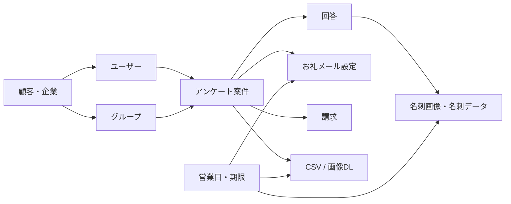

# 主要ドメインモデル

## 中心単位

SPEED AD の中心単位は「アンケート案件」です。アンケート案件に、回答、名刺画像、名刺データ化設定、お礼メール設定、ダウンロード、請求が紐づきます。

## 主要ドメイン

| ドメイン | 役割 | 主な関連 |
| --- | --- | --- |
| 顧客・企業 | 契約主体、請求先、利用状態の基礎 | ユーザー、グループ、請求 |
| ユーザー | ログイン、アンケート作成、設定操作の主体 | グループ、アンケート、請求先 |
| グループ | 複数ユーザーでアンケートや請求を扱う単位 | 招待、所属、請求単位 |
| アンケート案件 | 回答収集、名刺データ化、請求の中心 | 回答、名刺、メール、請求 |
| 回答 | 来場者のアンケート回答 | 回答詳細、名刺画像、テスト回答 |
| 名刺画像・名刺データ | 回答者に紐づく名刺情報 | データ化、CSV、DL期限 |
| お礼メール | 会期後フォローの設定・送信 | 送信対象、送信期限、送信履歴 |
| 請求 | 利用料やデータ化費用の明細 | アンケート、アカウント、請求書 |
| 営業日・期限 | データ化納期や送信期限の前提 | 会期、データ化、DL期限 |

## 関係の見方

## 注意点

- 上記は理解用のドメイン整理であり、DBスキーマ定義ではありません。
- 管理者画面では「アンケート案件」を中心に参照、登録、編集、状態更新、出力、通知、例外対応を整理します。
- 現行モックでは一部の値がJSONやブラウザストレージに寄っています。本番仕様ではサーバー側を正とする必要があります。
