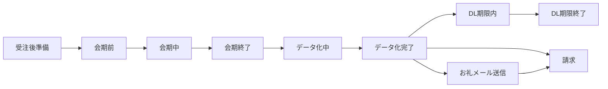

# 全体業務フロー

## フェーズ

| フェーズ | 主な状態 | バックエンドで整理すること |
| --- | --- | --- |
| 受注後準備 | 会期前 | アンケート作成、名刺データ化設定、お礼メール設定、グループ招待 |
| 会期前 | 会期前 | 会期前日通知、開始前チェック、QRや回答導線の準備 |
| 会期中 | 会期中 | 回答受付、名刺画像登録、想定件数到達通知 |
| 会期終了 | 会期終了 | 回答受付終了、編集制御、データ化対象確定 |
| データ化中 | 会期終了（データ化中） | OCR、手入力、照合、CSV作成、完了予定管理 |
| データ化完了 | 会期終了（データ化完了） | CSV/画像DL、お礼メール送信依頼、送信対象確認 |
| 納品・期限 | DL期限内 / DL期限終了 | 保存期間、DL期限通知、取得可否制御 |
| 請求 | 月次請求 | 請求明細作成、請求書送付、入金状態管理 |

## 処理の流れ

## 通知・バッチの代表起点

| 起点 | 代表処理 |
| --- | --- |
| 操作時 | アカウント作成、パスワード再設定、グループ招待、名刺データ化申込 |
| 毎日0:00 | 会期開始、会期前日、DL期限系の通知 |
| 会期終了日23:59 | 会期終了通知 |
| データ化完了予定 | ステータス更新、名刺データ化完了通知、御礼メール送信依頼 |
| 月末 | 請求書作成、請求通知 |

## 未確認事項

- バッチ時刻は旧Wiki・観測資料ベースの整理です。本番ジョブ定義とは突合が必要です。
- 会期終了後の細かな状態遷移は、サーバー側の正本仕様が必要です。
- お礼メールの実送信、再送、失敗時の扱いは本資料では断定しません。
