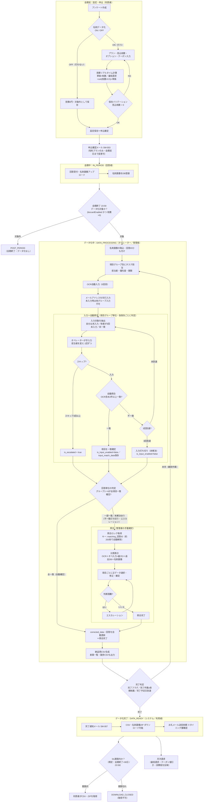

# 名刺データ化のフロー

名刺データ化の「会期前の設定・申込」から「会期中の名刺画像登録」「会期終了後のデータ化作業」「納品・ダウンロード」「請求接続」までを一枚で見渡すためのフロー図（ドラフト）です。

現行モック（`02_dashboard` の設定・見積・ステータス判定）と既存仕様・システムメール仕様から整理しています。OCR・手入力・照合の本番ワークフロー詳細は未確定のため、該当箇所は「※要確認」として扱います。

## 全体フロー図

## ステータス対応

利用者向けステータスは `02_dashboard` の `statusService.js`（`USER_STATUSES`）で判定されます。フロー図の各フェーズと次のように対応します。

| フェーズ | ステータス定数 | 表示 | ダウンロード |
| --- | --- | --- | --- |
| 会期前 | PRE_PERIOD | 会期前 | 不可 |
| 会期中 | IN_PERIOD | 会期中 | 不可 |
| データ化中 | DATA_PROCESSING | 会期終了（データ化中） | 不可 |
| データ化完了 | DATA_READY | 会期終了（データ化完了） | 可 |
| データ化なし | POST_PERIOD | 会期終了 | 不可 |
| DL期限終了 | DOWNLOAD_CLOSED | 会期終了（DL期限終了） | 不可 |

## データ化中の作業状態

「データ化中」フェーズ内部の作業は、管理者画面要件（`30_admin_data_operation.md`）の状態更新区分に沿って遷移します。利用者向けステータスとは別の、社内オペレーション用の状態です。

| 作業状態 | 内容 |
| --- | --- |
| 未着手 | タスク割当済み・入力前 |
| 入力中 | OCR補助・手入力の作業中 |
| 入力完了 | 入力が終わり照合キューへ |
| 照合中 | ロック取得し一致／不一致を判定中 |
| 差戻し | 不一致・不備で再入力が必要 |
| 例外 | エスカレーション対応中 |
| 完了 | 照合確定・納品対象 |

入力は1件の名刺をまとめて行うのではなく、項目グループ単位で担当者を分け並行で進めます（現行モック `data/admin/data_entry_status.json` のタスク構成）。

| 項目グループ | 含む項目 |
| --- | --- |
| メールアドレス | メールアドレス |
| 氏名 | 氏名（姓名） |
| 会社・部署・役職 | 会社名／部署名／役職名 |
| 住所 | 郵便番号／住所１／住所２（建物名） |
| 電話番号 | 電話番号１・２／携帯番号／FAX番号 |
| URL ほか | URL など |

エスカレーション（例外）の種別は、読取不能／重複／差異／画像不備／顧客確認待ちを扱います。

なお、入力作業の優先度はスピードプランに連動し（オンデマンド > 超特急 > 特急 > 通常）、オンデマンドは当日納期（完了予定日＝会期終了当日）として最優先で処理されます。フロー構造自体はプランによって変わりません（参照: `03_admin/00.要件定義書.txt`、`admin_requirements.md`）。なお、プレミアム申込資料には「会期中に優先処理」という表現もありますが、業務ワークフロー仕様はデータ化を会期終了後に固定しているため、会期中処理の有無は※要確認です。

## 照合・ベリファイ入力ルール（最大3回入力）

入力は「異なる担当者が1回ずつ、最大3回」入力するベリファイ方式です（OCRを0回目として扱う）。旧Wiki・要件定義書ベースの整理であり、本番実装との突合は要確認です。

- **入力順序**：メールアドレスを先に入力・確定しないと、他の項目グループは入力できない（メールが照合の基準キー。`03_admin/00.要件定義書.txt:312`）。
- **入力対象の抽出条件**：自分は未入力／他オペレーターが3回入力していない／OCR・オペレーター1〜3で内容が一致していない。
- **自動照合（入力保存ごと）**：各項目の入力保存時に判定し、OCRを含め2件以上が同じ内容なら一致確定（`is_input_enabled=false`・`input_match_data`保存）。メールアドレスが一致すると他項目も自動で一致扱い。回答のグループ1〜6が全項目一致すると `corrected_data`・回答を自動更新（＝照合完了相当）。全項目がそろわない回答だけが管理者の照合へ回る。
- **打ち切り**：オペレーター入力が3回に達したら自動で入力不可（`is_input_enabled=false`）にし、照合へ回す。
- **スキップ**：スキップが3回以上で `is_escalated=true`（エスカレーション）。
- **照合画面**：OCR＋オペレーター入力（最大3）＋過去DB＋名刺画像を比較表示し、項目ごとに正データを選択・修正・確定。判断困難時はエスカレーション。
- **ロック**：入力は「回答ID＋グループID」、照合は「matching_回答ID」のキーでロック。キャッシュ管理で約200秒で自動解除。

参照: 旧Wiki `21_1111547_input-screen-logic.md` / `20_1111383_input-list-logic.md` / `22_1111789_lock-control.md`、要件定義書（`03_admin/00.要件定義書.txt` ほか）。エスカレーション後の再入力・再照合ループ上限は明文化が見つかっていません（※要確認）。

## 工程の入力・出力

| 工程 | トリガー | 主な入力 | 主な出力 | 接続先 |
| --- | --- | --- | --- | --- |
| 設定・申込 | アンケート作成〜会期前 | データ化可否、プラン、見込枚数、オプション、クーポン | 見積、申込確定、社内メモ | 申込確認メール（SM-003） |
| 会期中 | 会期開始〜終了 | 回答者の名刺画像 | 登録済み名刺画像 | データ化対象確定 |
| データ化中 | 会期終了 23:59 | 名刺画像一式、回答ID | 項目グループ別の入力結果、照合結果、差異一覧、納品用CSV | 完了判定 |
| データ化完了 | 完了判定成立 | 確定CSV | 完了通知、DL可能化 | お礼メール送信依頼、請求 |
| 納品・取得 | 完了通知後 | 完了CSV／画像ZIP | 利用者の取得 | DL期限管理 |
| 請求 | 月末締め | 実績枚数、最低請求、クーポン | 請求明細・請求書 | 入金管理 |

## 関連メール

| ID | 送信契機 | 主な内容 |
| --- | --- | --- |
| SM-003 | 名刺データ化の申込（設定保存）時 | 選択プラン、見込枚数、最低請求、請求見込、会期、変更期限 |
| SM-007 | データ化完了時（完了予定日前は完了予定日AM10:00／以降はデータアップ完了時に随時） | ダウンロード可能の案内、請求書は追って送付 |

## 未確認事項

- OCR・手入力・照合の本番ワークフロー詳細とオペレーター割当ルール。
- 完了判定を「完了予定日」「CSVアップロード」「完了件数」のどれで最終確定するか。
- 全項目一致した回答が手動照合（照合一覧・照合完了操作）を完全にスキップするか、一覧に残って確認されるか（照合一覧の選別条件の原文は未確認）。
- お礼メール送信依頼の発火タイミング（完了直後か、利用者操作か）。
- CSV／ZIPの生成・ダウンロード実装（現行モックでは未実装表示）。
- データ化完了後の差し戻し・再アップロード・請求補正の扱い。
- プレミアムオプション（多言語・追加項目）の単価加算ロジック（現行モックでは未反映）。
