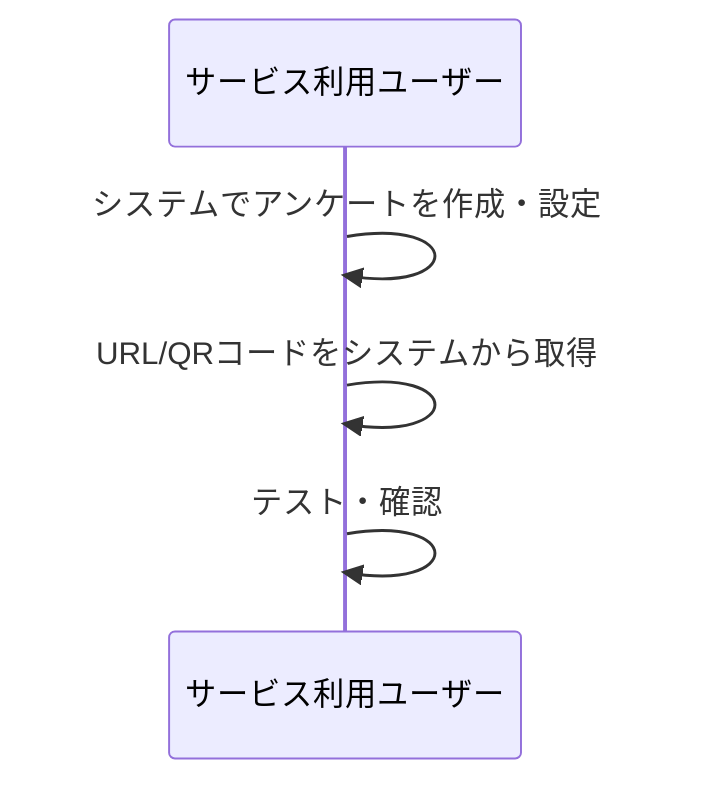
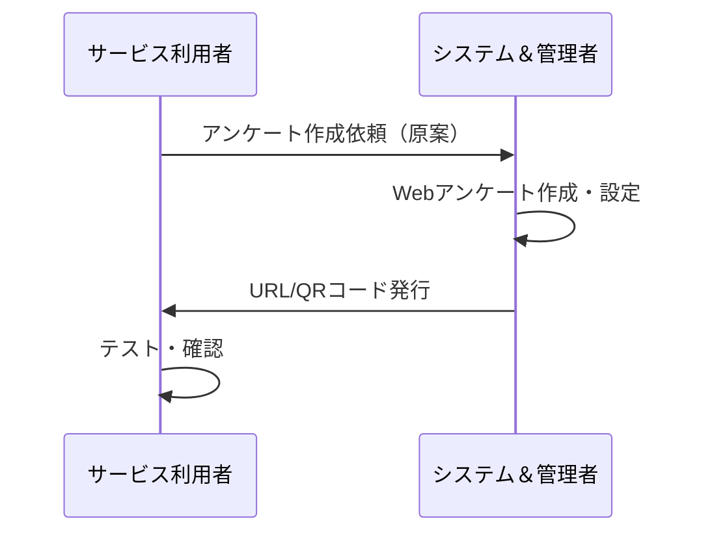
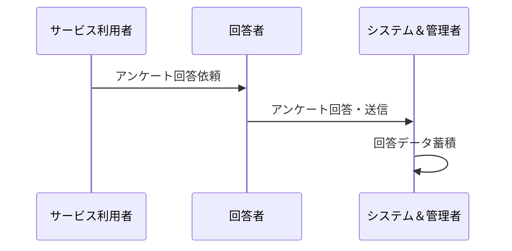
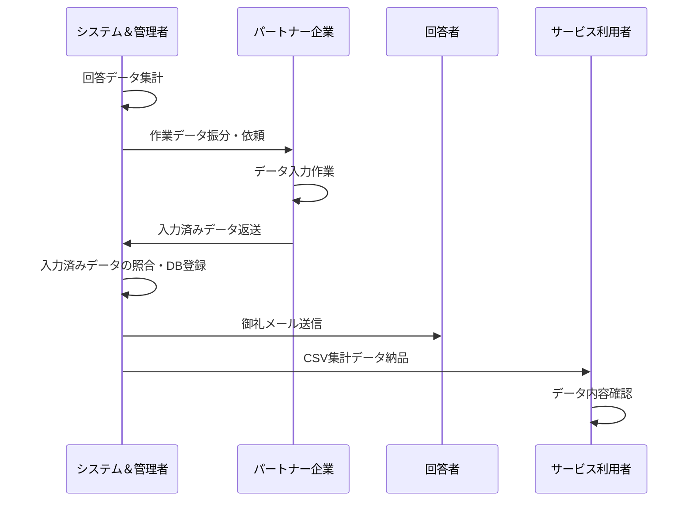
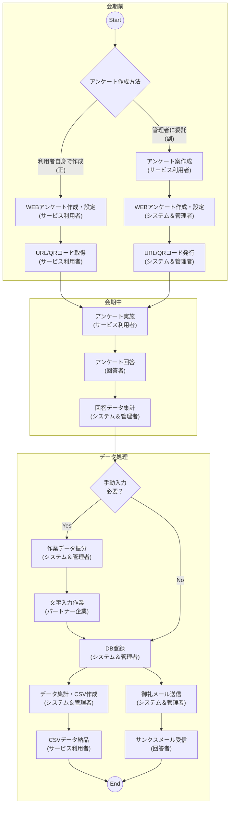

# ビジネスプロセス定義書

## 1. 概要

本ドキュメントは、アンケート業務におけるビジネスプロセスを定義します。
プロセスは「通常作業プラン」「特急作業プラン」「オンデマンド作業プラン」の3つのプランに分かれており、それぞれ作業のタイムラインが異なります。
この定義は `サービス設計_ビジネスプロセス図_2025-01-08.pdf` に基づいています。

## 2. 関係者（アクター）

本プロセスに関わる関係者は以下の通りです。

*   **サービス利用者:** アンケートの主催者。アンケートの企画、作成依頼、実施を行う。
*   **システム＆管理者:** 本システムの管理者。アンケートの作成・設定、データ集計、DB登録、メール送信などを行う。
*   **パートナー企業:** データ入力作業などを担当する協力会社の管理者。
*   **回答者:** アンケートに回答するユーザー。

## 3. 基本プロセスフロー

各プランに共通する基本的なプロセスの流れは以下の通りです。

### 3.1. 会期前

アンケートの作成は、主にサービス利用者が自身で行いますが、依頼に応じて管理者が代行することも可能です。

#### 3.1.1. (正) サービス利用者が作成するパターン

1.  **WEBアンケート作成・設定 (サービス利用者):** サービス利用者がシステムにログインし、自身でアンケートの質問項目、デザイン、公開設定などを行います。
2.  **URL/QRコード発行 (サービス利用者):** サービス利用者がシステム上でアンケートを公開し、回答用のURLおよびQRコードを直接取得します。

#### 3.1.2. (副) 管理者に作成を委託するパターン

1.  **アンケート案作成 (サービス利用者):** サービス利用者が、質問項目などを記載した原案（Word、Excelなど）を作成します。
2.  **作成依頼 (サービス利用者):** 作成した原案をシステム＆管理者に提供し、アンケートの作成を依頼します。
3.  **WEBアンケート作成・設定 (システム＆管理者):** システム＆管理者が、原案を元にWebアンケートフォームを作成し、システム設定を行います。
4.  **URL/QRコード発行 (システム＆管理者):** システム＆管理者が、作成したアンケートのURLおよびQRコードを発行し、サービス利用者に納品します。

### 3.2. 会期中

1.  **アンケート実施 (サービス利用者):** サービス利用者が、イベント会場などで回答者に対してアンケートへの協力を依頼します。
2.  **アンケート回答 (回答者):** 回答者が、提供されたURLやQRコードからアンケートに回答します。
3.  **回答データ集計 (システム＆管理者):** システム＆管理者が、回答されたデータを集計します。

### 3.3. 会期後 / 会期中（データ処理）

回答データの処理と最終的なアウトプットの提供を行います。このフェーズのタイミングが各プランで異なります。

1.  **作業データ振分 (システム＆管理者):** システム＆管理者が、手動での入力が必要な作業をパートナー企業に割り振ります。
2.  **文字入力作業 (パートナー企業):** パートナー企業が、割り振られたデータの入力作業を実施します。
3.  **データベース登録 (システム＆管理者):** システム＆管理者が、全てのデータをデータベースに登録します。
4.  **御礼メール送信 (システム＆管理者):** システム＆管理者が、回答者に対してサンクスメールを送信します。
5.  **データ集計・納品 (システム＆管理者):** システム＆管理者が、最終的な集計データをCSV形式で作成し、サービス利用者に納品します。

## 4. 各作業プランの詳細

### 4.1. 通常作業プラン

*   **特徴:** 最も標準的なプランです。
*   **データ処理フェーズのタイミング:** **会期後6日以内** に完了します。

### 4.2. 特急作業プラン

*   **特徴:** 通常よりも迅速な対応が求められるプランです。
*   **データ処理フェーズのタイミング:** **会期後3日以内** に完了します。

### 4.3. オンデマンド作業プラン

*   **特徴:** イベント会期中にリアルタイムでのデータ処理が求められるプランです。
*   **データ処理フェーズのタイミング:** **会期中** に随時実施されます。

# 業務フロー

本ドキュメントは、ビジネスプロセス定義書に基づき、各アクターの具体的な作業手順を時系列で記述したものです。

## 1. 会期前フェーズ

アンケートの作成方法には、サービス利用者が自身で作成するパターンと、管理者に委託するパターンの2通りが存在します。

### 1.1. (正) サービス利用者が作成するパターン

| No. | 担当アクター | 作業内容 | アウトプット | 補足 |
|---|---|---|---|---|
| 1 | サービス利用者 | システムにログインし、アンケートの質問項目、選択肢、デザインなどを設定する。 | Webアンケートフォーム | |
| 2 | サービス利用者 | 設定したアンケートを公開し、回答用のURLとQRコードをシステムから取得する。 | URL、QRコード | |
| 3 | サービス利用者 | 取得したURL/QRコードが正しく機能するかテスト・確認する。 | (確認) | |

### 1.2. (副) 管理者に作成を委託するパターン

| No. | 担当アクター | 作業内容 | アウトプット | 補足 |
|---|---|---|---|---|
| 1 | サービス利用者 | アンケートの目的、質問項目、選択肢などを定義する。 | アンケート原案（ドキュメント） | |
| 2 | サービス利用者 | 作成したアンケート原案をシステム＆管理者に提出し、Webアンケートの作成を依頼する。 | (依頼) | |
| 5 | システム＆管理者 | 生成したURLとQRコードをサービス利用者に送付する。 | (送付) | |
| 6 | サービス利用者 | 受け取ったURL/QRコードが正しく機能するかテスト・確認する。 | (確認) | |

## 2. 会期中フェーズ

| No. | 担当アクター | 作業内容 | アウトプット | 補足 |
|---|---|---|---|---|
| 1 | サービス利用者 | イベント会場などで、来場者や対象者にアンケートへの回答を依頼する。 | (口頭での案内) | QRコードを掲示する、タブレットを渡すなどの方法が考えられる。 |
| 2 | 回答者 | スマートフォンやPC、タブレットなどからアンケートフォームにアクセスし、質問に回答・送信する。 | 回答データ | |
| 3 | システム＆管理者 | 回答データをリアルタイムで受信し、システム内に蓄積する。 | 蓄積された回答データ | |
| 4 | システム＆管理者 | (オンデマンドプランの場合) 会期中に随時データ集計と後続処理を開始する。 | (処理開始) | 詳細は「3. データ処理フェーズ」を参照。 |

## 3. データ処理フェーズ

このフェーズの開始タイミングはプランによって異なります。
- **通常プラン:** 会期終了後、6日以内に全作業を完了。
- **特急プラン:** 会期終了後、3日以内に全作業を完了。
- **オンデマンドプラン:** 会期中に随時作業を開始・完了。

| No. | 担当アクター | 作業内容 | アウトプット | 補足 |
|---|---|---|---|---|
| 1 | システム＆管理者 | 蓄積された回答データを集計する。 | 集計済みデータ | |
| 2 | システム＆管理者 | フリーテキスト回答など、手動でのデータクレンジングや入力が必要な作業を特定し、パートナー企業に作業を割り振る。 | 作業依頼データ | |
| 3 | パートナー企業 | 割り振られたデータ（手書きアンケートの電子化、フリーテキストの整形など）の入力・整形作業を行う。 | 整形済みデータ | |
| 4 | パートナー企業 |完了したデータをシステム＆管理者に返送する。| (返送) | |
| 5 | システム＆管理者 | 全ての回答データ（Web回答＋パートナー作業分）を最終的に統合し、データベースに登録する。 | DB登録済みデータ | |
| 6 | システム＆管理者 | 回答者全員に対し、御礼のメール（サンクスメール）を送信する。 | (メール送信) | |
| 7 | 回答者 | サンクスメールを受信する。 | | |
| 8 | システム＆管理者 | サービス利用者の要件に従い、最終的な集計データをCSV形式でエクスポートする。 | CSV集計データ | |
| 9 | システム＆管理者 | 生成したCSV集計データをサービス利用者に納品する。 | (納品) | |
| 10| サービス利用者 | 納品されたCSVデータを受け取り、内容を確認する。 | (確認) | |

## 4. プロセスフロー図 (Mermaid)

### 4.1. 会期前フェーズ

#### (正) サービス利用者が作成するパターン

#### (副) 管理者に作成を委託するパターン

### 4.2. 会期中フェーズ

### 4.3. データ処理フェーズ

### 4.4. 統合プロセスフロー図

