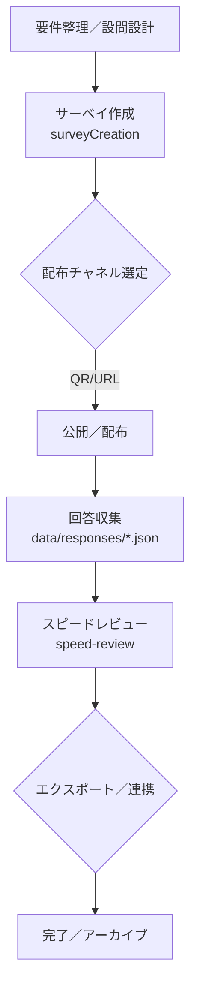

# 03 サーベイ・ライフサイクル（サービス準拠／ドラフト v1）

対象画面・コード
- 画面: `02_dashboard/surveyCreation.html`, `02_dashboard/speed-review.html`
- サービス／UI: `02_dashboard/src/services/surveyService.js`, `02_dashboard/src/ui/surveyRenderer.js`,
  `02_dashboard/src/speed-review.js`, `02_dashboard/src/ui/speedReviewRenderer.js`

## 概要
計画 → 作成 → 配布 → 回答収集 → レビュー → エクスポート の標準フロー。

## 具体項目（実装準拠）
- 入力・保存項目（`collectSurveyDataFromDOM` より）
  - 基本: `name`, `displayTitle`, `description`, `periodStart`, `periodEnd`, `plan`, `deadline`, `memo`
  - 名刺連携: `bizcardEnabled`, `bizcardRequest`
  - サンクスメール: `thankYouEmailSettings`
  - 設問: `questionGroups[].questions[]`
    - `questionId`, `type`（`single_answer`／`multi_answer`／`matrix_sa`／`matrix_ma` 等）, `text`, `required`, `options[]`

- 回答・レビュー連携（Speed Review）
  - レコード例: `answerId`, `surveyId`, `answeredAt`, `isTest`, `details[]`, `businessCard{...}`
  - `details[]` は `question: 'Q.○○', answer: '...' | string[]`
  - 名刺情報は `group1..group6`（会社名／氏名／部署役職／メール／住所／電話／URL 等）

## ステータス案
- サーベイ: `draft` → `ready` → `published` → `closed` → `archived`
- 回答: `received` → `reviewed`｜`re-contact`（再連絡要）

## バリデーション／例外
- 期間の整合: `periodStart <= periodEnd`
- 必須設問: `required === true` の未入力検知
- 名刺連携: `bizcardEnabled` 時の `bizcardRequest` 不足

## 運用ガイド
- 設問命名は表示文言とデータキーの整合を意識（同義語の乱立回避）
- 配布版はバージョニング（v1, v2）で差し替え管理
- 匿名化／保持期間はセキュリティ方針に追記（顧客データは最小限）

## 前提・想定（Assumptions）
- モック環境では `data/responses/*.json` を保存先とし、本番は API／DB 連携を想定
- レビュー結果の恒久保存は未実装のため、当面はタグ／CSV出力で代替
- 設問タイプは現行4種を主に運用。将来的な追加時は UI／サービスの同時改修が必要

