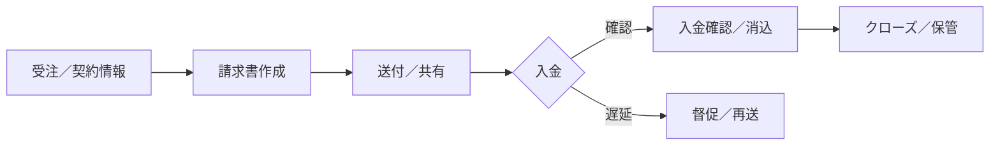

# 04 請求（Order-to-Cash）［サービス準拠／ドラフト v1］

対象画面・コード
- 画面: 一覧（`02_dashboard/invoiceList.html`）、詳細（`02_dashboard/invoiceDetail.html`）、印刷（`invoice-print.html`）
- サービス／UI: `02_dashboard/src/invoiceList.js`, `02_dashboard/src/invoiceDetail.js`,
  `02_dashboard/src/invoicePrint.js`, `02_dashboard/src/services/invoiceService.js`,
  `02_dashboard/src/ui/invoiceRenderer.js`, `02_dashboard/src/ui/invoiceDetailRenderer.js`

## 概要
受注／契約 → 請求作成 → 送付 → 入金確認 → 消込 → 保管の基本フロー。

## データ項目（実装準拠）
- 請求ヘッダ
  - `invoiceId`, `issueDate`, `dueDate`, `corporateName`, `contactPerson`
  - 金額: `subtotalTaxable`, `tax`, `subtotalNonTaxable`, `totalAmount`
  - 口座: `bankInfo.bankName`, `branchName`, `accountType`, `accountNumber`, `accountHolder`
- 明細（現状はモック表示）
  - `no`, `name1`, `name2`, `quantity`, `price`, `total`

## ステータス案
- `draft`（作成中）→ `issued`（発行）→ `sent`（送付済）→ `paid`（入金済）→ `reconciled`（消込済）→ `archived`
- 例外: `overdue`（期限超過）, `reissued`（再発行）, `cancelled`（取消）

## バリデーション／計算
- 合計: `totalAmount = subtotalTaxable + tax + subtotalNonTaxable`
- 口座情報の必須項目チェック（名称／番号／名義）
- 期限: `dueDate >= issueDate`

## 送付／再送
- チャネル例: PDF／印刷（`invoicePrint.js`）、メール／ポータルは将来拡張
- 再送ポリシー: `overdue` で督促し、管理者承認後に `reissued` または `resent`

## 例外処理
- 金額差異: 誤請求の取消 → 再発行（`reissued`）
- 請求先変更: `corporateName`／`contactPerson` 更新の履歴化
- 入金過不足: 調整行（±）を明細に追加、理由コード管理

## 前提・想定（Assumptions）
- 一覧は `core/invoices.json`（モック）から取得。本番は会計／決済システム連携を想定
- 明細は現状 UI モック。将来は受注データ／利用実績から自動構成
- 入金取込はファイル／自動APIいずれかで別途定義（照合アルゴリズムは運用で調整）
