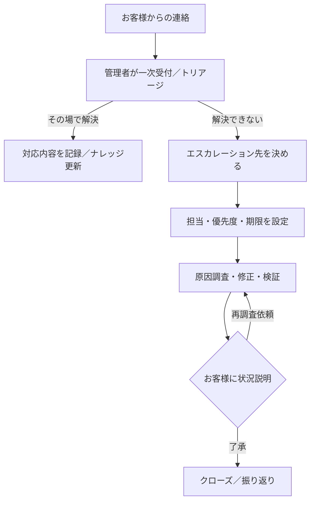

# 05 サポート／エスカレーション（サービス準拠／ドラフト v2）

お問い合わせに対して、誰がどこまで対応し、問題が解決するまでの道筋をまとめました。一次対応は管理者が担当し、オペレーターは記録や資料提供でサポートします。

## 主に使う画面
- `03_admin/escalations.html`（問い合わせ一覧）
- `03_admin/operator-management.html`（社内メンバーの割り振り）
- `03_admin/performance-management.html`（対応状況の確認）

## 標準フロー

## 緊急度の目安（初期案）
- **P1（最重要）**: 多くのお客様に影響／データ破損の恐れ  
  → 1 時間以内に初回の連絡、4 時間以内に回復目標
- **P2（高）**: 影響範囲が限定されるが早急な対応が必要  
  → 4 時間以内に初回連絡、2 営業日以内に解決目標
- **P3（中）**: 通常の問い合わせ。翌営業日までに初回返信、5 営業日以内に解決目標
- **P4（低）**: 改善要望など緊急度低。計画的に対応

## 役割分担のイメージ
- **管理者**: お客様対応の窓口。一次受付・一次対応・エスカレーションの判断・最終承認を担う（A/R）。
- **オペレーター**: 記録の整備やデータ提供など、管理者の補助を行う（C/I）。
- **入力管理者**: 必要に応じて入力状況を説明し、再入力が必要な場合はオペレーターへ指示（C）。
- **マスター管理者**: 重大インシデント時の意思決定とポリシー更新（A）。
- **開発／保守担当**: 技術的な調査や修正を実施（R）。

## 記録しておくと良いこと
- **受付時**: 受付時刻、緊急度、影響範囲、再現方法、暫定の回避策
- **対応中**: やったこと／わかったこと、次の確認時刻
- **完了時**: 原因と恒久対策、顧客への説明内容、ナレッジ（FAQ・手順書）の更新状況

## 前提・想定（Assumptions）
- 現状は SPEED AD 管理画面で一覧・記録を管理。外部チケットシステムとの連携は今後検討。
- SLA（対応目標時間）は KPI ドキュメント（`08_kpis_and_reporting.md`）とセットで運用する。
- 行政・教育機関など、契約によって緊急度の定義が変わる場合は本章をローカライズする。
