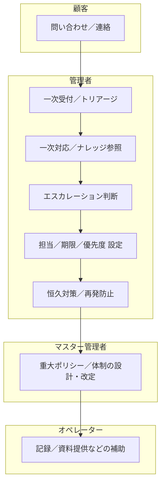

# 09 ユーザーペルソナ別フロー（サービス準拠／ドラフト v2）

ユーザー（役割）ごとの業務フローを、画面／ソースに即して日本語でまとめます。泳線は Mermaid のサブグラフで表現しています。

対象ペルソナ（役割）
- マスター管理者: 役割設計・ロール作成／変更、重大ポリシー管理
- 管理者: 設定／権限／承認／重大案件ハンドリング（一次受付・一次対応を担当）
- 入力管理者: 入力業務の監督／管理、オペレーター支援
- オペレーター: 日次運用（入力／突合）。サポートの一次対応は担当しない（必要時に補助）
- 顧客／回答者: アンケート入力、請求先窓口

参照
- 画面: `02_dashboard/*.html`, `03_admin/*.html`
- ソース: `02_dashboard/src/**/*`（特に `src/services/*`, `src/ui/*`）

---

## A. サーベイ End-to-End（管理者／オペレーター／顧客）

```mermaid
flowchart LR
  subgraph 管理者
    A1[要件整理／設問設計]
    A2[配布ポリシー決定]
  end

  subgraph オペレーター
    O1[サーベイ作成\nsurveyCreation.html]
    O2[プレビュー／調整\nui/surveyRenderer.js]
    O3[配布設定／QR発行\nmodals/qrCodeModal.html]
    O4[回答モニタ\nspeed-review.html]
    O5[レビュー／差戻し管理\nspeedReviewRenderer.js]
    O6[エクスポート／共有]
  end

  subgraph 顧客／回答者
    C1[フォーム入力／送信]
  end

  A1 --> A2 --> O1 --> O2 --> O3 --> C1 --> O4 --> O5 --> O6
```

主な入出力
- 入力: `name/displayTitle/periodStart/periodEnd/plan/deadline/memo`、設問 `questionGroups[].questions[]`
- 連携: 回答 `details[]` と名刺 `businessCard.*`（Speed Review 用）
- 出力: CSV／Excel などのエクスポート（将来 BI 連携）

Assumptions
- 回答データはモックでは `data/responses/*.json`、本番は API／DB を想定
- レビュー判定の永続化は未実装のためエクスポート／タグで代替

---

## B. 請求 Order-to-Cash（マスター管理者／管理者／入力管理者／オペレーター／顧客）


主要フィールド（ヘッダ）
- `invoiceId`, `issueDate`, `dueDate`, `corporateName`, `contactPerson`
- `subtotalTaxable`, `tax`, `subtotalNonTaxable`, `totalAmount`
- `bankInfo.bankName/branchName/accountType/accountNumber/accountHolder`

Assumptions
- 一覧／詳細はモック JSON（`core/invoices.json`）参照。本番は会計／決済連携
- 明細は現在 UI モック。将来は受注／利用実績から自動生成
- 入金取込はファイル／自動APIいずれか（照合ルールは運用で確定）

---

## C. 問い合わせ／エスカレーション（管理者／マスター管理者／顧客／オペレーター補助）



記録／可視化
- 受付時刻、重大度、影響範囲、再現手順、暫定回避策、クローズ理由

Assumptions
- 管理者が一次対応を担当。オペレーターは補助に徹する。
- 現状は管理画面での一覧／設定を想定（外部チケット連携は将来拡張）
- SLA 指標は KPI ドキュメントと連携（初回応答／解決時間）

---

## D. オペレーター日次（オペレーター／入力管理者 中心）


補足
- 入力管理者は D1〜D5 の監督／確認を行い、入力品質と締切遵守を管理
- マスター管理者は体制／権限／監査要件を策定し、継続的に見直す
- 社内フローでは承認行為は管理者が実施
- サポートの一次対応は管理者が担当。オペレーターは補助に徹する。

