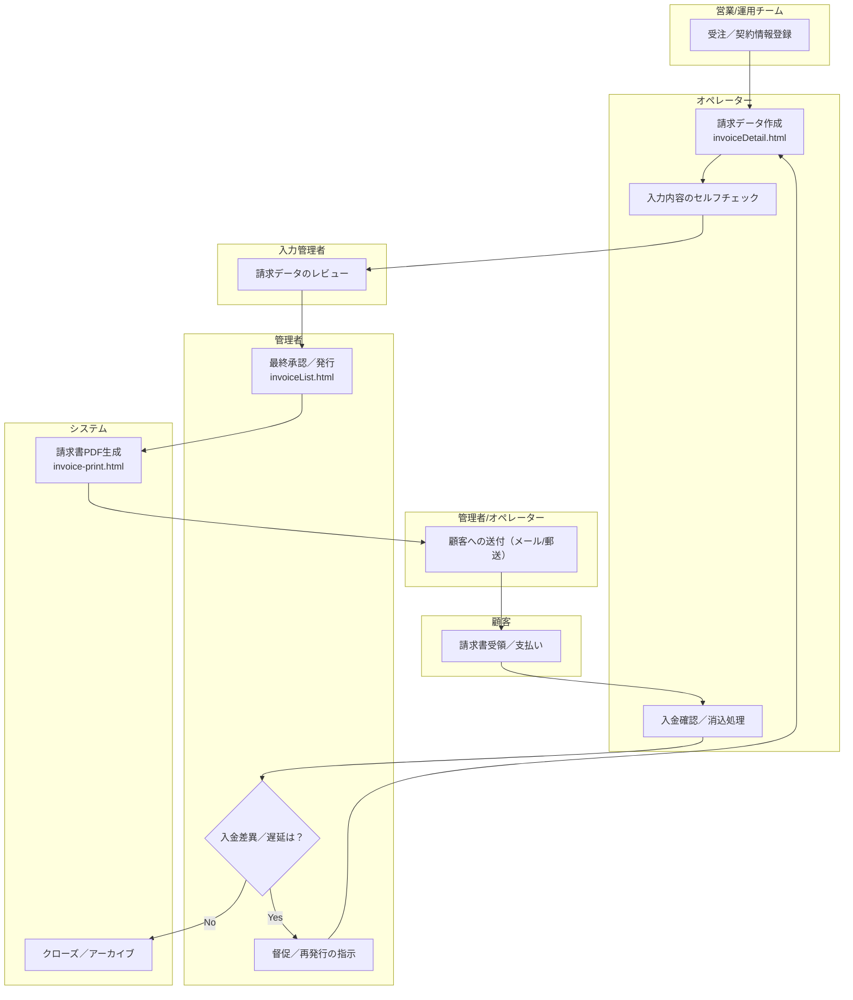

# 請求・入金管理プロセス（Order-to-Cash）

本ドキュメントは、受注から請求書の発行、送付、入金確認、消込に至るまでの一連の業務プロセス（Order-to-Cash）を定義します。

---

## 1. 関連情報

- **関連ドキュメント:**
  - **役割定義**: 各プロセス担当者の責任範囲を定義  
    `./02_roles_and_responsibilities.md`
  - **データ定義**: プロセスで授受されるデータの詳細なマッピング  
    `./07_data_flow_mapping.md`
- **関連画面/UI:**
  - `02_dashboard/invoiceList.html` (請求一覧)
  - `02_dashboard/invoiceDetail.html` (請求詳細)
  - `invoice-print.html` (請求書印刷プレビュー)
- **関連サービス/ロジック:**
  - `02_dashboard/src/services/invoiceService.js`
  - `02_dashboard/src/ui/invoiceRenderer.js`

---

## 2. プロセスフロー

### 2.1. フロー図

### 2.2. 各ステップの概要
1.  **受注／契約情報登録**: 営業または運用チームが契約情報をシステムに登録します。
2.  **請求データ作成**: オペレーターが契約情報に基づき、請求データを作成します。
3.  **セルフチェック**: オペレーターが入力内容を自己確認します。
4.  **レビュー**: 入力管理者が請求データの内容をレビューし、承認または差し戻しを行います。
5.  **最終承認／発行**: 管理者が最終承認を行い、請求書を発行します。
6.  **PDF生成**: システムが承認された請求データを基に、請求書PDFを自動生成します。
7.  **顧客への送付**: 管理者またはオペレーターが、生成された請求書を顧客に送付します。
8.  **支払い**: 顧客が請求書に基づき支払いを行います。
9.  **入金確認／消込**: オペレーターが入金を確認し、システム上で消込処理を行います。
10. **差異／遅延確認**: 管理者が入金の差異や遅延がないかを確認します。
11. **督促／再発行**: 差異や遅延があった場合、管理者が督促や請求書の再発行を指示します。
12. **クローズ**: 問題なく入金が完了した請求は、クローズされ、アーカイブされます。

---

## 3. 主要データ項目

請求書を構成する主要なデータ項目です。詳細は `07_data_flow_mapping.md` を参照してください。

- **請求ヘッダ情報**
  - `invoiceId`: 請求書ID
  - `issueDate`: 発行日
  - `dueDate`: 支払期限
  - `corporateName`: 会社名
  - `contactPerson`: 担当者名
  - `totalAmount`: 合計金額
- **金額関連**
  - `subtotalTaxable`: 課税対象小計
  - `tax`: 消費税
  - `subtotalNonTaxable`: 非課税対象小計
- **振込先口座情報**
  - `bankInfo.bankName`: 銀行名
  - `branchName`: 支店名
  - `accountType`: 口座種別
  - `accountNumber`: 口座番号
  - `accountHolder`: 口座名義
- **請求明細**
  - `no`: 明細番号
  - `name1`: 品目1
  - `name2`: 品目2
  - `quantity`: 数量
  - `price`: 単価
  - `total`: 金額

---

## 4. 請求ステータス定義

請求ライフサイクルにおける各ステータスを定義します。

| ステータスID | 説明 |
| :--- | :--- |
| `draft` | **作成中**: 請求データが保存されているが、まだ承認申請されていない状態。 |
| `awaiting_approval` | **承認待ち**: 請求データが作成され、管理者の承認を待っている状態。 |
| `issued` | **発行済み**: 管理者によって承認され、請求書として正式に発行された状態。 |
| `sent` | **送付済み**: 発行された請求書が顧客に送付された状態。 |
| `paid` | **入金済み**: 顧客からの入金が確認された状態。 |
| `reconciled` | **消込済み**: 入金と請求が紐付けられ、会計上の処理が完了した状態。 |
| `overdue` | **期限超過**: 支払期限を過ぎても入金が確認されていない状態。 |
| `cancelled` | **取消済み**: 何らかの理由で請求が取り消された状態。 |
| `archived` | **保管済み**: 全てのプロセスが完了し、長期保管に移行した状態。 |

---

## 5. 主要なビジネスルール

- **合計金額の計算式**:
  - `totalAmount = subtotalTaxable + tax + subtotalNonTaxable`
- **必須項目**:
  - 振込先口座の「銀行名」「支店名」「口座番号」「口座名義」は入力必須です。
- **日付の整合性**:
  - 支払期限（`dueDate`）は、発行日（`issueDate`）以降の日付でなければなりません。

---

## 6. 例外ケースと対応フロー

| ケース | 対応フロー |
| :--- | :--- |
| **請求金額の誤り** | 当該請求を「取消 (`cancelled`)」ステータスに変更し、正しい内容で新しい請求書を再発行します。 |
| **請求先情報の変更** | 変更履歴を記録した上で、最新の請求先情報（会社名、担当者名など）に更新します。 |
| **入金額の過不足** | 差額を調整するための明細行を追加し、その理由を管理用のメモ項目として記録します。 |

---

## 7. システム連携と将来の拡張

- **データソース**:
  - **モック環境**: `data/core/invoices.json` から請求データを取得します。
  - **本番環境**: 将来的には、会計システムや決済サービスとのAPI連携を想定しています。
- **請求明細の自動生成**:
  - 現在のUIでは請求明細はモックデータが表示されていますが、将来的には受注情報やサービスの利用実績に基づいて自動生成されることを想定しています。
- **入金照合の自動化**:
  - 入金データの取り込みは、銀行API連携または振込明細ファイルのアップロードを想定しています。具体的な照合ロジックは、運用を通じて継続的に調整します。
