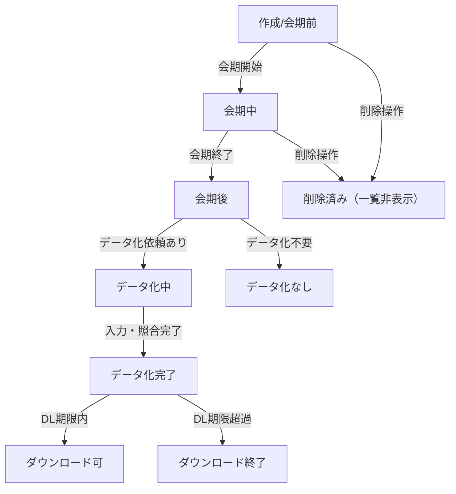
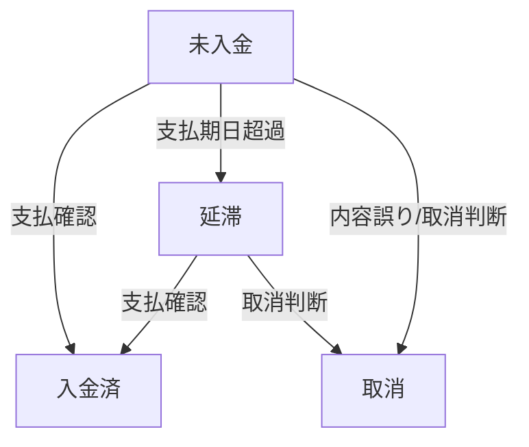

# データ管理レビューメモ（ステータス整合性／ライフサイクル）

本メモは以下のタスクを概念から説明し、判断の順番と考え方を共有するためのたたき台です。

- status_integrity
  - 判定条件策定
  - 誤ステータス修正
- data_lifecycle_policy
  - 不要化判定
  - 保持期間策定

## 0. 経営向けサマリー（代表説明用）
- お客様がダウンロードできるデータ（回答・名刺テキスト/画像・請求書PDF）とアンケート定義は「原則消さない」。プライバシーや法的理由があるときだけ、社内承認のうえで削除/匿名化する。
- アクセスは役割で制限。利用者は自組織分のみ、社内も閲覧中心。画像/PDFはより厳しく、ダウンロードは申請制＋期限つきリンクにする案。
- 保管場所を2層に分ける。すぐ使うデータは軽く、古いデータは倉庫（アーカイブ）に移してコストと性能を保つ。取り出し方は手順化する。
- 直近の不具合対策: 重い「未入力データ抽出」を作成日から7営業日以内に絞り、レスポンスとエラー改善を確認する。
- 次に決めること: 例外時の承認ルール、権限と監査ログの詳細、倉庫に移すタイミングと復元の約束事（SLA）。

## 1. 参照ドキュメント
- ステータス草案: `docs/changelog/status_draft.md`
- ダッシュボード実装方針: `docs/product/specs/12_dashboard_current_functional_requirements.md`
  - 画面で見せるステータスを正規化し、削除済みは除外している
  - ライフサイクルに応じてダウンロード可否を判定している
- 画面要件: `docs/product/specs/00_screen_requirements.md`
  - `削除済み` / `不明` はフィルタ選択肢に出さない
- 権限制御とステータス挙動: `docs/ja/user-permissions.md`
- データモデル: `docs/product/architecture/02_data_model.md`
- 多言語名刺フロー（保管ステップあり）: `docs/product/processes/multilingualBizcardFlow.md`
- プラン別保存期間: `docs/references/resources/client-materials/service-plan-comparison.md`（無料/Standard: 30日、Premium: 無期限）

## 2. Status Integrity

### 2.1 目的と前提
- 目的: 「今どの状態か」「ユーザーが何をできるか」を一貫したルールで示し、誤表示や誤操作を防ぐ。
- 前提: ステータスは「会期」「データ化の進捗」「ダウンロードの可否」「削除や例外」の4層に分けて考える。

### 2.2 判定条件の組み立て方
- 正準ステータス集合を一本化する  
  - 表示用の代表値を限定して、誰が見ても同じ語彙で話せる状態にする。  
  - 内部で細かい値（削除済み、不明、下書きなど）があっても、画面では代表値に丸めて見せる。
- 判定の順番を固定する  
  1. データ化対象かどうか（プランや依頼の有無）  
  2. 会期の位置（開始前／期間中／終了後）  
  3. データ化の進み具合（未着手／処理中／完了）  
  4. ダウンロードの締め切りを過ぎているか
- UI との整合  
  - フィルタやバッジは代表値のみを使い、削除済み・不明は表示対象から外す。  
  - 権限制御と結びつけ、「会期前だけ編集可」「期間中は編集不可」などの振る舞いを揃える。

### 2.3 誤ステータスを直す流れ
- どこを見て違和感を拾うか  
  - 日付とステータスの矛盾（終了しているのに期間中表示）  
  - データ化不要なのに「完了」表示になっている  
  - 削除済みが一覧に出ている
- 直し方の考え方  
  1. 会期と進捗をもとに代表ステータスを再計算する。  
  2. データ化対象外なら「処理中」「完了」を名乗らせない。  
  3. 削除済みは一覧に出さず、内部だけで記録する。
- 人手で直すときの注意  
  - 誰が何を理由に直したかを残す（監査ログ）。  
  - 直したあと、一覧と権限制御の振る舞いが意図どおりかを目視確認する。

## 3. Data Lifecycle Policy

### 3.1 目的と前提
- 目的: 「どのデータをいつまで持つか」を事前に決め、プライバシー・コスト・法務リスクを抑えつつ業務に必要な期間は確実に残す。
- 前提: データごとに性質が違う（回答データ、名刺画像、ダウンロード生成物、ログなど）。同じ期限で一律に扱わず、性質に応じて決める。

### 3.2 不要化の考え方
- 判定の基本軸  
  - 会期が終わっているか  
  - データ化が完了しているか  
  - ダウンロード受付が終わっているか  
  - 請求やレポートが片付いているか
- 例外の扱い  
  - 手動レビュー待ちのものは保留。  
  - 法務・契約で保全が求められるものはアーカイブに移し、削除対象から外す。

### 3.3 保持期間のたたき台
- プラン別のベースライン  
  - 無料/Standard: 30日を目安（会期終了またはデータ化完了を起点）。  
  - Premium: 無期限を基本とし、削除依頼があれば個別対応。
- データ種別ごとの目安  
  - 回答データ・名刺データ化結果: プランのベースラインに合わせる。  
  - 名刺画像原本: プライバシー保護のため短く設定（例: 30〜60日）を検討。  
  - ダウンロード生成物（CSV/XLSX）: 短期（例: 7〜14日）で消す前提。  
  - ログ・監査証跡: コンプライアンス要件に合わせて年単位で設定。  
- 運用イメージ  
  - データに「いつまで保持するか」の期限情報を紐づける。  
  - 期限が来たらアーカイブか削除を定期的に実施する。  
  - 削除前に利用者へ猶予を知らせる（例: 14日前に通知）。  
  - アーカイブは復元手順を明記しておく。

### 3.4 保存期間案（利用者がダウンロードできるもの）
- 前提: 利用者向けダウンロードデータは「永久保存（削除しない）」を基本とする。内部でのアーカイブや圧縮は可だが、利用者が取得できる状態を維持する。  
- アンケート回答系  
  - 回答データ: 永久保存（プランに依存せず削除しない）。  
  - 名刺入力データ（構造化）: 永久保存。  
  - 名刺画像データ: 永久保存。ただし保管はアーカイブ/低コストストレージ化し、暗号化とアクセス制御を担保する。
- 請求系（請求一覧・詳細）  
  - 請求書PDF: 永久保存（法務/会計要件にも合致）。ストレージ効率化のための圧縮・アーカイブは可。

### 3.5 保存期間案（運営側が恒常的に持つ主要データ8カテゴリ）
- アンケート定義・設定: 永久保存（顧客からの削除要請や法令対応など明示の例外がある場合のみ対応）。
- 回答データ（本文・選択値・タイムスタンプ）: プラン基準（無料/Standard 30日、Premium 無期限）。法務要件があれば延長。
- 名刺データ化（画像原本）: 短期保持（30〜60日）を上限とし、抽出後は削除または匿名化。バックアップも同じ期間でローテーション。
- 名刺データ化（構造化データ）: プラン基準で保持。会期終了/データ化完了を起点に30日（無料/Standard）とする。
- 請求・決済関連（請求書、入金ステータス、金額メタデータ）: 会計・税務要件に準拠し長期保持（例: 5〜7年）。削除・マスキングは法務確認のうえで例外処理。
- ユーザー/グループ/権限メタデータ: アカウント維持の限り保持。退会時は識別子を匿名化し、監査用最小情報のみ残す案。
- 監査・操作ログ（ステータス変更履歴、ダウンロード履歴など）: セキュリティ/監査要件を踏まえ年単位（例: 1〜3年）。重要操作はより長期（例: 5年）も検討。
- サービス設定・プラン情報・多言語/料金テーブル: プロダクト設定として保持。履歴は追跡可能な形で長期保管。

### 3.6 アーカイブ運用（平易な説明）
- 目的: すぐ使うデータは軽く保ちつつ、必要になれば取り出せるように別場所へ移す「退避」。削除ではなく、倉庫にしまうイメージ。
- 主な置き場所の例  
  - 回答や名刺のテキストデータ: 本番と同じ形で「_archive」側に移し、年月や会期ごとに棚分けして保管。よく使う検索キーだけ残し、余計な索引は作らない。  
  - 画像やPDFのような大きなファイル: 専用ストレージに暗号化して置き、データベースには場所のメモだけ残す。  
  - 監査ログやダウンロード履歴: 一定期間で書き込み元から移し、長期保管用の棚にまとめる。
- 運び方（流れ）  
  1. いつ移すかを決める（会期終了やダウンロード期限後など）。  
  2. 倉庫にコピーする（テキストは_archiveへ、画像/PDFはストレージへ）。  
  3. 数が合っているか簡単な検算をする。  
  4. 本番から元データを片付けて容量を空ける。  
  5. もし戻すときの手順と、誰が取り出せるかを決めておく。
- 優先して倉庫に移したいもの  
  1) `input_business_cards`（名刺データ。テキストと画像を分けて保管）  
  2) `answer_details`（回答明細。年月などでまとめて移す）  
  3) 請求書PDF（長期保管を前提に倉庫へ）

## 4. 永久保存の前提整理（やさしい説明）
- 基本ルール: 回答データ、名刺のテキストと画像、請求書PDF、アンケート定義・設定は「原則消さない」。  
- 消す/匿名化する可能性がある場合  
  - 法律で求められたとき、契約が終わったとき、本人から正式に削除請求があったとき。  
  - 名刺画像だけはプライバシー配慮で短期保存にする案もあり（テキストは残す）。  
- どう決めるか（承認の流れの例）  
  1) 依頼を受けて運用/CSが内容確認。  
  2) 個人情報が絡むなら法務/DPOが最終確認。  
  3) 何をいつ誰がどれだけ操作したかを必ず記録に残す。

## 5. アクセス権限・再配布・監査ログ（平易な説明）
- 役割ごとの基本ルール  
  - 利用者: 自分の組織のデータだけ見られ、ダウンロードも自組織分だけ。再配布は禁止を明記する。  
  - 社内のサポート/運用: 調査のために閲覧可。ダウンロードは管理者だけなど、できる人を絞る。  
- データの種類で強さを変える  
  - 回答/名刺のテキスト: 自組織のみ。  
  - 名刺画像や請求書PDF: 見られる人をさらに絞り、ダウンロードは申請制＋有効期限つきリンクにする案。  
- 記録（監査ログ）  
  - 誰がいつ何をダウンロード/閲覧したかを残す。画像/PDFなど重要なものは長めに保管。  
  - 期限つきリンクを発行した記録と、実際にダウンロードされた記録を別々に残す。  
- 再配布を防ぐ工夫  
  - ダウンロードの回数制限や有効期限を設定。  
  - ダウンロード前に「社外配布禁止」などを再確認するダイアログを表示。  
  - 権限と記録の保管期間をポリシーとして文章にまとめる。

## 6. 選択肢整理表（検討用）
```
# ステータス・ライフサイクル設計 選択表（シンプル版）

項目                     | 選択肢A                   | 選択肢B                   | 選択肢C                   | 備考
------------------------|---------------------------|---------------------------|---------------------------|-------------------------------------------
ステータスの種類        | 現行案どおり              | いくつかまとめる          | 大きく作り直す            | 画面表示に影響
削除・下書きの見せ方    | 一覧に出さない            | 灰色で表示                | 表示するが操作不可        | 監査ログは残す
ステータス更新のタイミング| 毎日まとめて更新          | 変更のたびに更新          | 両方組み合わせ            | 負荷とのバランス
ダウンロード可否の判定  | 会期＋データ化＋期限       | 会期＋データ化            | 会期のみ                  | 期限を重視するか
無料/Standard保持期間   | 30日                      | 60日                      | 180日                     | 会期終了またはデータ化完了から
Premium保持期間         | 無期限                    | 1年                       | 3年                       | 契約に合わせる
名刺画像保持            | 30日                      | 60日                      | 30日                      | プライバシー配慮で短め
請求書PDF保持           | 5年                       | 7年                       | 10年                      | 法務・会計に合わせる
監査ログ保持            | 1年                       | 3年                       | 5年                       | 重要操作は長めに
ダウンロード期限通知    | 14日前＋当日              | 7日前＋当日               | 通知なし                  | 案内の頻度を選ぶ
削除前バックアップ      | 必須（30日保管）          | 必須（30日保管）          | 任意                      | 復元手順とセットで
検索しやすさの改善      | 名刺データを優先           | 回答明細を優先            | 両方優先                  | どこから着手するか
```

## 7. 現場観測と暫定対応（2025-12-03議論より、平易な説明）
- HTTP 408（タイムアウト）発生に伴い、HTTPサーバーのタイムアウト値を60秒→120秒へ暫定延長済み。根本原因は「入力リソース探索」がデータ増で重くなっている可能性があるため、抽出条件・索引設計の見直しが必要。
- 直近3ヶ月より前の入力データ（移行対象外）をバックアップ取得のうえ223,961件削除済み。9〜10月の「3:データ化中」滞留データは現時点で削除NGという合意。
- 容量・負荷の主因候補: `input_business_cards` が顕著、`answer_details` も設問数に比例して膨張。
- 次の調査優先案: 「3:データ化中」滞留件数と最終更新日時の洗い出し／重い抽出条件の特定（408ログのURL・クエリ・時間帯を切る）。
- 即効策（未入力データの抽出が重い件への応急策）  
  - 抽出期間を「作成日から7営業日以内」に絞り、それ以外は検索しない。営業日カレンダーと時間帯の考え方を先に決める。  
  - 検索しやすくするため、作成日や顧客/会期/ステータスで並べ替えやすい形にする。  
  - 画面側でも初期値を7営業日にし、期間外を選んだときは案内を出す。特別な理由があるときだけ、権限者が一時的に期間を広げられるようにする。  
- 適用後にレスポンス時間やエラー（408/500）が減ったかを確認し、必要なら期間をさらに短くするなど調整する。

## 8. 次に決めること（合意が必要な論点）
- ステータス再計算の例外（削除済み・データ化不要・下書き状態など）をどう扱うか。
- プラン別の正式な保持日数を確定する（無料/Standard: 30日、Premium: 無期限で固定）。
- 名刺画像の短期保持と削除方法（単純削除か匿名化・ハッシュ化を組み合わせるか）。
- 監査ログの保持期間と提供方法（誰がアクセスでき、どの形式で出すか）。

## 9. 画面別ステータス一覧（ドキュメント出典ベース）
- ダッシュボード「アンケート一覧」 (`docs/product/specs/00_screen_requirements.md`)  
  - フィルタ・表示: 会期前 / 会期中 / データ精査中 / 完了 / 終了 / データ化なし （削除済み・不明は非表示）
- ダッシュボード「請求（請求一覧・詳細）」 (`docs/product/specs/04_invoice_screen.md`)  
  - ステータス: 未入金 / 入金済 / 延滞 / 取消 （フィルタの初期値「すべて」を含む）
- グループ編集（メンバー管理） (`docs/product/specs/group_edit_requirements.md`)  
  - バッジ並び順: グループ加入済 / グループ招待中 / アドレスエラー
- 管理画面「クーポン管理」 (`docs/product/specs/admin/coupon_management_requirements.md`)  
  - プルダウン: すべて / 有効 / 利用上限到達 / 利用停止 / 期限切れ
- 管理画面「カレンダー管理」 (`docs/product/specs/admin/calendar-management_requirements.md`)  
  - 日付ステータス: 営業日 / 休業日 / 振替営業日  
  - SLA集計例で参照するタスク状態（例示）: データ入力待ち / 照合待ち

## 10. ステータス中心の簡易フロー図

### 10.1 アンケート（ダッシュボード）ステータス遷移


### 10.2 請求（Invoice）ステータス遷移

