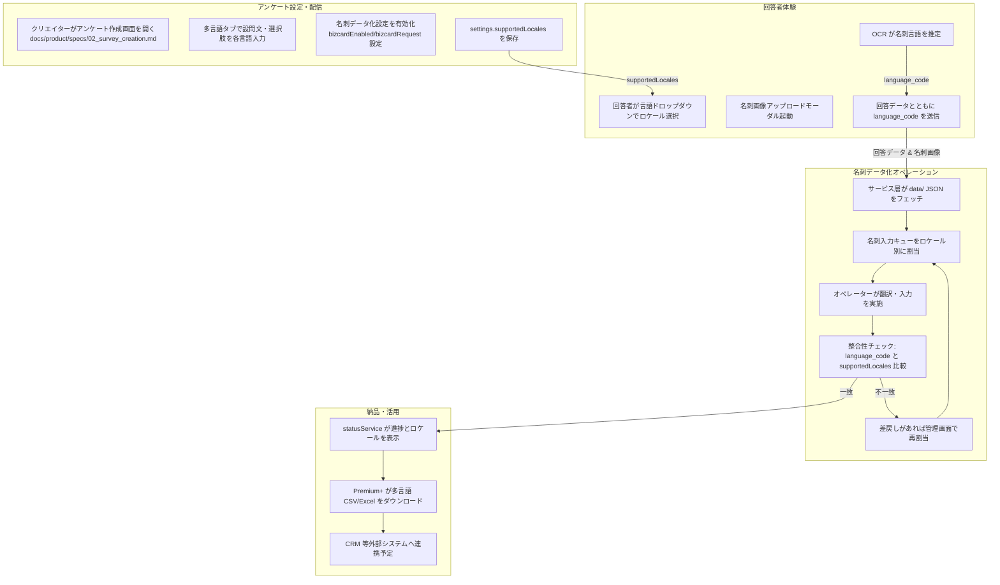

# 名刺データ化サービスにおける多言語対応フロー

## 1. 背景と目的
展示会アンケートから名刺画像を取り込み、翻訳を含めたデータ化を行うサービスにおいて、多言語対応は Premium+ を中心とした上位プランの差別化要素であり、後続業務（翻訳、オペレーター入力、分析）まで波及する。  
本書は既存仕様やデータモデルを横断し、**名刺画像を起点とするサービスフローのどこで多言語情報が発生し、どのように伝搬・検証されるか**を整理する。

## 2. 関係レイヤー概要
- **データソース層**: `data/demo_business-cards/*.json` や `data/core/surveys.json` など、モック JSON が一次ソース。多言語フィールドは `{ ja: '', en: '' }` 形式で格納する。  
- **サービス層**: `02_dashboard/src/services/` 配下のモジュールがフェッチと整形を担当。`bizcardSettingsService.js` はアンケート設定と名刺依頼数の読込／保存を担い、`bizcardPlans.js` が多言語表示に対応した料金表を提供。  
- **UI層**: `02_dashboard/src/ui/` および `survey-answer.js` が、名刺アップロードと多言語切替 UI を制御。  
- **管理・レビュー**: 03_admin 配下の画面で名刺画像／入力キューを扱い、言語別オペレーター割当や完了 CSV アップロードを想定している。  
（全体像は `docs/product/processes/05_data_flow_mapping.md` の概要図を参照）

## 3. サービスフローにおける多言語タッチポイント
1. **アンケート作成 & 名刺依頼設定**  
   - `bizcardEnabled`, `bizcardRequest` などを `settings.bizcard.*` として保存（`docs/product/specs/02_survey_creation.md:41`）。  
   - Premium 以上で多言語入力タブを開放し、質問文・選択肢を言語別 JSON に格納（同:60,64）。  
   - プラン判定は `planRestrictedComponent` で UI レベル制御、サーバー側は `plan_limits.multilingual.maxLocales` で検証（`docs/product/specs/11_plan_feature_restrictions.md:25`）。  

2. **回答画面での名刺画像取得**  
   - 多言語アンケートではヘッダーに言語切替ドロップダウンを表示（`docs/requirements/specifications/13_survey_answer_screen.md:26`）。  
   - 名刺アップロードモーダルは 4 ステップ構成で表裏撮影・プレビューを案内し、多言語 UI 文言は `survey-answer.js` 内でロケール別にロード（同:60-86, `02_dashboard/src/survey-answer.js:270-451`）。  
   - OCR による名刺言語自動判別を将来検証項目として定義し、アンケート言語と差異がある場合のフローも規定（`docs/requirements/specifications/13_survey_answer_screen.md:86-88` & `docs/product/specs/02_survey_creation.md:209-235`）。  

3. **名刺データ化処理（バックオフィス）**  
   - `speedReviewService` が CSV 由来の名刺ファイル名を多言語メタデータと結合し、表裏の URL を保持（`02_dashboard/src/services/speedReviewService.js:136-237`）。  
   - 管理画面では言語単位でキュー割当・進捗を追跡（`03_admin/admin_requirements.md:70-88`）。OCR 結果と `language_code` が一致しない場合はオペレーターに差戻し、再割当するフローを mermaid 図で定義（`docs/product/specs/02_survey_creation.md:209-235`）。  

4. **納品・ダウンロード**  
   - ステータスサービスが名刺データ化の進行度を多言語説明付きで表示（`02_dashboard/src/services/statusService.js:42-60`）。  
   - Premium+ のみ多言語 CSV/Excel エクスポートと SLA 通知を有効化（`docs/product/specs/11_plan_feature_restrictions.md:11-134`）。  

## 4. データモデルとバリデーション
- **アンケート設定 (`survey.settings`)**: `bizcardEnabled`, `bizcardRequest`, `supportedLocales` などを保持。`supportedLocales` は回答 GUI の言語タブと名刺 OCR の判定基準になる（`docs/product/specs/02_survey_creation.md:64`）。  
- **回答データ (`input_business_cards` テーブル案)**: `photo_1`, `photo_2`, `language_code`, `answer_id` などを設け、多言語フロー時は `language_code` とアンケート側ロケールの整合性チェックを行う（`docs/product/architecture/02_data_model.md:238-361`）。  
- **BusinessCard オブジェクト**: `imageUrl.front/back`・`group1`〜`group8` に翻訳後フィールドを格納。多言語翻訳済みの項目を JSON で再利用できるように設計（同:503-511）。  
- **検証ステップ**:  
  1. `language_code` がアンケート設定に存在するかチェック。  
  2. 名刺 OCR が別言語を返した場合は差戻しログ生成。  
  3. Premium+ では最大 5 言語まで `maxLocales` を検証し、超過時はアップセル導線を表示。

## 5. 提供プランと SLA
- **Free/Standard**: 名刺データ化は日本語基準で最大 3 言語まで翻訳不可。多言語 UI 要素は非表示、＋料金で一部項目拡張のみ（`docs/product/specs/11_plan_feature_restrictions.md:11-24`）。  
- **Premium**: 設問翻訳 3 言語まで、OCR の補助は手動差戻し。  
- **Premium+ (Enterprise)**: 多言語（5 言語＋自動提案）、当日～超特急プランや SLA 通知、Export オプションを開放。`bizcardPlans.js` の「多言語対応」アドオンが追加料金を表す（`02_dashboard/src/services/bizcardPlans.js:96-102`）。  
- **SLA 指標**: 回答画面では 3 秒以内応答、名刺アップロード時は進捗バー表示、サーバー保存時は暗号化を想定（`docs/requirements/specifications/13_survey_answer_screen.md:153-157`）。

## 6. 運用・テスト観点
- **手動検証**: `docs/handbook/testing/login_to_survey_answer_scenario.md:30` の ANS-006 で多言語切替と名刺処理の整合性を確認。  
- **OCR/翻訳運用**: 差戻しや再割当時のアラート通知を `survey.revisionHistory` や管理画面タスクで追跡（`docs/product/specs/02_survey_creation.md:201-235`）。  
- **将来拡張案**: API 連携時は REST/GraphQL に差し替え、`resolveDashboardDataPath` の依存除去と外部リソースファイルへのテキスト分離（`docs/product/architecture/01_ARCHITECTURE.md:40-67` & `docs/product/specs/07_graph_page_requirements.md:114`）。  

## 7. 参考ドキュメント
- アンケート作成仕様: `docs/product/specs/02_survey_creation.md:41-235`  
- 回答画面要件: `docs/requirements/specifications/13_survey_answer_screen.md:26-157`  
- プラン制約一覧: `docs/product/specs/11_plan_feature_restrictions.md:11-134`  
- データモデル定義: `docs/product/architecture/02_data_model.md:238-511`  
- データフロー概要図: `docs/product/processes/05_data_flow_mapping.md:3-74`  
- 名刺関連サービスコード: `02_dashboard/src/services/bizcardSettingsService.js:1-99`, `02_dashboard/src/services/bizcardPlans.js:4-138`  
- テストシナリオ: `docs/handbook/testing/login_to_survey_answer_scenario.md:30`
