### SPEED AD 要件定義書（多言語対応版）

文書バージョン: 2.4
作成日: 2025年11月26日 (最終改訂)

#### はじめに

本書は、SPEED ADの多言語対応に関する要件を定義します。日本企業が海外のリード情報を扱う際の課題解決を主眼に置いています。

#### 1. 要件の優先順位とスコープ

##### 1.1. フェーズ1：データ多言語対応（〜2025年12月リリース）
本要件定義書が対象とするスコープは、「アンケートデータと名刺データの多言語対応」に限定する。主な目的は、多言語でのリード獲得からデータ化、仕分けまでのプロセスを確立することである。
    対象言語（3言語/4種）: 日本語、英語、中国語（簡体字）、中国語（繁体字）。
    対象機能: 本書3章、4章に記載の機能。

##### 1.2. フェーズ2：多言語対応の拡張（2026年〜）
以下の項目は本要件定義書のスコープ外とし、フェーズ2で別途要件を定義する。
    管理画面全体の表示言語切り替え（UIの国際化）。
    韓国語、東南アジア言語、欧州言語（ドイツ語、フランス語等）への対応拡大。
    ユーザーの基本言語設定機能。

##### 1.3. 前提・用語の明確化
    デフォルト言語: ユーザーの言語設定に基づき決定する。（未設定の場合は日本語を適用）
    言語選択の優先順位: ユーザーの言語設定 > ブラウザ言語 > 第一言語（アンケート設定）の順で初期選択を提示する。
    非対応言語の名刺データ: サポート外言語が検出された場合、管理者等に通知する（通知経路はダッシュボードとメールを検討）。

---

### （サービス要件）

#### 2. 業務上の影響範囲

本改修は、既存の業務フローに以下の影響を与える。

2.1. ユーザー（サービス利用ユーザー）
    アンケート作成: 多言語対応アンケートを作成する場合、言語ごとの質問文や選択肢を登録する新しい手順が発生する。本機能はプレミアムプランの契約ユーザーに提供される。
    データ活用: ダウンロードするCSVに「回答言語」「国」の列が追加されるため、社内でのデータ仕分けや、国内外の担当者へのデータ連携プロセスを見直す必要が生じる場合がある。

2.2. オペレーター
    タスク受注フローの変更: タスクが自身の言語スキルに応じて自動で割り振られるため、手動でタスクを選択する業務は無くなる。システムから提示されたタスクを順次処理するフローに変更となる。
    業務知識の追加: 対応言語（特に中国語）特有の氏名・住所表記に関するマニュアルの習得と、語学スキルが求められる。

2.3. 管理者（オペレーター管理者含む）
    オペレーター管理業務の重要性の増大: オペレーターごとに「対応可能言語」を設定・管理する業務が発生する。特に、高度な語学スキルを持つ照合担当者の採用・教育・評価体制の構築が、サービス品質を担保する上で極めて重要になる。
        進捗管理業務の変更: 多言語データ化の進捗状況を言語別にモニタリングする必要が生じる。特定言語のタスクに遅延が発生した場合の原因究明や、オペレーターへの指示が求められる。

#### 2.4. 主要業務フロー

##### 2.4.1. アンケート回答フロー

```mermaid
graph TD
    A[回答者がQRコードをスキャン] --> B[アンケートフォームを表示];
    B --> C{言語を選択<br/>（初期表示は設定順）};
    C --> D[選択された言語でアンケートフォームを再表示];
    D --> E[回答を入力・送信];
    E --> F((回答データを保存));
    style F fill:#111,stroke:#333,stroke-width:2px
```

（補足）フォームを開いた後に言語を選択するパターンを前提とし、初期選択はアンケートの言語設定順（ユーザー言語設定 > ブラウザ言語 > 第一言語の優先順位）で提示する。

##### 2.4.2. データ化ワークフロー（スキルベース・ルーティング）

```mermaid
graph TD;
    A[データ受信（回答言語ヒント付き）] --> B[OCRで言語判定＋スコア算出];
    B --> C{対応言語かつ閾値以上？};
    C -->|はい| D[対応言語の未入力キューへ自動割当];
    C -->|いいえ| E[言語判定キューへ隔離（アンケート言語参照）];

    F[対応言語の未入力キュー] --> G[オペレーターが受領];
    G --> H[入力／再入力（最大3回）];
    H --> I{入力結果は一致？};
    I -->|はい| J[入力完了];
    I -->|いいえ（3回未満）| G;
    I -->|いいえ（3回超）| K[不一致として照合へ];
    E --> L[スキップ／差戻しで言語判定キューへ];

    J --> M((データ化完了));
    K --> N((照合で最終判断入力));
    style M fill:#111,stroke:#333,stroke-width:2px;
    style N fill:#111,stroke:#333,stroke-width:2px;
```

基本的にはアンケートの言語情報を必ず付与しているため、OCRでの言語判定を軸にアンケートの言語情報を補助的に参照する。これにより、各名刺データは判定言語に対応する未入力キューへ自動でタスク割り当てされる。

オペレーターは自身の対応言語情報に基づき、未入力キューから名刺データを受領して作業を開始する。名刺データは一致が取れるまで最大3回の再入力を行い、3回超えても一致しない場合は不一致データとして照合作業へ回送する。オペレーター入力画面で対応言語外のデータが表示された際は、スキップ機能を利用して対象外言語であれば言語判定キューへ差し戻す。

照合作業では、名刺画像の一致済み項目の突合や、不一致項目の最終判断入力を照合画面から実施する。

##### 2.4.3. 例外対応フロー（OCR/言語判定失敗）

```mermaid
graph TD
    A[データ受信] --> B{言語判定成功?};
    B -- Yes --> C[通常ルーティングへ];
    B -- No --> D[手動判定キューに登録];
    D --> E[オペレーターが言語を手動判定];
    E --> F{対応言語か?};
    F -- Yes --> G[スキルに合致するオペレーターへ再割当];
    F -- No --> H[非対応言語として管理者へ通知];
    H --> I[翻訳/対応可否の判断と指示];
    style I fill:#111,stroke:#333,stroke-width:2px
```

---

### （システム要件）

#### 3. 機能要件

##### 3.1. ユーザー向け機能
3.1.1. アンケート作成・管理（変更）
    多言語対応設定: アンケート(またはユーザー)ごとに「多言語対応」を有効化（ON/OFF）する機能を追加する。（プレミアムプラン限定機能）
    設問の多言語入力: 多言語対応がONの場合、1つの設問に対し、タブ切り替え等のUIで対象言語（日本語、英語、中国語簡体字・繁体字）の質問文や選択肢を登録・編集できる機能を追加する。

3.1.2. アンケート回答（変更・新規）
    【新規】言語選択機能: 回答者がQRコード読み取り後、使用する言語（アンケートに設定された言語から）を選択する画面を設ける。ブラウザの言語設定を元に、最適な言語を自動で推奨表示する。
    回答インターフェースの地域化: 選択された言語に基づき、設問、ボタン、エラーメッセージ等、回答プロセスに関わる全てのUIテキストをその言語で表示する。
    （内部処理）回答時に選択された言語コードを、回答データに記録する。
    非対応/未設定言語の選択: 対応言語外が選ばれた場合は第一言語で表示・保存し、警告文言を提示する。

3.1.3. データエクスポート（変更）
    CSVへの列追加: アンケート回答データおよび名刺データのCSVダウンロード時に「回答言語」の列を追加する。

###### 3.1.4. アンケート作成フロー（多言語対応 ON 時）

```mermaid
graph TD
    A[新規アンケート作成<br/>多言語対応をON] --> B[第一言語で設問入力];
    B --> C{言語タブ切替};
    C --> D[各言語タブで質問文/選択肢を入力<br/>（未入力は第一言語でフォールバック）];
    D --> E[各言語でプレビュー確認<br/>未入力・未翻訳をチェック];
    E --> F[ドラフト保存];
    F --> G[公開設定・確認<br/>言語選択画面の挙動を確認];
    G --> H[公開・配布<br/>QR/URLを共有];
    style H fill:#111,stroke:#333,stroke-width:2px
```

##### 3.2. 管理者・オペレーター向け機能

3.2.1. アンケート管理（変更）
    回答データ管理: アンケートに紐づく回答一覧画面で、回答者が選択した言語によるフィルタリング（絞り込み）機能を追加する。一覧表示には、回答言語を示す国旗アイコンや言語タグを表示する。

3.2.2. データ入力・照合管理（変更）
    ワークフロー変更（スキルベース・ルーティング）: システムは、回答者がアンケートで選択した言語、または名刺画像のOCRによる言語判定結果に基づき、対応可能な言語スキルを持つオペレーターにタスクを自動で割り当てる。
    ルーティング優先度: OCRの言語判定を主とし、回答画面の選択言語は補助ヒントとして閾値未満/判定不能時に参照する。
    【UX改善】優先言語の表示: データ入力画面において、システムが判断した入力すべき言語の優先順位（例：1.日本語, 2.英語）を明示し、オペレーターの作業効率と正確性を向上させる。
    OCR処理の最適化:
        利用API: Google Cloud Vision API を継続して利用する。
        精度向上ロジック: アンケートで回答言語が選択されている場合、その言語コード（例: 回答者が'en'を選択）を Cloud Vision API の `language_hints` パラメータとして連携し、当該言語のOCR精度を向上させる。言語情報がない場合は、APIの自動言語判定に委ねる。

3.2.3. オペレーター管理（変更）
    スキル設定機能: 管理者が、オペレーターごとに「対応可能言語」（対象言語から複数選択可）を設定できる機能を追加する。**中国語については、簡体字（zh-CN）と繁体字（zh-TW, zh-HK等）を区別して設定可能とする。**

##### 3.3. 翻訳運用フロー
    タブ切替入力: アンケート作成時に言語タブを切り替え、タブ内の項目・内容をユーザーが入力することで各言語の表示内容を決定する。（英語タブに日本語を入力するなど、言語と入力内容の不一致も許容）
    未入力項目の扱い: ある言語タブで未入力の場合、第一言語として入力された内容をデフォルト表示とする。
    翻訳責任: 翻訳内容の正確性・適法性はサービス利用者側に帰属し、サービス側では保証しない。
    保存前チェック: 保存時に未入力の言語がある場合は簡易通知（警告）を表示し、未入力言語の一覧を示した上で公開は継続可能とする。
    機械翻訳の扱い: 自動翻訳の活用を検討するが、翻訳精度はサービス内で保証しない。

#### 4. データモデルの変更

`surveys`テーブル（アンケート情報）:
    `is_multilingual_enabled` (Boolean): 多言語対応フラグを追加。
`survey_details`テーブル（アンケート設問情報）:
    質問文、選択肢等のカラムを、複数言語のテキストを格納できるJSON形式に変更。（例: `question_text` → `{"ja": "質問文", "en": "Question", "zh-CN": "问题"}`）
    バリデーション: 保存時に必須言語キーの欠落やJSON形式の不整合を検知し、エラー（必須キー欠落）/警告（任意言語欠落）を返す。
`answers`テーブル（回答データ）:
    `language_code` (String): 回答者が選択した言語コードを記録するカラムを追加。（例: 'ja', 'en', 'zh-CN' ...）
        CSV出力仕様: 言語列はBCP47の言語コードを出力し、文字コードはUTF-8（必要に応じBOM付与）とする。未翻訳フォールバック時も元の言語コードを保持する。
`admin_users`テーブル（オペレーター情報）:
    `skill_languages` (JSON/Text): 対応可能言語を配列で保存するカラムを追加。（例: `["ja", "en", "zh-Hant"]`）

#### 5. 将来的な拡張計画（フェーズ2以降）

UIの完全な国際化: 管理画面全体をユーザーの基本言語設定に応じて表示変更する機能。
対応言語の拡大: 韓国語、東南アジア言語（ベトナム語、タイ語等）、欧州言語（ドイツ語、フランス語等）への対応。
ユーザーの基本言語設定機能: ユーザー情報に「基本言語」を追加し、管理画面表示や各種通知の言語に反映させる機能。

---

##### 6. 非機能要件

6.1. パフォーマンス
    データ化速度: 多言語対応後も、既存の日本語データ化と同等のSLA（サービス品質保証）を維持する。特に、スキルベース・ルーティングによるタスク割り当て処理がボトルネックにならないこと。
    応答時間: アンケートの言語選択画面や回答画面の表示速度は、3秒以内を目標とする。

6.2. セキュリティ
    アクセス制御: オペレーターは、自身のスキルセットに合致しない言語のデータにはアクセスできないようにする。
    データ保護: 個人情報を含むデータは、従来通り暗号化し、厳格なアクセス管理を行う。
    未対応言語アラート: 対応可能なオペレーターが不在の場合は、同グループのオペレーター管理者、およびそれ以上の権限者へ通知（ダッシュボードとメール通知を想定）。
    監査ログ: 言語スキル設定の変更、最終言語（finalLocale）の補正、再割当操作を監査ログに記録し、追跡可能にする。

6.3. 可用性
    システム稼働率: 99.9%以上を維持する。

6.4. 運用・保守
    モニタリング: 言語ごとのデータ処理量や処理時間を監視し、特定言語のタスク遅延を早期に検知できる仕組みを構築する。
    設定変更の容易性: 将来的な対応言語の追加・変更が、大規模なシステム改修を伴わずに、設定ファイルの変更等で柔軟に対応できる設計とする。
    **UIフォント:** 多言語（特に中国語の簡体字・繁体字）を正しく表示するためのWebフォントについては、現在最適なものを検討中。
    **エラーハンドリング:** 対応可能なオペレーターが存在しない場合や、OCRの言語判定が失敗した場合のリカバリーフローなど、詳細なエラーハンドリング方針については現在検討中。

6.5. テスト戦略（暫定）
    E2E: 言語切替→回答→CSV出力で言語コードが保持されることを主要言語（ja/en/zh-CN/zh-TW）で検証。
    OCR連携: 言語選択あり/なし両ケースで `language_hints` の付与とOCR結果の整合性を確認。
    UIレイアウト: 各言語での文字量増による崩れを簡易ビジュアルチェックで確認。
    権限/通知: 非対応言語タスクでのアラート通知（ダッシュボード・メール）を確認。

---
以上
