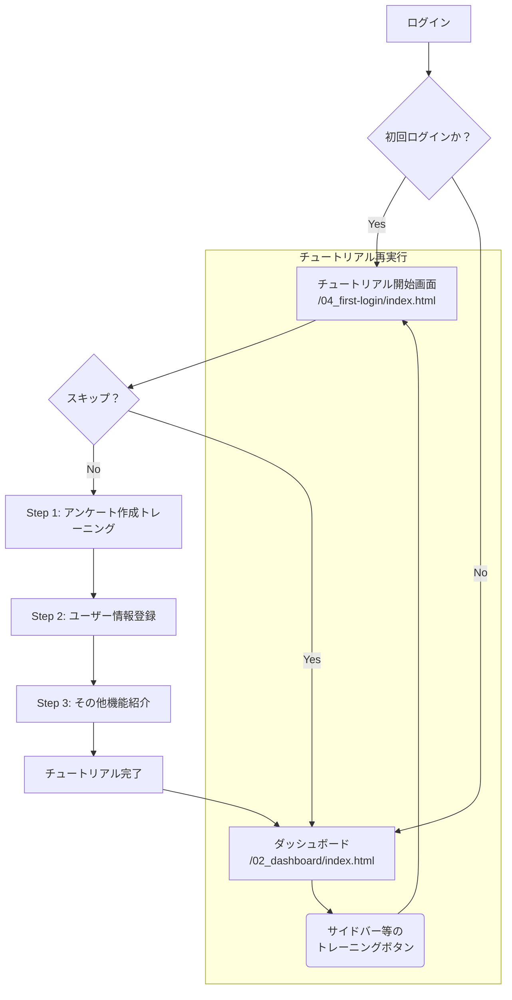

# 初回ログインチュートリアル機能 要件定義書

**バージョン: 2.0**

## 1. 概要

### 1.1. 目的
本資料は、SPEED ADサービスに新規登録したユーザーが、初回ログイン時に体験するオンボーディング（初回利用案内）機能、通称「初回ログインチュートリアル」の仕様を定義するものである。
本機能の主な目的は、ユーザーがサービスの基本的な操作方法（特にアンケート作成とアカウント情報登録）をスムーズに習得し、サービス利用開始のハードルを下げることにある。

### 1.2. 背景
SPEED ADは多機能であるため、新規ユーザーが全ての機能を独力で把握するのは困難な場合がある。特に、コア機能であるアンケート作成のプロセスを最初に理解してもらうことで、ユーザーのサービスへの定着率を高めることを目指す。

## 2. 機能要件

### 2.1. チュートリアル全体仕様

| ID | 機能名 | 機能概要 | 実装詳細 / 考慮事項 |
| :--- | :--- | :--- | :--- |
| F-001 | チュートリアル自動開始 | 新規作成されたアカウントが初回ログインした際、ダッシュボード表示前に本チュートリアルを自動的に開始する。 | ・初回ログイン判定は、ユーザーオブジェクトに `isFirstLogin` や `lastLoginAt` のようなフラグを持たせ、サーバーサイドで判定するのが望ましい。 ・フロントエンドは、ログイン後のユーザー情報に基づきチュートリアルを開始する。 |
| F-002 | スキップ機能 | ユーザーは任意のタイミングでチュートリアルを中断し、スキップすることができる。スキップ後は、メインのダッシュボード画面 (`/02_dashboard/index.html`) に遷移する。 | ・スキップボタンは画面右上に「チュートリアルをスキップ」テキストとして常に表示する。 ・スキップした場合、`localStorage` 等に `tutorialSkipped: true` のフラグを保存し、次回以降のログインで自動開始しないようにする。 |
| F-003 | チュートリアルの再実行 | 一度完了またはスキップした後でも、ユーザーが任意にチュートリアルを再度実行できる機能を設ける。 | ・サイドバーの「ヘルプ」セクション内に「初回チュートリアルをもう一度見る」リンクを配置する。 ・クリックすると `04_first-login/index.html` に遷移し、チュートリアルを開始する。 |
| F-004 | インタラクティブなUIガイド | 説明対象のUI要素をハイライトし、それ以外の画面領域はダークオーバーレイで覆う（スポットライト効果）。 | ・CSSの `box-shadow` や複数の `div` 要素を組み合わせてくり抜き効果を実装する。 ・対象要素の座標は `element.getBoundingClientRect()` で動的に取得する。 ・ウィンドウリサイズ時には追従して再計算する。 |
| F-005 | ガイド表示 | 矢印や吹き出しを用いて、次に操作すべき箇所やその説明を視覚的に表示する。 | ・吹き出しはハイライトされた要素の上下左右、最適な位置に自動で表示されるようにする。 ・吹き出しのデザインは、角丸でドロップシャドウを付け、視認性を高める。 |
| F-006 | 操作の制限 | チュートリアル中は、ガイド対象外のUI要素に対するクリックや入力を無効化する。 | ・オーバーレイ `div` の `z-index` を最前面に設定し、`pointer-events: auto;` にすることで、背後の要素への操作をブロックする。 ・ハイライト対象の要素のみ `z-index` をさらに高くし、`pointer-events` を有効にする。 |
| F-007 | 進捗表示 | チュートリアル全体の進捗状況を示すプログレスバーを画面上部または下部に表示する。 | ・「ステップ 3 / 10」のようなテキスト形式と、視覚的なバーを組み合わせる。 |
| F-008 | 状態管理と復帰 | チュートリアルの進捗（現在のステップ）は `localStorage` に保存する。 | ・これにより、ユーザーが途中でブラウザをリロードしたり閉じたりしても、次回アクセス時に同じステップから再開できる。 ・チュートリアル完了またはスキップ時に `localStorage` の進捗情報は削除する。 |

### 2.2. チュートリアルのシナリオ

#### Step 1: アンケート作成トレーニング（必須）
**目的:** ユーザーに、コア機能であるアンケート作成の一連の流れを体験させる。
**注意:** 本トレーニングで作成されるアンケートは、サーバーには保存されない。

| ID | シナリオ | ガイド文言（吹き出し内のセリフ例） | ユーザー操作 |
| :--- | :--- | :--- | :--- |
| S1-001 | トレーニング開始 | 「SPEED ADへようこそ。最初に、基本的な操作に慣れていただくためのチュートリアルを開始します。ここで入力された内容は保存されませんので、ご安心ください。」 | 「トレーニングを開始する」をクリック |
| S1-002 | 新規アンケート作成 | 「それでは、最初のアンケートを作成します。画面右上の『+ アンケート新規作成』ボタンをクリックしてください。」 | 「+ アンケート新規作成」ボタンをクリック |
| S1-003 | 基本情報の入力（アンケート名） | 「こちらは『アンケート名』です。社内でアンケートを識別・管理するための名称となります。回答者には公開されませんので、管理しやすい名称をご入力ください。」 | 任意のテキストを入力（例：2025年 夏期展示会用アンケート） |
| S1-004 | 基本情報の入力（表示タイトル） | 「次に『表示タイトル』をご入力ください。こちらが、アンケート画面で回答者様に表示される正式なタイトルとなります。」 | 任意のテキストを入力（例：製品Aに関する満足度調査） |
| S1-005 | 基本情報の入力（回答期間） | 「『回答期間』では、アンケートを実施する期間をカレンダーより設定します。展示会の会期やキャンペーン期間などをご指定ください。」 | カレンダーUIで任意の日付範囲を選択 |
| S1-006 | アンケート作成実行 | 「基本情報の入力は以上です。それでは『作成する』ボタンをクリックし、設問設定へお進みください。」 | 「作成する」ボタンをクリック |
| S1-007 | 設問グループ作成 | 「こちらは設問を編集する画面です。まず、関連する質問をまとめる『グループ』を作成します。グループ名をご入力ください。（例：お客様の基本情報について）」 | 任意のテキストを入力（例：基本情報） |
| S1-008 | 設問の追加 | 「グループが作成されました。次に、画面右下の『+』ボタンをクリックして、最初の質問を追加してください。」 | フローティングアクションボタン（+）をクリック |
| S1-009 | 設問の作成（記述式） | 「質問が追加されました。こちらに質問文をご入力ください。この『記述式』は、回答者が文章で自由に回答する形式の設問です。（例：弊社サービスを何でお知りになりましたか？）」 | 任意の質問文を入力 |
| S1-010 | 設問の作成（単一選択） | 「次にもう一つ、別の形式の質問を追加します。複数の選択肢から一つを選んでいただく『単一選択』です。質問文と、いくつかの選択肢をご入力ください。」 | 質問文と選択肢を2〜3個入力 |
| S1-011 | プレビュー機能の確認 | 「設問が作成できました。回答者からどのように見えるかは、いつでも『プレビュー』機能でご確認いただけます。こちらをクリックしてご確認ください。」 | 「プレビュー」ボタンをクリック |
| S1-012 | トレーニング完了 | 「（プレビューから戻った後）以上で、アンケート作成の一連の流れは完了となります。『アンケートを保存』をクリックして、このトレーニングを終了してください。」 | 「アンケートを保存」ボタンをクリック |

#### Step 2: ユーザー情報登録（必須）
**目的:** サービスの利用に不可欠なユーザー（企業）情報の登録を促す。
**注意:** ここで入力されたデータは、実際にデータベースに保存される。

| ID | シナリオ | ガイド文言（吹き出し内のセリフ例） | ユーザー操作 |
| :--- | :--- | :--- | :--- |
| S2-001 | アカウント情報画面への誘導 | 「アンケート作成、お疲れ様でした。次に、請求書の送付先など、お客様の重要な情報を登録します。サイドバーの『アカウント情報』をクリックしてください。」 | 「アカウント情報」メニューをクリック |
| S2-002 | プロフィール情報の入力 | 「こちらで、お客様の企業名やご住所、請求先情報などを設定します。この内容は実際に保存されますので、お間違いのないよう正確にご入力ください。」 | モーダル内の各項目に実際の情報を入力 |
| S2-003 | 保存の実行 | 「ご入力ありがとうございます。『保存』ボタンをクリックして、内容を登録してください。」 | 「保存」ボタンをクリック |

#### Step 3: その他の機能紹介（任意）
**目的:** コア機能以外の重要な機能の存在を認知させ、利用を促す。

| ID | シナリオ | ガイド文言（吹き出し内のセリフ例） |
| :--- | :--- | :--- |
| S3-001 | 機能紹介 | 「基本的な設定は以上となります。SPEED ADには他にも、名刺をデータ化する機能や、回答者へのお礼メールを自動で送る機能など、事業を加速させるための様々な機能がございます。」 |
| S3-002 | チュートリアル完了 | 「各機能の詳しい使い方は、画面内のヘルプや、サイドバーの『初回チュートリアル』からいつでもご確認いただけます。それでは、SPEED ADのダッシュボードへ進みましょう。」 |
| S3-003 | ダッシュボードへ | （「SPEED ADをはじめる」ボタン表示） |

## 3. 非機能要件

| 項目 | 内容 |
| :--- | :--- |
| **UI/UX** | ・ユーザーが操作に迷わない、直感的で分かりやすいインターフェースであること。 ・吹き出しは角丸でドロップシャドウを付け、モダンなデザインとする。 ・プログレスバーやハイライトのアニメーションは、スムーズで心地よい体験を提供する。 |
| **パフォーマンス** | ・チュートリアル表示による、ブラウザの描画遅延や操作の遅延を0.1秒未満に抑える。 |
| **技術スタック/ライブラリ候補** | ・インタラクティブなガイドの実装には、既存のJavaScriptライブラリ（例: **intro.js**, **driver.js**, **shepherd.js**）の利用を積極的に検討する。これにより、開発コストを削減し、ウィンドウリサイズへの追従や複数ブラウザ対応など、安定した動作を期待できる。 |

## 4. 画面遷移図

## 5. 実装上の考慮事項

- **チュートリアルエンジン:**
  - 吹き出しの位置、スポットライトのくり抜き、次のステップへの進行などを管理する、一連のロジックを「チュートリアルエンジン」としてコンポーネント化する。
  - エンジンは、ステップの設定（対象要素のセレクタ、表示する文言など）をJSON形式で受け取り、チュートリアルを進行できるように設計する。

- **エラーハンドリング:**
  - チュートリアル中に、対象のDOM要素が見つからない場合（画面構成の変更など）、コンソールにエラーを出力し、チュートリアルを安全に強制終了する。
  - ユーザーがガイド外の操作を試みた場合は、操作を無効化し、ガイドに従うよう促すメッセージを短時間表示することも検討する。

- **データフロー:**
  - **トレーニング用アンケート:** 作成中のデータは、JavaScriptのメモリ上のオブジェクトとして保持する。ページ遷移をまたぐ場合は、`sessionStorage` を利用して一時的に保持する。
  - **ユーザー情報:** 「保存」ボタン押下時に、`fetch` を用いてAPI（例: `PATCH /api/users/{userId}/profile`）にリクエストを送信する。
