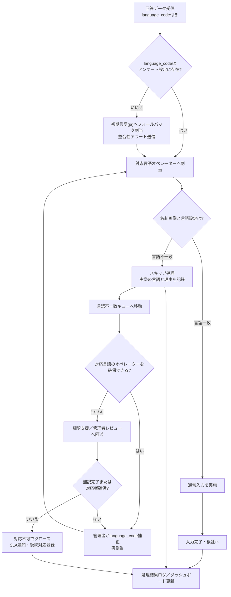

# アンケート新規作成・編集ページ仕様書（完全版・多言語対応反映）

## 1. 概要

本ドキュメントは、アンケート新規作成・編集ページの画面仕様と機能要件を定義する。ユーザーは本ページで新しいアンケートを作成し、既存のアンケートを編集できる。画面上の表示は日本語のみとするが、アンケート自体は多言語設定が可能である（日本語・英語・中国語簡体字・中国語繁体字）。

---

## 2. 画面レイアウト

* **ヘッダー:** 共通。ブランドロゴ、ユーザー情報。
* **サイドバー:** 共通。ナビゲーションメニュー。
* **メインコンテンツ:** アンケート作成・編集フォーム。

---

## 3. 入力項目とバリデーション

### 3.1 基本情報

| 項目名       | ID               | タイプ     | 必須 | バリデーション          | データ構造            |
| --------- | ---------------- | ------- | -- | ---------------- | ---------------- |
| アンケート名    | `surveyName`     | テキスト    | ✔  | 空禁止、最大50文字       | `name`           |
| 表示タイトル    | `displayTitle`   | テキスト    | ✔  | 空禁止、最大100文字      | `displayTitle`   |
| 説明        | `description`    | テキストエリア | -  | 最大500文字          | `description`    |
| 回答受付開始日   | `periodStart`    | 日付      | ✔  | 空禁止、日付形式、翌日以降（当日は不可） | `periodStart`    |
| 回答受付終了日   | `periodEnd`      | 日付      | ✔  | 空禁止、開始日以降        | `periodEnd`      |
| プラン       | `plan`           | プルダウン   | ✔  | 通常/特急/超特急/オンデマンド | `plan`           |
| データ化完了予定日 | `completionDate` | 自動計算    | -  | 営業日計算ルールに基づく     | `completionDate` |
| メモ        | `memo`           | テキストエリア | -  | 最大1000文字         | `memo`           |

- **名称の使い分け**: 「アンケート名」は社内向けの管理名称、「表示タイトル」は回答者に表示するタイトル。両フィールドにヘルプアイコンを配置し、ポップオーバーで用途の違いを説明する。

#### データ化完了予定日の計算ルール

* 営業日: 平日（土日・祝日は除外）。祝日は `holidays.json` で管理。
* 計算例: 終了日=2025/09/01, プラン=通常 → 完了予定日=2025/09/09。

---

### 3.2 名刺データ関連

| 項目名        | ID               | タイプ   | 必須                        | バリデーション | データ構造                           |
| ---------- | ---------------- | ----- | ------------------------- | ------- | ------------------------------- |
| 名刺データ化     | `bizcardEnabled` | プルダウン | -                         | 有効/無効   | `settings.bizcard.enabled`      |
| 名刺データ化依頼枚数 | `bizcardRequest` | 数値    | `bizcardEnabled=有効` の場合必須 | 整数、0以上  | `settings.bizcard.requestCount` |

---

### 3.3 お礼メール設定

| 項目名         | ID                      | タイプ     | 必須           | バリデーション      | データ構造                             |
| ----------- | ----------------------- | ------- | ------------ | ------------ | --------------------------------- |
| お礼メール       | `thankYouEmailSettings` | プルダウン   | ✔            | 自動送信/手動/設定なし | `settings.thankYouEmail.mode`     |
| メール本文テンプレート | `thankYouEmailTemplate` | テキストエリア | `自動送信` の場合必須 | 最大2000文字     | `settings.thankYouEmail.template` |
| 差出人情報       | `thankYouEmailSender`   | テキスト    | `自動送信` の場合必須 | メールアドレス形式    | `settings.thankYouEmail.sender`   |

---

### 3.4 多言語対応設定

| 項目名     | ID                      | タイプ     | 必須                               | バリデーション                   | データ構造                                   |
| ------- | ----------------------- | ------- | -------------------------------- | ------------------------- | --------------------------------------- |
| 多言語対応   | `isMultilingualEnabled` | トグルスイッチ | -                                | ONの場合、各設問に多言語入力欄が表示される    | `is_multilingual_enabled`               |
| 設問多言語入力 | `localizedQuestions`    | タブUI入力  | `isMultilingualEnabled=ON` の場合必須 | 対象言語: 日本語、英語、中国語(簡体字/繁体字) | `survey_details.question_text` (JSON形式) |

- **表示条件**: プロフェッショナルプラン以上でのみ `多言語対応` セクションを表示し、スタンダード/無料プランではセクションを非表示にする。

---

## 4. 質問グループ・質問項目設定

* 質問グループ: 追加/複製/削除/並べ替え可。
* 質問項目: グループ内で複数追加可能。複製/削除/並べ替え可。番号は自動振り直し。
* 設問追加: 各グループカードの「設問を追加」ボタンから対象グループに直接追加でき、空のグループでも同操作が可能。
* 質問タイプ: シングルアンサー、マルチアンサー、フリーアンサー、プルダウン選択、数値入力、日付入力、マトリクス。
* **多言語入力:** 多言語対応ON時は、質問文・選択肢を各言語タブで入力可能。

---

## 5. UI/UX

* **フローティング質問追加ボタン:**
    *   **初期位置:** 画面を開いた直後は、右下の定位置に表示される。
    *   **移動機能:** ユーザーはこのボタンをドラッグすることで、画面内の任意の位置に自由に移動させることができる。
    *   **位置の記憶:** 移動した位置は、セッション中（ページをリロードするまで）は記憶される。
* メニューは画面外にはみ出さない。
* スクロール/リサイズでメニュー自動クローズ。
* **QRコードプレビュー**: 「QRコード」ボタン押下で回答用URLのQRコードをモーダル表示し、コピー/ダウンロード操作を提供する。アンケートID未発行時はボタンを無効化する。
* アウトラインマップ表示（PC:常時, モバイル:非表示）。リンク選択時は対象セクションに `scroll-margin-top` を設定し、ページ上部に揃えてスクロール・フォーカスを移動する。
* 目次アクション: 目次内に「プレビュー表示」「アンケート保存」ボタンを常設し、未保存の変更がある場合のみ活性化する。
* **多言語入力UI:** 言語タブ切替式。未入力言語がある場合はタブに警告アイコンを表示。
* **アクセシビリティ:** キーボード操作/スクリーンリーダー対応。

---

## 6. データ連携

* `surveyService.js` 経由でAPI通信。
* API変更点:

  * `is_multilingual_enabled` の送受信追加。
  * `survey_details.question_text` をJSON形式で送受信。
  * 回答データ(`answers`)に `language_code` を保存。
* CSVエクスポートに「回答言語」「国」列を追加。

---

## 7. モーダル連携

* アカウント情報 (`accountInfoModal.js`)
* 問い合わせ (`contactModal.html`)
* 名刺設定 (`bizcardSettings.html`)
* サンキューメール設定 (`thankYouEmailSettings.html`)

---

## 8. 保存時の総合バリデーション

* 必須項目の網羅性（基本情報/お礼メール/多言語入力）。
* 少なくとも1つの質問グループに1項目。
* 選択肢付き質問には2つ以上の選択肢。
* 条件付き必須: 名刺依頼枚数、お礼メール、言語ごとの質問文/選択肢。

### エラーメッセージ仕様

* 項目直下に赤字で表示。
* ページ上部に「保存に失敗しました（詳細は各項目を確認してください）」を表示。
* **多言語入力エラー:** 言語タブに警告アイコンを表示。
* 表示言語は日本語のみ（管理画面）。

---

## 9. 多言語アンケート回答フロー

* 回答者がQRコードを読み取ると、言語選択画面を表示。
* ブラウザの言語設定を検出し推奨言語をハイライト。
* 選択された言語でアンケートUIを表示。
* 回答データに `language_code` を保存。

---

## 10. データモデル変更

* `surveys`: `is_multilingual_enabled` (Boolean) 追加。
* `survey_details`: 質問文・選択肢をJSON形式で保持。
* `answers`: `language_code` を追加。
* `admin_users`: `skill_languages` を配列で保持（中国語は簡体字・繁体字を区別）。

---

## 11. 非機能要件

* パフォーマンス: 多言語対応後も応答速度3秒以内。
* セキュリティ: 言語スキル外のデータアクセス禁止。
* 可用性: 稼働率99.9%以上。
* 運用・保守: 言語別の処理量をモニタリング。設定ファイルで言語追加に柔軟対応。Webフォントは中国語対応済みを採用。
* OCR最適化: 回答言語が指定されている場合、Google Cloud Vision API に `language_hints` を連携。

---

## 12. 今後の拡張（フェーズ2以降）

* 対応言語の拡大（韓国語・東南アジア言語・欧州言語など）。
* ユーザー基本言語設定機能。

---

## 6. 設問タイプ仕様決定 (2025-09-28)

### 6.1 数値入力（`number_answer`）
- **UI**: 設問編集時に「整数」と「小数」モードを切り替えるトグルと、任意の単位ラベル入力欄を追加する。回答画面では `<input type="number">` を用い、モバイル端末では数値キーボードを表示する。
- **バリデーション**: `question.validation.numeric` を新設し、`mode`（`integer` / `decimal`）、`min`・`max`（未設定時は制限なし）、`precision`（小数点以下桁数）、`step`（UI制御用・デフォルトは `mode` に従って 1 または 0.1）、`unitLabel` を保持する。UI上はリアルタイムで入力値を検証し、条件から外れた場合はエラー表示と保存不可で統一する。
- **回答保存**: 回答JSONでは `value` を数値で保持し、追加で `unit` を任意記録する（単位が設定されている場合のみ）。将来の地域別単位換算に備えて `unitSystem`（例: `metric`）をオプションフィールドとして許容する。

### 6.2 日付/時刻入力（`date_time`）
- **UI**: 編集画面で `inputMode`（`date` / `time` / `datetime`）を選択、`timezone` プルダウンは初期値を `Asia/Tokyo` としつつ、IANA Time Zone Database を基に多言語展開時に候補を拡張できるようにする。`min`, `max`, `allowPast`, `allowFuture` を設定できるパネルを用意する。回答画面では flatpickr をモード別に設定し、`datetime` 選択時のみ時刻ピッカーを併用する。
- **バリデーション**: `question.dateTimeConfig` に `inputMode`, `timezone`, `minDateTime`, `maxDateTime`, `allowPast`, `allowFuture` を保持。`inputMode` が `date`・`time` の場合も `timezone` を保存し、将来のローカライズで現地時間に変換できるようにする。
- **回答保存**: `datetime` モードは `valueLocal`（例: `2025-10-01T09:00:00+09:00`）と `valueUtc`（UTCに正規化したISO8601）を両方保存。`date` は `YYYY-MM-DD` 形式、`time` は `HH:mm[:ss]` 形式で保持し、解析時に `timezone` と組み合わせてUTCへ変換できるようにする。

### 6.3 手書き入力（`handwriting`）
- **UI**: 600×200px のキャンバスと「やり直し」「全消去」「背景ガイド切替（方眼/無地）」ボタンを標準搭載。スタイラス入力に備え、タッチ操作とマウス操作を両対応とする。
- **設定**: `question.handwritingConfig` に `canvasWidth`（既定600）、`canvasHeight`（既定200）、`penColor`, `penWidth`, `backgroundPattern`（`plain` / `grid`）を保持。`penColor` はテーマ配色情報から初期化しつつ任意変更を許容する。
- **回答保存**: 回答JSONでは `dataUrl`（PNG Base64、先頭の `data:image/png;base64,` を含む）と `strokeMetadata`（各ストロークの座標・線幅を配列で保持、将来のベクターデータ活用を想定）を格納する。ファイルサイズの上限は 1MB を基準値とし、超過時は保存前にPNG圧縮を行う。

### 6.4 多言語入力・翻訳運用
- **言語構成**: 基本言語は日本語（固定）とし、運用組織が管理する対応言語リストから第二・第三言語をアンケートごとに選択する。対応言語の初期ラインナップは日本語・英語・中国語（繁体字）・中国語（簡体字）・ベトナム語とし、最大3言語構成（日本語＋選択済み言語）をサポートする。
- **入力タブ運用**: 設定された言語ごとに入力タブを生成し、選択解除でタブ単位の入力UIを非表示にする。タブの追加・削除時は各フィールドの多言語オブジェクトへ対応キーを追加/削除し、未選択言語のフィールドは編集UIに出さない。
- **ルーティングと表示の乖離許容**: 第二言語設定は回答データのルーティングに利用され、実際の表示テキストが設定言語と異なる場合でも保存可能とする（例: 第二言語=中国語だが英語表記）。この場合は入力オペレーターへの注意喚起として警告バナーを表示する。
- **未入力時の警告**: 日本語以外のタブで未入力フィールドが残る場合は保存前に確認モーダルを表示し、「未翻訳の項目があります」と警告した上で保存継続/中断を選択させる。第二言語以降が未設定のアンケートではモーダルは表示しない。
- **プレースホルダー**: 設問文・選択肢・行列ラベルの初期値辞書を `resources/i18n/survey_editor.json`（新設予定）で管理し、日本語・英語の双方にプレースホルダーを提供する。未入力言語には淡色の「未翻訳」バッジを表示する。
- **必須言語**: 現行は日本語(`ja`)のみ必須。公開時に `question.text.ja`・選択肢/行列の `text.ja` が空の場合はブロッカーとする。英語(`en`)は任意だが、空の場合は警告バナーを表示し保存は可能とする。
- **将来の自動翻訳**: `question.localizationPolicy` を追加し、`autoTranslateStrategy`（`manual` / `machine_suggest`）を保持。初期値は `manual` とし、将来的に翻訳APIを組み込む際は `machine_suggest` へ切り替えることで提案文を表示できるようにする。

### 6.6 プレビュー／公開状態管理
- **プレビューの言語切替**: 編集画面右上にプレビュー言語セレクタを追加し、選択した言語でアンケートプレビューを開く。未翻訳の項目は日本語をフォールバック表示し、横に「未翻訳」バッジを付与する。
- **プレビュー表示レイアウト**: スマートフォン幅（375px想定）のビューポートで表示し、ボタン・入力の余白や角丸は回答画面と一致させる。選択肢の見た目は実際の回答画面同様に「◯」「□」などの記号で描画する。
- **公開前チェック**: 公開操作時は対象アンケートで選択済みの言語について未入力フィールドや警告の有無を自動走査し、問題があればダイアログで一覧表示する。日本語側にブロッカーがあれば公開不可、その他言語は警告を表示しつつ続行可とする。
- **公開後の言語追加・修正**: 公開中に言語タブを増やす／編集する場合は下書きバージョンを作成し、翻訳入力後に再公開する。再公開までの間、追加言語は回答者に非表示とし、既存回答は旧バージョンを維持する。
- **バージョン履歴**: 各公開時点の多言語データを履歴として保持し、いつどの言語が変更されたかを確認できるよう `survey.revisionHistory` に言語ごとの更新メタデータを記録する。
- **通知運用**: 公開前チェックで警告が残った状態で公開する場合、関係者（入力オペレーター／翻訳担当）へ通知メールまたは管理画面のタスク通知を送付する運用を標準とする。

### 6.5 データモデルへの反映
- 各設問は `question.meta` をルートに追加し、`validation`, `dateTimeConfig`, `handwritingConfig`, `localizationPolicy` などの拡張設定を格納する。既存JSONとの互換性を保つため、フィールドはすべて任意（存在しない場合は従来挙動）とする。
- アンケート全体のタイムゾーン既定値は `survey.defaultTimezone` を `Asia/Tokyo` で初期化し、`date_time` 設問が個別設定を持たない場合はこの値を参照する。海外展開時はテナント単位で初期値を切り替えられるようにする。
- API/保存形式はISO8601およびUTF-8で統一し、サーバー側もUTC正規化・単位系メタデータ・画像サイズ検証を行う。

