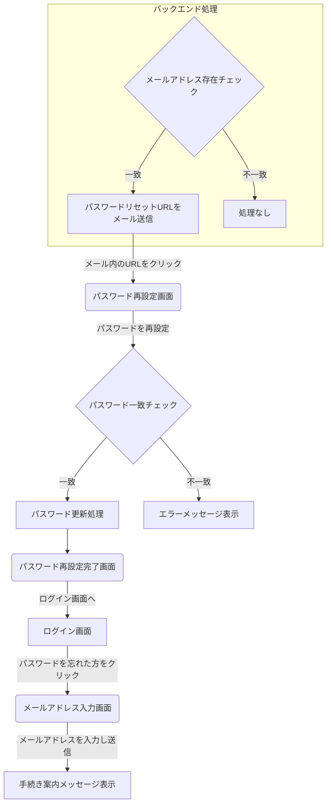

# 要件定義書: パスワードリセット機能 (v1.1)

## 1. 概要

本ドキュメントは、ユーザーがパスワードを忘れた際に、自身で安全にパスワードを再設定するための「パスワードリセット機能」に関する要件を定義する。

## 2. 機能一覧

- メールアドレス入力機能
- パスワードリセット手続き案内機能
- パスワード再設定機能
- パスワード再設定完了通知機能

## 3. 画面遷移図

**フロー解説:**
メールアドレスの登録有無に関わらず、画面上は常に同じ案内メッセージを表示することで、悪意のある第三者がメールアドレスの存在を確認できる「タイミング攻撃」のリスクを低減する。

## 4. 各画面の仕様

### 4.1. メールアドレス入力画面 (`/forgot-password`)

- **目的:** ユーザーが登録済みのメールアドレスを入力し、パスワードリセットのプロセスを開始する。
- **画面項目:**
    - **タイトル:** パスワードをお忘れですか？
    - **説明文:** 「ご登録のメールアドレスを入力してください。パスワード再設定用のURLをお送りします。」
    - **入力フィールド:**
        - **ラベル:** メールアドレス
        - **タイプ:** `email`
        - **必須:** はい
    - **ボタン:**
        - **ラベル:** 送信
        - **動作:** クリック後、処理が完了するまでボタンを無効化し、二重送信を防止する。
    - **エラー表示領域:**
        - メールアドレスが未入力の場合や、形式が不正な場合にエラーメッセージをインラインで表示する。

### 4.2. パスワードリセット手続き案内

- **目的:** メールアドレス送信後のアクションをユーザーに案内する。
- **処理フロー:**
    1. ユーザーがメールアドレスを入力して「送信」ボタンをクリックする。
    2. **（フロントエンド）** 画面に「ご入力のメールアドレスに、パスワード再設定の手順をお送りしました。メールをご確認ください。」というメッセージを表示する。
    3. **（バックエンド）**
        - 入力されたメールアドレスが登録済みかを確認する。
        - **登録済みの場合のみ**、対象のメールアドレス宛に、パスワードリセットURLを記載したメールを送信する。
        - **未登録の場合は、メール送信処理を行わない。**

### 4.3. パスワード再設定画面 (`/reset-password`)

- **目的:** ユーザーが新しいパスワードを設定する。この画面には、メールで送信された有効なURLからのみアクセスできる。
- **画面項目:**
    - **タイトル:** パスワードの再設定
    - **入力フィールド (1): 新しいパスワード**
        - **タイプ:** `password`
        - **必須:** はい
        - **表示/非表示機能:** 入力内容を確認するためのアイコン（目など）を設置する。
    - **パスワード強度インジケーター:**
        - 入力に応じて強度「弱い(赤)」「普通(黄)」「安全(緑)」と色をリアルタイムに表示する。
        - **強度基準テキスト:** 「推奨: 8文字以上で、英字、数字、記号を組み合わせるとより安全になります。」
    - **入力フィールド (2): 新しいパスワード（確認用）**
        - **タイプ:** `password`
        - **必須:** はい
    - **エラー表示領域:**
        - 2つのパスワードが一致しない場合に「パスワードが一致しません。」とインライン表示する。
    - **ボタン:**
        - **ラベル:** パスワードを再設定

### 4.4. パスワード再設定完了画面

- **目的:** パスワードの再設定が正常に完了したことをユーザーに通知する。
- **画面項目:**
    - **メッセージ:** 「パスワードの再設定が完了しました。」
    - **ボタン/リンク:**
        - **ラベル:** ログイン画面へ
        - **動作:** クリックするとログイン画面に遷移する。

## 5. パスワード強度基準

- **判定ロジック:**
    - `zxcvbn`などのライブラリを利用し、パスワードの強度を0から4のスコアで内部的に計算する。
    - **弱い:** スコアが2未満
    - **普通:** スコアが2以上4未満
    - **安全:** スコアが4以上
- **スコア計算の考慮要素:**
    - 文字数、文字種の組み合わせ（英大小文字、数字、記号）、辞書に載っている単語でないか、などを総合的に評価する。

## 6. 非機能要件

### 6.1. セキュリティ
- **パスワードリセットURL:**
    - **有効期限:** 発行から**1時間**とする。
    - **一意性:** 一度使用されたURLは無効化する。
    - **推測困難性:** 暗号論的に安全なランダムなトークンを含める。
- **パスワード保存:**
    - パスワードは、bcryptなどの強力なハッシュアルゴリズムを用いてハッシュ化してからデータベースに保存する。平文では保存しない。
- **タイミング攻撃対策:**
    - メールアドレス入力画面の応答は、アドレスの登録有無にかかわらず一定に保つ。

### 6.2. パフォーマンス
- 各画面は3秒以内に表示されること。
- パスワード強度の判定は、ユーザーの入力を妨げない速度で実行されること。