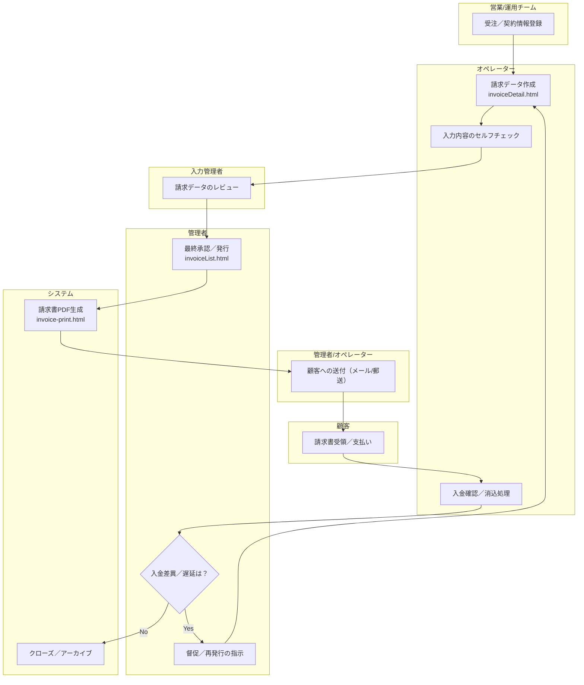

# 04 請求（Order-to-Cash）

本ドキュメントは、受注から請求書の発行、送付、入金確認、消込に至るまでの一連のプロセス（Order-to-Cash）を定義します。

**関連ドキュメント:**
- **役割定義**: [02_roles_and_responsibilities.md](./02_roles_and_responsibilities.md)
- **データ定義**: [07_data_flow_mapping.md](./07_data_flow_mapping.md)
- **画面/UI**: `02_dashboard/invoiceList.html`, `02_dashboard/invoiceDetail.html`, `invoice-print.html`
- **サービス/ロジック**: `02_dashboard/src/services/invoiceService.js`, `02_dashboard/src/ui/invoiceRenderer.js`

## プロセスフロー

## データ項目（実装準拠）
詳細は [07_data_flow_mapping.md](./07_data_flow_mapping.md) を参照してください。
- **請求ヘッダ**: `invoiceId`, `issueDate`, `dueDate`, `corporateName`, `contactPerson`, `totalAmount`
- **金額関連**: `subtotalTaxable`, `tax`, `subtotalNonTaxable`
- **銀行口座**: `bankInfo.bankName`, `branchName`, `accountType`, `accountNumber`, `accountHolder`
- **明細**: `no`, `name1`, `name2`, `quantity`, `price`, `total`

## ステータス管理
- `draft`: 作成中
- `awaiting_approval`: 承認待ち
- `issued`: 発行済み
- `sent`: 送付済み
- `paid`: 入金済み
- `reconciled`: 消込済み
- `overdue`: 期限超過
- `cancelled`: 取消済み
- `archived`: 保管済み

## バリデーション／計算ロジック
- **合計金額**: `totalAmount = subtotalTaxable + tax + subtotalNonTaxable`
- **必須項目**: 銀行口座の名称、口座番号、名義は入力必須です。
- **日付**: 支払期限（`dueDate`）は、発行日（`issueDate`）以降である必要があります。

## 例外処理
- **金額差異**: 請求金額に誤りがあった場合は、当該請求を「取消（`cancelled`）」ステータスに変更し、新しい請求書を再発行します。
- **請求先変更**: 請求先の情報（会社名、担当者名）が変更になった場合は、変更履歴を記録した上で更新します。
- **入金過不足**: 入金額に過不足があった場合は、調整用の明細行を追加し、その理由を管理項目として記録します。

## 前提・想定（Assumptions）
- **データソース**: 一覧表示のデータは、モック環境では `data/core/invoices.json` から取得します。本番環境では、会計システムや決済サービスとのAPI連携を想定しています。
- **請求明細**: 現在のUIでは請求明細はモックデータが表示されています。将来的には、受注情報やサービスの利用実績に基づいて自動生成されることを想定しています。
- **入金照合**: 入金データの取り込みは、ファイルアップロードまたはAPI連携を想定しています。具体的な照合アルゴリズムは、運用を通じて継続的に調整します。
