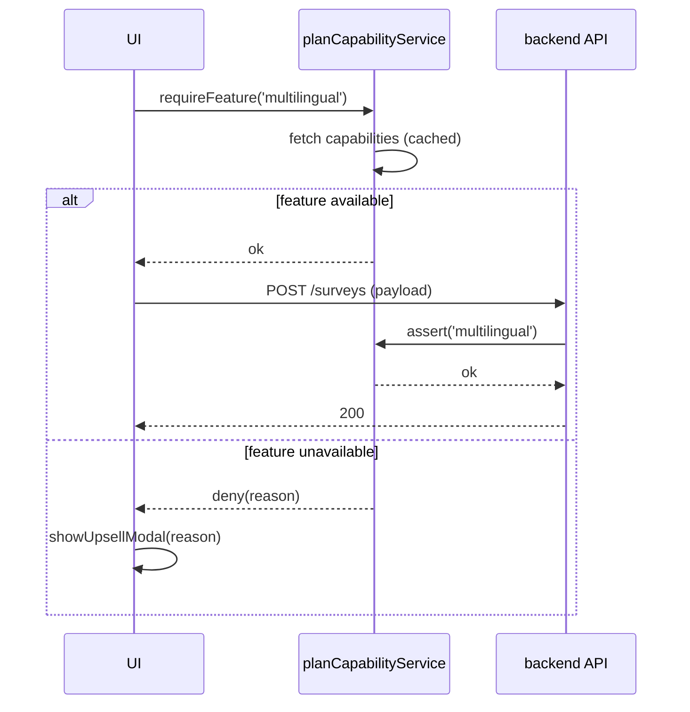

# 利用者画面向けプラン別機能制限設計方針

## 1. 背景と目的
- 利用者画面では契約プランに応じて利用できる機能が異なり、契約内容に基づく体験制御が求められる。
- 既存仕様では `surveys.plan` やアカウント契約プランがデータモデルに存在するものの、画面/UI・APIの判定ロジックが散在し、追加プランやキャンペーンに対応しづらい。
- プラン追加・改訂に対する柔軟性、アップセル導線の明確化、監査ログの一元化を実現するため、**共通の能力定義を基に UI・サービス・API で一貫した制御**を行う設計を策定する。

## 2. 対象プランと識別キー
| プラン表示名 | システムキー (`planTier`) | 想定契約単位 | 主な特徴 | 備考 |
| :-- | :-- | :-- | :-- | :-- |
| Free | `free` | 月次 | 基本アンケート、無料範囲内での名刺データ化(2項目)。御礼メールはSPEED ADドメイン限定。 | クロス集計・外部連携は非対応。 |
| Standard | `standard` | 月次/従量 | 名刺データ化10項目＋追加3項目、通常〜特急スピード対応、御礼メール送信上限500件。 | 追加料金で従量課金に移行可能。 |
| Premium | `premium` | 月次/年次 | 全有料機能利用可、カスタム項目拡張、特急以上のスピード保証、クロス集計提供。 | 御礼メール自社ドメイン、保存期間無制限。 |
| Premium+ (Enterprise) | `premiumPlus` | 年次/従量 | Premiumに加えてオンデマンド納期、SLA/多言語/高度分析、SSO対応。 | 旧称「Pro」「Enterprise」を統合。 |

- `planTier` は UI/サービス/保存API で共通利用する判定キー。請求情報の `plan.displayName` とは別に保持する。
- 将来的なプラン追加に備えて `account.planTier` と `surveys.plan` の両方で同じキーを採用し、マスタ管理を一元化する。

## 3. 機能カテゴリ別の制限マトリクス
| 機能カテゴリ | Free | Standard | Premium | Premium+ | UI制御方針 | 保存/API制御方針 |
| :-- | :-- | :-- | :-- | :-- | :-- | :-- |
| アンケート設問数 | 20問まで | 200問まで | 500問まで | 1000問まで | 上限超過時に警告→追加ボタン無効化。 | 保存APIで `plan_limits.maxQuestions` を検証。 |
| 名刺データ化項目 | 固定2項目 | 既定10項目＋追加3 | 既定＋カスタム10 | 制限なし | 選択肢生成時に `allowedFields` でフィルタ。 | 依頼送信時に `allowedFields` を検証。 |
| 名刺データ化スピード | 通常のみ | 通常/特急 | 通常/特急/超特急 | 全種 (オンデマンド含む) | 非対象プランはカード自体を非表示。 | 申込APIで `speedPlans` 妥当性チェック。 |
| 多言語アンケート | 利用不可 | 利用不可 | 設問翻訳3言語まで | 5言語＋自動提案オプション | セクション非表示、サイドナビでアップセル。 | `plan_limits.multilingual.maxLocales` を検証。 |
| 御礼メール | テンプレ固定/100件まで | カスタム本文/500件まで | 自社ドメイン/無制限 | シナリオ自動化/行動トリガー | 設定UIの項目表示をプラン別テンプレで切替。 | 送信ジョブ作成時に `sendQuota` と `domainRestrictions` を評価。 |
| 集計機能 | 単純ダッシュボードのみ | 基本集計＋CSV | 基本＋クロス集計 | クロス＋リアルタイム指標 | ナビゲーション項目を制御、非対応はグレーダウト。 | 集計APIは `featureFlags.analytics` を確認し非対応時は 403。 |
| アンケート公開数 | 1件 | 10件 | 50件 | 100件 | 新規作成ボタン活性判定に利用。 | 公開処理時に `limits.activeSurveys` を検証。 |
| 外部連携 | なし | Slack通知のみ | Slack + CRMエクスポート | Slack/CRM + Webhook + SSO | 設定タブの表示制御。 | 連携API登録時に `integrations` 許可リストを参照。 |

- UI制御は「非表示＞非活性＋アップセルCTA＞説明付き活性」の順に適用し、期待する誘導を明示する。
- 保存/API層は `planCapabilityService.hasFeature(accountId, featureKey)` で判定し、UIの制御と同一ロジックを共有する。

## 4. 実装構成
### 4.1 データソース構成
```json
// data/core/plan-capabilities.json (新規)
{
  "free": {
    "maxQuestions": 20,
    "bizcard": {
      "allowedFields": ["email", "fullName"],
      "speedPlans": ["normal"],
      "maxCustomFields": 0
    },
    "integrations": [],
    "features": {
      "thankYouEmail": { "mode": "templateOnly", "sendQuota": 100, "domain": "spped-ad" },
      "analytics": { "crossTab": false, "realtime": false },
      "multilingual": { "enabled": false, "maxLocales": 0 }
    },
    "limits": { "activeSurveys": 1 }
  },
  "standard": { "maxQuestions": 200, "bizcard": { ... } },
  "premium": { ... },
  "premiumPlus": { ... }
}
```
- JSONでプラン毎の数値・配列・ブール値を管理し、フロントとバックエンドで共用する。
- `tools/generate-plan-types.js` を追加し、JSONから TypeScript/Flow 型定義を生成して IDE 補完とバリデーションを実現する。
- 追加キャンペーンを扱う場合は `addOns` セクションを用意し、`planCapabilityService` 側でマージする仕組みを実装する。

### 4.2 サービスレイヤ
- `02_dashboard/src/services/planCapabilityService.js`（新規）
  - `loadPlanCapabilities()` で JSON をフェッチし、ローカルキャッシュ（`Map`）に格納。Etag/バージョンヘッダーで更新検知。
  - `getAccountPlanTier(account)` で `account.planTier` からキー取得。未定義は `free` を既定とし、データ異常時はモニタリング送信。
  - 主要API: `hasFeature(featureKey)`, `getLimit(limitKey)`, `listAllowedValues(categoryKey)`, `assertLimit(limitKey, value)`。
  - `observePlanChange(accountId, planTier)` を提供し、プラン変更時にキャッシュ更新イベントを発火して UI を再レンダリング。
- 既存サービス (`surveyService.js`, `bizcardService.js`, `analyticsService.js`) は `planCapabilityService` を依存注入し、保存前検証を共通化する。

### 4.3 UI適用ポイント
1. **アンケート作成ページ**
   - 質問追加ボタン・多言語セクション・御礼メール設定に `planRestrictedComponent` を適用。
   - Free/Standard アカウントでは目次に「アップグレード」CTAを表示し、クリックでアップセルモーダル。
2. **名刺データ化設定ページ**
   - 項目選択リストは `allowedFields` でフィルタ。特急以上は非表示だがカード枠を残し説明ツールチップを表示。
3. **ダッシュボード/設定ナビゲーション**
   - 集計メニューや外部連携タブは `featureFlags.analytics`、`integrations` をもとにロック表示（鍵アイコン＋理由）。
4. **新規アンケート作成CTA**
   - `limits.activeSurveys` 超過時はCTAを無効化し、モーダルで利用状況とアップグレード導線を提示。
5. **共通ヘッダーのプランバッジ**
   - プラン名と次回更新日、アップグレードボタンを表示。`planCapabilityService.observePlanChange` に応答して更新。

### 4.4 能力判定フロー

- UIとAPIで同一の `planCapabilityService` 判定ロジックを利用し、プリフライト判定の不一致を防ぐ。
- API側はリクエスト失敗時に `PLAN_DENY` エラーコードと追加メタ（`featureKey`, `currentPlan`, `requiredPlan`）を返す。

### 4.5 キャッシュおよびフォールバック
- `plan-capabilities.json` は CDN キャッシュ1分、ブラウザキャッシュ10分。強制更新が必要な場合はバージョンパラメータを変更。
- 読み込み失敗時は直近の成功レスポンスを `localStorage` に保持してフォールバック、失敗を Sentry に送信。
- 旧ロジックからの移行期間は `?disable_plan_enforcement=1` のクエリでサポートモードを有効化し、サポートチームが一時的に制限解除できる。

## 5. バックエンド/APIとの整合
- 管理者画面（`03_admin`）のプラン変更操作、請求APIのレスポンスに `planTier` および `planCapabilitiesVersion` を含める。
- 保存・更新APIは `planCapabilityService` と同じ JSON を利用して検証し、UI改変による不正利用を防止。`assertLimit` 失敗時は 409 を返却。
- イベントログには `PLAN_DENY` と `PLAN_LIMIT_WARN` を記録し、サポート調査・アップセル分析に活用する。
- プラン変更時は Webhook (`/webhooks/plan-change`) を発火し、利用者画面が SSE/WebSocket 経由で受信して UI を再描画する。

## 6. アップセル体験設計
- 制限に遭遇したユーザーには共通モーダルを表示し、以下を含める。
  1. 現在のプラン概要と残りリソース（例: 残り公開枠）。
  2. 該当機能が利用可能なプランと主要ベネフィット、差額の概算。
  3. 「アップグレードを依頼」ボタン（問い合わせフォーム／社内管理者メールリンク）。
  4. FAQリンクとライブチャット導線。
- モーダル内の文言は `data/marketing/plan-upsell-copy.json` で管理し、ローカライズを考慮したキー構造 (`{ featureKey: { ja, en } }`) を採用する。
- アップセルCTAのクリックイベントは `upsell_event` として計測し、どの機能で制限に遭遇したかを記録する。

## 7. 監視とアラート
- `PLAN_DENY` 発生数をプラン別にダッシュボード化し、異常増加時にサポートへ通知。
- `plan-capabilities.json` 読み込み失敗率、キャッシュヒット率を監視し、3分以上連続失敗でアラート発報。
- サポートモード (`disable_plan_enforcement`) の利用ログを監査テーブルへ保存し、月次レビューを実施する。

## 8. テスト戦略
- **ユニットテスト:** `planCapabilityService` の `hasFeature`・`assertLimit` のパラメトリックテスト。プラン境界値、フォールバック経路を網羅。
- **UIスナップショット:** Storybook で Free/Standard/Premium/Premium+ アカウントの画面差分を確認。アップセルモーダル表示も含む。
- **E2Eテスト:** Cypressで Free プランユーザーが多言語セクションにアクセスできないこと、Premium+ がオンデマンドスピードを選択できることを検証。
- **API契約テスト:** Pact で UI ↔ API 間の `PLAN_DENY` レスポンス仕様を固定化。プラン変更Webhookの受信テストを含む。
- **監査テスト:** `PLAN_DENY` イベントがログストリームに出力されること、サポートモード利用時に監査レコードが残ることを確認。

## 9. 移行計画
1. 既存アカウントの `plan` を `planTier` にマッピングし、旧名称（例: Pro）を `premiumPlus` へ移行するマスタを整備。
2. ハードコードされているプラン判定ロジックを検索 (`rg 'premium' 02_dashboard`) し、段階的に `planCapabilityService` 呼び出しへ置換。
3. `plan-capabilities.json` をデプロイし、管理APIと利用者画面双方で参照するよう Feature Flag 付きでリリース。
4. ローンチ後1週間は `PLAN_DENY` イベントを監視し、誤判定やUI表示不備をサポートと共有する。必要に応じてフォールバックフラグで旧挙動へ戻す。
5. FAQ/ヘルプ/営業資料を更新し、プラン制限の問い合わせ窓口を明示する。

## 10. 今後の拡張余地
- 期間限定キャンペーンやアドオン機能を `addOns` として定義し、`planCapabilityService` がプランと組み合わせて判定できるようにする。
- プラン別利用状況ダッシュボードを追加し、制限値に近づいているユーザーに対して自動通知やアップセルを行う。
- 機能単位でサーバーサイド実行時間やコストを記録し、プランごとの採算管理に活用する。
