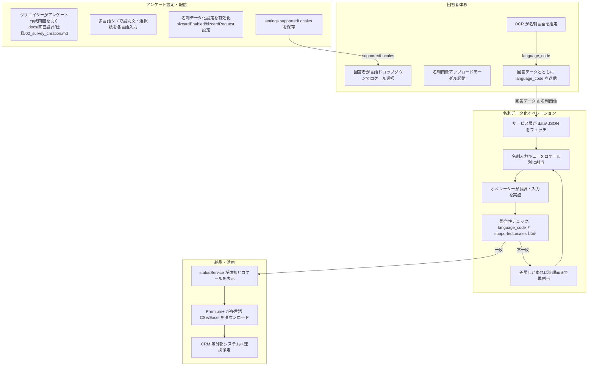
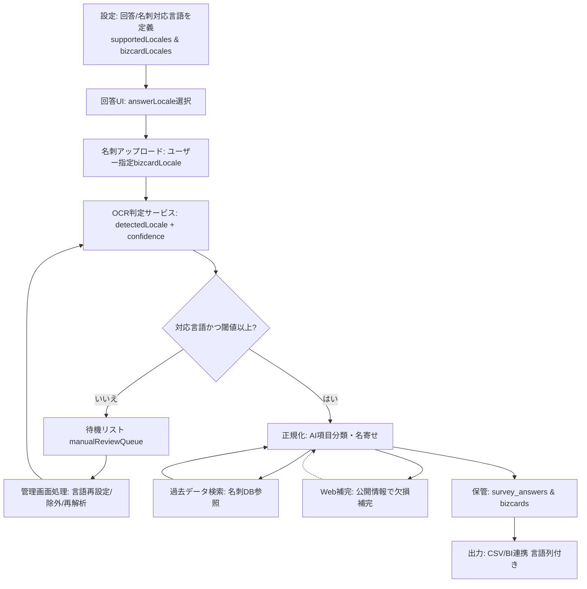

# 名刺データ化サービスにおける多言語対応フロー

## 1. 背景と目的
展示会アンケートから名刺画像を取り込み、翻訳を含めたデータ化を行うサービスにおいて、多言語対応は Premium+ を中心とした上位プランの差別化要素であり、後続業務（翻訳、オペレーター入力、分析）まで波及する。  
本書は既存仕様やデータモデルを横断し、**名刺画像を起点とするサービスフローのどこで多言語情報が発生し、どのように伝搬・検証されるか**を整理する。

## 2. 関係レイヤー概要
- **データソース層**: `docs/サンプル/demo_business-cards/*.json` や `data/core/surveys.json` など、モック JSON が一次ソース。多言語フィールドは `{ ja: '', en: '' }` 形式で格納する。  
- **サービス層**: `02_dashboard/src/services/` 配下のモジュールがフェッチと整形を担当。`bizcardSettingsService.js` はアンケート設定と名刺依頼数の読込／保存を担い、`bizcardPlans.js` が多言語表示に対応した料金表を提供。  
- **UI層**: `02_dashboard/src/ui/` および `survey-answer.js` が、名刺アップロードと多言語切替 UI を制御。  
- **管理・レビュー**: 03_admin 配下の画面で名刺画像／入力キューを扱い、言語別オペレーター割当や完了 CSV アップロードを想定している。  
（全体像は `docs/プロダクト/プロセス/05_data_flow_mapping.md` の概要図を参照）

## 3. サービスフローにおける多言語タッチポイント
1. **アンケート作成 & 名刺依頼設定**  
   - `bizcardEnabled`, `bizcardRequest` などを `settings.bizcard.*` として保存（`docs/画面設計/仕様/02_survey_creation.md:41`）。  
   - Premium 以上で多言語入力タブを開放し、質問文・選択肢を言語別 JSON に格納（同:60,64）。  
   - プラン判定は `planRestrictedComponent` で UI レベル制御、サーバー側は `plan_limits.multilingual.maxLocales` で検証（`docs/画面設計/仕様/11_plan_feature_restrictions.md:25`）。  

2. **回答画面での名刺画像取得**  
   - 多言語アンケートではヘッダーに言語切替ドロップダウンを表示（`docs/画面設計/仕様/13_survey_answer_screen.md`）。  
   - 名刺アップロードモーダルは 4 ステップ構成で表裏撮影・プレビューを案内し、多言語 UI 文言は `survey-answer.js` 内でロケール別にロード（`docs/画面設計/仕様/13_survey_answer_screen.md`, `02_dashboard/src/survey-answer.js:270-451`）。  
   - OCR による名刺言語自動判別を将来検証項目として定義し、アンケート言語と差異がある場合のフローも規定（`docs/画面設計/仕様/13_survey_answer_screen.md` と `docs/画面設計/仕様/02_survey_creation.md`）。  

3. **名刺データ化処理（バックオフィス）**  
   - `speedReviewService` が CSV 由来の名刺ファイル名を多言語メタデータと結合し、表裏の URL を保持（`02_dashboard/src/services/speedReviewService.js:136-237`）。  
   - 管理画面では言語単位でキュー割当・進捗を追跡（`03_admin/admin_requirements.md:70-88`）。OCR 結果と `language_code` が一致しない場合はオペレーターに差戻し、再割当するフローを mermaid 図で定義（`docs/画面設計/仕様/02_survey_creation.md:209-235`）。  

4. **納品・ダウンロード**  
   - ステータスサービスが名刺データ化の進行度を多言語説明付きで表示（`02_dashboard/src/services/statusService.js:42-60`）。  
   - Premium+ のみ多言語 CSV/Excel エクスポートと SLA 通知を有効化し、出力列は「アンケートの回答言語」「名刺の入力言語」に統一（`docs/画面設計/仕様/11_plan_feature_restrictions.md:11-134`）。  

## 4. データモデルとバリデーション
- **アンケート設定 (`survey.settings`)**: `bizcardEnabled`, `bizcardRequest`, `supportedLocales` などを保持。`supportedLocales` は回答 GUI の言語タブと名刺 OCR の判定基準になる（`docs/画面設計/仕様/02_survey_creation.md:64`）。  
- **回答データ (`input_business_cards` テーブル案)**: `photo_1`, `photo_2`, `language_code`, `answer_id` などを設け、多言語フロー時は `language_code` とアンケート側ロケールの整合性チェックを行う（`docs/プロダクト/アーキテクチャ/02_data_model.md:238-361`）。  
- **BusinessCard オブジェクト**: `imageUrl.front/back`・`group1`〜`group8` に翻訳後フィールドを格納。多言語翻訳済みの項目を JSON で再利用できるように設計（同:503-511）。  
- **検証ステップ**:  
  1. `language_code` がアンケート設定に存在するかチェック。  
  2. 名刺 OCR が別言語を返した場合は差戻しログ生成。  
  3. Premium+ では最大 5 言語まで `maxLocales` を検証し、超過時はアップセル導線を表示。

## 5. 提供プランと SLA
- **Free/Standard**: 名刺データ化は日本語基準で最大 3 言語まで翻訳不可。多言語 UI 要素は非表示、＋料金で一部項目拡張のみ（`docs/画面設計/仕様/11_plan_feature_restrictions.md:11-24`）。  
- **Premium**: 設問翻訳 3 言語まで、OCR の補助は手動差戻し。  
- **Premium+ (Enterprise)**: 多言語（5 言語＋自動提案）、当日～超特急プランや SLA 通知、Export オプションを開放。`bizcardPlans.js` の「多言語対応」アドオンが追加料金を表す（`02_dashboard/src/services/bizcardPlans.js:96-102`）。  
- **SLA 指標**: 回答画面では 3 秒以内応答、名刺アップロード時は進捗バー表示、サーバー保存時は暗号化を想定（`docs/画面設計/仕様/13_survey_answer_screen.md`）。

## 6. 運用・テスト観点
- **手動検証**: `docs/ハンドブック/テスト/login_to_survey_answer_scenario.md:30` の ANS-006 で多言語切替と名刺処理の整合性を確認。  
- **OCR/翻訳運用**: 差戻しや再割当時のアラート通知を `survey.revisionHistory` や管理画面タスクで追跡（`docs/画面設計/仕様/02_survey_creation.md:201-235`）。  
- **将来拡張案**: API 連携時は REST/GraphQL に差し替え、`resolveDashboardDataPath` の依存除去と外部リソースファイルへのテキスト分離（`docs/プロダクト/アーキテクチャ/01_ARCHITECTURE.md:40-67` & `docs/画面設計/仕様/07_graph_page_requirements.md:114`）。  

## 7. 参考ドキュメント
- アンケート作成仕様: `docs/画面設計/仕様/02_survey_creation.md:41-235`  
- 回答画面要件: `docs/画面設計/仕様/13_survey_answer_screen.md`  
- プラン制約一覧: `docs/画面設計/仕様/11_plan_feature_restrictions.md:11-134`  
- データモデル定義: `docs/プロダクト/アーキテクチャ/02_data_model.md:238-511`  
- データフロー概要図: `docs/プロダクト/プロセス/05_data_flow_mapping.md:3-74`  
- 名刺関連サービスコード: `02_dashboard/src/services/bizcardSettingsService.js:1-99`, `02_dashboard/src/services/bizcardPlans.js:4-138`  
- テストシナリオ: `docs/ハンドブック/テスト/login_to_survey_answer_scenario.md:30`

## 8. サービス実装計画（多言語対応）

### 8.1 最優先で導入すべき事項
サービスの多言語対応における基本的な課題を解決し、安定した運用基盤を構築するために早期に実装すべき機能群。
- **回答画面と名刺入力の言語設定の分離**  
  - 背景: 現状のシステムではアンケート回答時の言語と名刺入力に紐づく言語が連動している。しかし実際には「アンケートは英語で回答し、名刺はベトナム語で記載されている」といったケースが存在するため、両者を切り離して処理する必要がある。  
  - 対応方針: ユーザーがアンケートに回答する際の言語と、名刺情報を取り込む際の言語をそれぞれ独立して選択・処理できる仕組みを構築する。
- **OCRによる言語自動判定**  
  - 背景: オペレーターが手動で名刺の言語を判断するのは非効率であり、ヒューマンエラーの原因となる。  
  - 対応方針: 名刺をスキャンした際に記載されている言語（日本語、英語、中国語、ベトナム語など）をシステムが自動で識別する機能を実装する。
- **入力不能データの一時待機システム（待機リスト）**  
  - 背景: OCRで言語を特定できない、または対応言語以外の名刺など、システムで自動処理できないデータが発生する。  
  - 対応方針: 自動で言語判定ができなかった、あるいはオペレーターが入力できなかった名刺データを一時的に「待機リスト」へ移し、後続の手動対応と切り分けられるようにする。
- **管理者向けのデータ処理画面**  
  - 背景: 待機リストに移動されたデータを効率的に処理するため、管理者が一覧で内容を確認し、適切なアクションを実行できるインターフェースが必要である。  
  - 対応方針: 待機リストに入ったデータに対して、管理者が手動で言語を再設定したり、入力対象から除外したりできる専用の管理画面を用意する。
- **データ出力（CSV）への言語情報追加**  
  - 背景: 納品されるデータがどの言語で入力されたものかが不明だと、後工程でのデータ集計や分析が困難になる。  
  - 対応方針: 最終的に出力されるアンケート回答CSV/名刺CSVの双方に「アンケートの回答言語」「名刺の入力言語」列を設け、回答言語はアンケート作成時の優先回答言語で初期化した値を保持する。

### 8.2 将来的に導入を検討すべき事項
サービスの付加価値向上と運用コスト削減を目指し、中長期的に実装を検討する先進的な機能群。
- **AIによる入力支援機能の強化**  
  - 背景: オペレーターによる手動での項目振り分け（会社名、役職、住所など）は、依然としてコストと時間がかかる。  
  - 対応検討: AIを活用し、名刺に記載されている「会社名」「役職」「住所」といった各項目を自動で振り分ける機能を開発し、オペレーターの入力作業を効率化する。
- **過去データの活用（データベース連携強化）**  
  - 背景: 同一人物が展示会に連日来場したり、複数のブースを訪問したりした場合、その都度同じ名刺情報を入力するのは非効率である。  
  - 対応検討: 一度入力した名刺の情報をデータベースに蓄積し、同じ名刺が再度読み込まれた際に過去のデータを呼び出すことで、入力の手間を省く。
- **Web検索を活用した情報の自動補完**  
  - 背景: OCRの読み取り精度には限界があり、文字化けや情報の欠落が発生することがある。  
  - 対応検討: OCRで読み取った会社名や住所などの情報が不完全な場合に、Web検索を自動で行い、公開情報と照合することで、より正確な情報で補完する機能の導入を検討する。

## 9. 理想データフロー（実装計画反映）

### 9.1 フロー全体像
サービス実装計画で整理した優先施策・将来施策を前提に、回答データと名刺データが一貫して多言語メタデータを保持しながら流れる理想的なプロセスを以下に定義する。目的は (1) アンケート回答と言語別名刺処理の分離と整合性の確保、(2) 判定不能データの早期隔離と管理者対応、(3) CSV 出力までの言語情報の担保、(4) AI 補助や過去データ再利用など拡張余地の確保 にある。

### 9.2 詳細プロセス
1. **設定フェーズ**  
   - `survey.settings.supportedLocales` に回答言語、`survey.bizcard.supportedLocales` に名刺入力対象言語をそれぞれ定義し、既存アンケートへ紐づける。  
   - 回答 UI で利用するデフォルト回答言語 (`defaultAnswerLocale`) と、名刺アップロードモジュールが提示する推奨名刺言語 (`defaultBizcardLocale`) を保持する。
2. **回答フェーズ**  
   - 回答画面のヘッダーで回答者が `answerLocale` を選択し、回答データに紐づけて保存する。  
   - 名刺アップロード UI では、アンケート作成時の優先回答言語 (`defaultAnswerLocale`) を初期値として `bizcardLocaleSelection` をセットし、ユーザーが必要に応じて変更できる状態を維持する。選択値を名刺メタデータとして送信する。
3. **OCR・言語判定フェーズ**  
   - 画像アップロード後に OCR サービスが `detectedLocale` と `confidence` を返却し、名刺メタデータへ書き込む。  
   - システムは `detectedLocale` と `survey.bizcard.supportedLocales` を突合し、閾値以上かつ対応言語であれば自動処理フローへ進める。  
   - 閾値未満または非対応言語の場合は「待機リスト」に移し、`manualReviewQueue` にステータスを登録する。
4. **正規化・補完フェーズ**  
   - 自動処理ラインでは `answerLocale` と `bizcardLocale` を保持したまま、AI 項目分類（将来対応）で会社名・役職・住所などを構造化する。  
   - 過去の名刺データベースを検索し、一致候補があればフィールドを自動補完しつつ、差分があればオペレーターへ確認タスクを発行する。  
   - 欠損が残る場合は Web 検索補完モジュールにより公開情報を参照し、補完内容とソース URL を監査ログに追記する。
5. **管理対応フェーズ**  
   - `manualReviewQueue` にあるレコードは管理者画面で一覧化し、言語再設定・除外・再 OCR の各アクションを提供する。  
   - 処理完了後は名刺メタデータを更新し、再度 OCR 判定ステップへ戻すか正規化フェーズへ遷移させる。
6. **出力・活用フェーズ**  
   - 正規化済みデータは `survey_answers` と `bizcards`（仮称）テーブルに格納し、`answerLocale` と `finalBizcardLocale` を必須列として保持する。  
   - CSV/Excel エクスポート時は回答データ・名刺データ双方に言語列を追加し、ステータスサービス・分析基盤へも同様のメタデータを伝達する。

### 9.3 主要データポイント
- `survey.settings` : `supportedLocales`, `defaultAnswerLocale`, `bizcard.supportedLocales`, `defaultBizcardLocale`。  
- `survey_answers` : `answerLocale`, `responseId`, `submissionTimestamp`（既存）に加え、多言語設問のバインド情報。  
- `bizcards` : `detectedLocale`, `finalBizcardLocale`, `confidence`, `ocrVersion`, `aiClassificationVersion`, `sourceAnswerId`。  
- `manualReviewQueue` : `bizcardId`, `status`, `reason`, `assignedTo`, `lastActionAt`。  
- `export_snapshots` : 回答・名刺データ双方の言語列（CSVの表示名は「アンケートの回答言語」「名刺の入力言語」）と処理経路 (`processed_by`／`review_status`)。

### 9.4 将来拡張の挿入ポイント
- **AI入力支援**: 正規化フェーズの「AI項目分類」コンポーネントとして導入し、分類結果を `aiClassificationVersion` と紐づけてロールバック可能にする。  
- **過去データ再利用**: 「過去データ検索」ノードで重複検知・自動補完を実行し、再利用したフィールドは差分ログに残す。  
- **Web検索補完**: 欠損検知時に「Web補完」ノードを起動し、補完元 URL を `bizcards.enrichmentSources` に追加して監査可能性を高める。
