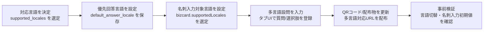
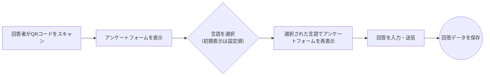
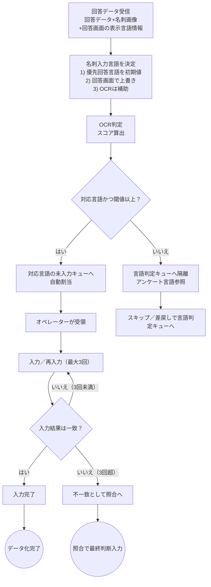
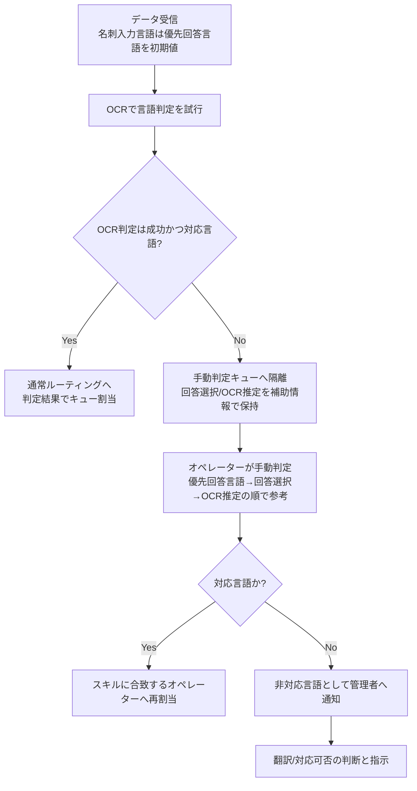

### SPEED AD 要件定義書（多言語対応版）

文書バージョン: 2.4  
作成日: 2025年11月26日 (最終改訂)

---

## 0. 概要
日本企業が海外リードを扱う際の課題解決に向け、アンケート・名刺データの多言語対応を定義する。プレミアムプラン向け機能を中心に、結果のガードレールを示し、実装詳細は開発に委ねる。

---

## 1. スコープと前提
- フェーズ1（〜2025/12）: アンケート・名刺データの多言語対応のみを対象。
- フェーズ2（2026〜）: 管理画面の国際化、対応言語拡大、ユーザー基本言語設定は別途定義。
- 対応言語: `ja`, `en`, `zh-CN`, `zh-TW` の3言語/4種に限定。中国語バリアントの扱いは開発裁量（上限のみ拘束）。
- 第一言語: `supported_locales` 先頭。未設定時は `ja`。
- 言語初期選択: ユーザー言語設定 > ブラウザ言語 > 第一言語の優先順。
- 非対応言語検出: 管理者へ通知（経路は運用設計で決定）。

---

## 2. 業務影響
- ユーザー: 多言語アンケート作成手順が追加（プレミアム限定）。CSVに「アンケートの回答言語」「名刺の入力言語」列を追加（「国」列の定義/取得元は要検討）。
- オペレーター: 言語スキルに基づく自動割当へ移行。各言語表記の知識が必要。
- 管理者: 対応可能言語の管理。言語別の進捗モニタリングが必要。

---

## 3. 業務フロー
### 3.0 展示会前の準備フロー（2025-12-02追記）

### 3.1 アンケート回答フロー

※未翻訳言語が選択された場合、内容は第一言語（日本語）で表示。回答途中での言語切替でも入力済み回答は変更・破棄しない。

### 3.2 データ化ワークフロー（スキルベース・ルーティング）
（2025-12-02追記: 名刺入力言語の決定順をフローに反映）

- 名刺入力言語の優先順位: アンケート作成時の優先回答言語を初期値とし、回答画面での選択値を次点、OCR判定は補助情報として扱う。キュー割当時はこの優先順を保持したまま `language_code` を決定する。

### 3.3 例外フロー（OCR/言語判定失敗）

---

## 4. 機能要件
### 4.1 ユーザー向け
- 多言語対応設定: アンケート/ユーザー単位でON/OFF（プレミアム限定）。
- 対応言語リスト: `supported_locales` に最大3言語/4種。第一言語は先頭。中国語バリアントの細かい扱いは開発裁量（上限のみ遵守）。
- 設問多言語入力: タブUIで各言語の質問文/選択肢を入力。
- 言語選択画面: QR読取後に設定言語から選択。ブラウザ言語で推奨表示。
- 回答表示: 選択言語でUI表示。未翻訳なら第一言語（日本語）で表示。回答途中の言語切替でも入力値は維持。
- 言語コード保存: 回答時に選択言語コードを記録。
- 名刺データ入力優先順位: アンケート作成時に設定された優先回答言語情報を第一優先として名刺入力言語を初期化し、回答画面での選択やOCR結果は補助扱い。
- 非対応ロケール: UIで非表示。パラメータ指定時は第一言語で表示・保存し、警告と監査ログを残す。
- CSV: 回答/名刺のCSVに追加する項目を「アンケートの回答言語」「名刺の入力言語」に変更（「国」列は定義/取得元を要検討）。

### 4.2 管理者・オペレーター向け
- 回答一覧: 言語フィルタと視覚的ラベル（国旗/タグ等、表現は開発裁量）。
- ルーティング: OCR判定を主、回答言語を補助。閾値未満は回答言語ヒント参照→なお不確定なら不一致キュー。
- 閾値: システム設定値。初期値は開発が設定し、変更手順は運用設計で定義。
- 優先言語表示: 入力画面で優先順位を明示。
- OCR最適化: 言語選択がある場合、`language_hints` に反映。
- スキル設定: 対応可能言語を複数設定。中国語は簡体/繁体を区別可能とする（バリアントやUIは開発裁量）。

### 4.3 翻訳運用
- タブ入力: 設定言語に応じて入力タブを生成。言語追加/削除に同期。
- 未入力フォールバック: 未入力言語は第一言語を表示。
- 未翻訳公開時: 回答表示は第一言語（日本語）。
- 翻訳責任: 翻訳の正確性・適法性は利用者側。
- 保存前チェック: 未入力言語を警告表示しつつ公開可能。
- 機械翻訳: 活用は検討対象、精度は保証しない。

---

## 5. データモデル変更
- `surveys`
  - `is_multilingual_enabled` (Boolean)
  - `supported_locales` (配列、上限3言語/4種、保存形式は実装裁量)
  - `default_answer_locale` (未設定時は `ja`、保存形式は実装裁量)
- `survey_details`
  - 設問・選択肢を多言語テキストで保存（形式は実装裁量の例: JSON）
  - 保存時バリデーション: 必須言語欠落→エラー、任意欠落→警告
- `answers`
  - `language_code`: 選択言語コードを保存。`supported_locales` 外は `default_answer_locale` にフォールバックし、監査ログを残す。
  - CSV出力: BCP47コード、UTF-8（必要に応じBOM付与）。フォールバック時も元のコードを保持。
- `admin_users`
  - `skill_languages`: 対応可能言語の配列（形式は実装裁量）。BCP47コードで保存し、`supported_locales` と突合。

---

## 6. 非機能要件
- パフォーマンス: 多言語化後も既存SLA同等。言語選択/回答表示は3秒以内目標。
- セキュリティ: 非対応言語へのアクセス制御。通知（手段は運用設計）、監査ログ（項目/保持は運用設計）。
- 可用性: 稼働率99.9%以上。
- 運用・保守: 言語別処理量/時間のモニタリング。設定変更で対応言語を柔軟追加。UIフォントは検討中。エラーハンドリング詳細は検討中。

---

## 7. 将来拡張（フェーズ2以降）
- 管理画面の国際化、対応言語拡大、ユーザー基本言語設定。

---

## 8. テスト戦略（暫定）
- E2E: 言語切替→回答→CSV出力で言語コード保持（ja/en/zh-CN/zh-TW）。
- 非対応ロケール: `supported_locales` 外指定で第一言語へフォールバックし、警告・監査ログを確認。
- OCR連携: 言語選択あり/なしで `language_hints` と結果の整合性を確認。
- UI: 多言語での文字量増による崩れを簡易チェック。
- 権限/通知: 非対応言語タスクでの通知動作を確認。

---
以上

---
## 更新履歴（2025-12-02）
- 展示会前の準備フロー（3.0）を追加し、対応言語選定から事前検証までの手順を明文化。
- データ化ワークフロー（3.2）に名刺入力言語の決定順（優先回答言語→回答画面選択→OCR補助）を組み込み、日付を追記。
- 例外フロー（3.3）をOCR判定失敗起点に再構成し、手動判定での参照順を明示。
- CSV列名を「アンケートの回答言語」「名刺の入力言語」に統一し、業務影響/機能要件に反映。
