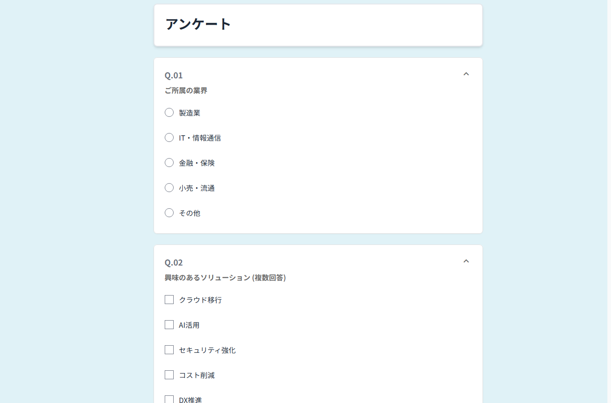
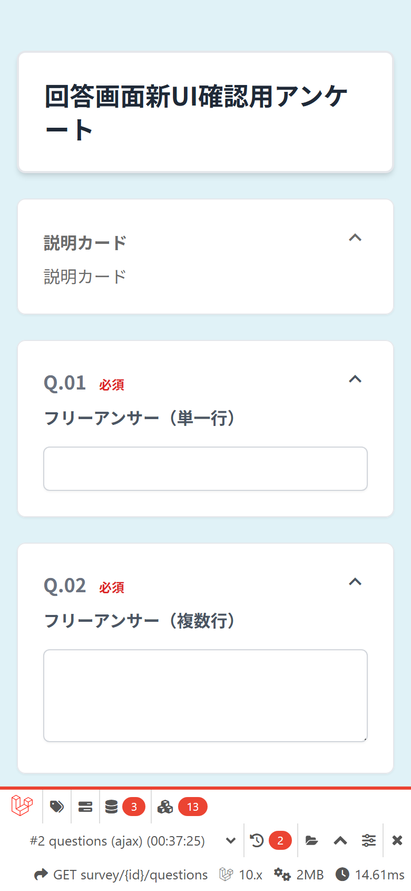
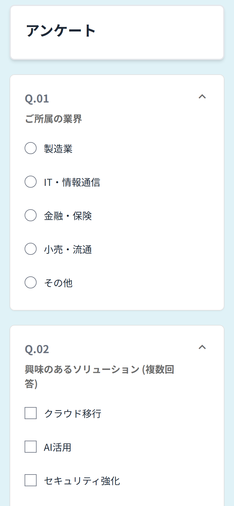
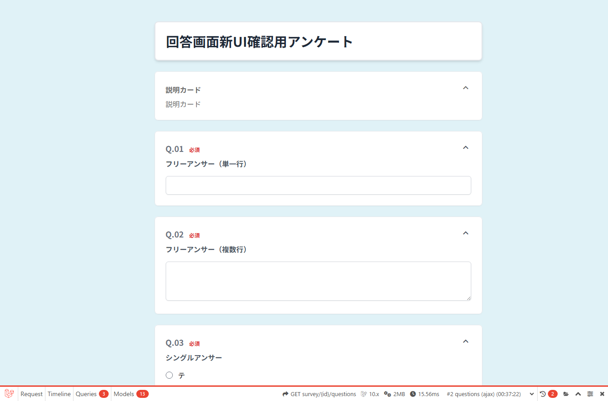
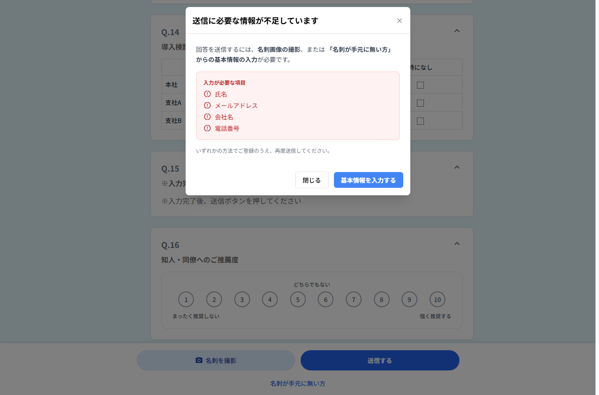
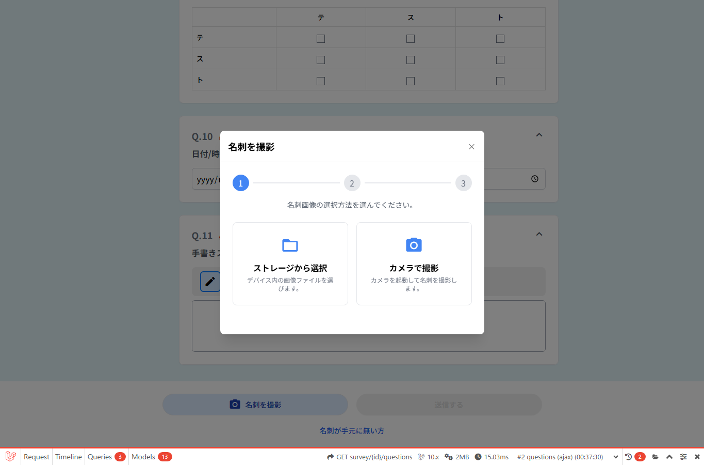
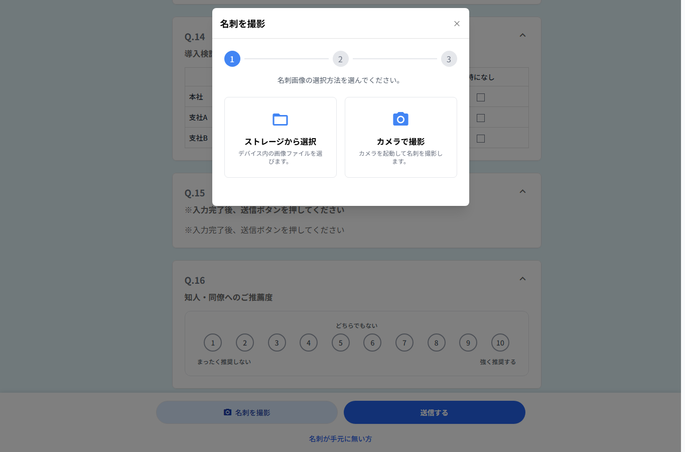
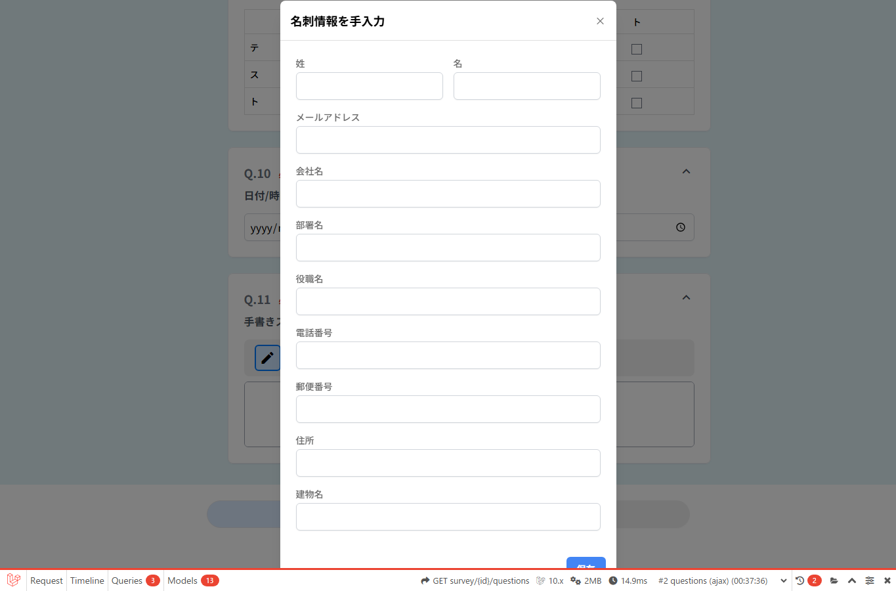
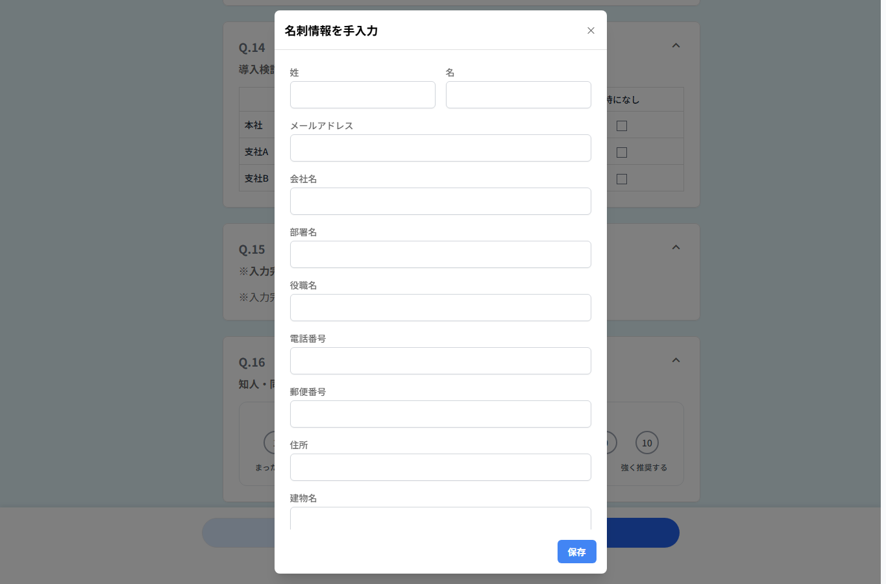

# 回答画面 dev / モック仕様差異確認

## 確認概要

- 確認日: 2026-07-03
- 確認方法: Playwright Chromium headless
- desktop viewport: 1365 x 900
- mobile viewport: 390 x 844
- dev側: `https://dev.speed-ad.com/questionnaire_answer?id=564`
- モック側: `https://abroadumedashota.github.io/SPPED-AD-TEST/02_dashboard/survey-answer.html?surveyId=sv_0001_26008`

dev側はHTTP 200で回答画面まで到達できた。ログイン画面や権限ブロックは出ていない。ただし開発環境固有の Laravel Debugbar が画面下部に表示されているため、通常UIとの差分としては扱わない。

## スクリーンショット比較

### 初期表示 desktop

| dev側 | モック側 |
| --- | --- |
|  |  |

### 初期表示 mobile

| dev側 | モック側 |
| --- | --- |
|  |  |

### 未入力送信時

| dev側 | モック側 |
| --- | --- |
|  |  |

### 名刺撮影 / 手入力モーダル

| dev側 名刺撮影 | モック側 名刺撮影 |
| --- | --- |
|  |  |

| dev側 名刺手入力 | モック側 名刺手入力 |
| --- | --- |
|  |  |

## 仕様差異表

| 項目 | dev側で確認できた状態 | モック側で確認できた状態 | 改修時の判断 |
| --- | --- | --- | --- |
| ページタイトル | `a` | `アンケート` | 本番/dev側の実データタイトルを正とするか、モックの汎用タイトルを使うか要確認。タイトル表示仕様は先に固定する。 |
| 設問数 | Q.01のみ表示。必須の自由記述欄。 | Q.01からQ.16まで表示。複数の入力タイプを網羅。 | dev側ID 564は比較用として設問タイプが不足。入力UIの網羅比較はモック主導で実施し、dev側の別アンケートID確認が必要。 |
| レイアウト | 淡い水色背景、中央カード、角丸、影。短い設問のため送信導線が初期表示内に入る。 | 淡い水色背景、中央カード。長尺フォームで送信導線は下部。 | 基本トーンは近い。余白・カード幅・ボタン位置は「長尺設問時」を基準に合わせる。 |
| ヘッダー | タイトルカードのみ。 | タイトルカードのみ。 | 追加ヘッダーやグローバルナビは不要な方向で一致。 |
| 進行表示 | 設問全体の進捗表示なし。名刺撮影モーダル内のみ1-2-3ステップ表示。 | 同左。 | 回答画面全体に進捗を出す仕様ではなさそう。名刺撮影モーダルのステッパーは揃える。 |
| 必須表示 | Q.01に赤字の `必須` 表示。DOM上も required。 | 必須ラベルは初期表示では確認できず。 | 必須表示とDOM required/aria-requiredの仕様はdev側に寄せる必要が高い。 |
| 設問説明文 | Q.01では説明文なし。 | Q.15のような説明文・注意文表示あり。 | 説明文の有無、表示位置、文字サイズはモック側の長尺設問で仕様化する。 |
| 単一選択 | 未確認。 | Q.01、Q.12、Q.16などで確認。 | dev側の該当設問データで追加確認が必要。 |
| 複数選択 | 未確認。 | Q.02、Q.11、Q.14で確認。 | dev側の該当設問データで追加確認が必要。 |
| テキスト入力 | textareaを確認。 | textarea、numberを確認。 | 自由記述のカード構造は近いが、dev側は必須エラーあり。モックにも必須時の表示を揃える。 |
| 日付・時刻 | 未確認。 | Q.06 date、Q.07 timeを確認。 | 標準UIか flatpickr 相当かを本番/dev側で要確認。 |
| 画像添付 | 名刺撮影モーダルを確認。通常画像添付設問は未確認。 | Q.10で画像添付枠を確認。ただし `survey.tapToCapture` の未翻訳文言あり。 | 画像添付の文言と撮影導線は優先確認。未翻訳キーは修正候補。 |
| 名刺撮影 | `名刺を撮影` から、ストレージ選択 / カメラ撮影の2択を持つ3ステップモーダルが開く。 | 同様の3ステップモーダル。 | 名刺撮影モーダルはかなり近い。細部はdev側を基準に合わせる。 |
| 名刺手入力 | 姓、名、メールアドレス、会社名、部署名、役職名、電話番号、郵便番号、住所、建物名、保存。 | 同じ項目構成を確認。 | 項目構成は一致。必須項目の扱いと保存後状態を要追加確認。 |
| 手書き | 未確認。 | Q.09で署名キャンバス、ペン、消去、Undo/Redo、削除を確認。 | dev側の手書き設問で要確認。モック側はボタン無効状態や文言の精査が必要。 |
| 未入力バリデーション | 送信押下後、Q.01直下に赤字で `回答が未入力です`。 | 送信押下後、名刺画像または名刺手入力が不足している旨のモーダル。氏名、メールアドレス、会社名、電話番号が必須として列挙。 | 設問必須エラーはdev側のインライン表示に寄せる。送信時の名刺/基本情報不足はモック側のモーダル仕様が有用。両者の優先順を決める。 |
| 送信導線 | `名刺を撮影` と `送信する` が横並び、下に `名刺が手元に無い方`。 | 同様。ただし長尺フォームの末尾で表示。 | ボタン構成は一致。長尺時に常時固定するか末尾配置にするかを決める。 |
| スマホ表示 | カード幅が画面に合わせて広がる。ボタンは2列。Debugbarが下部を占有。 | カード幅が画面に合わせて広がる。長い設問文は折り返し。送信不足モーダルも表示可能。 | スマホではモーダル幅、長文折り返し、下部導線の視認性を優先して合わせる。 |

## モック側で確認できた設問タイプ

- 単一選択: Q.01、Q.12、Q.16
- 複数選択: Q.02
- 自由記述: Q.03、Q.04
- 数値: Q.05
- 日付: Q.06
- 時刻: Q.07
- マトリクス単一選択: Q.08、Q.13
- 手書き署名: Q.09
- 画像添付: Q.10
- マトリクス複数選択: Q.11、Q.14
- 説明文のみ: Q.15
- 名刺撮影 / 名刺手入力: 下部導線から確認

## 改修時に優先して合わせるべき差異

1. 必須表示と未入力エラーの出し方を固定する。dev側は設問直下インライン、モック側は名刺不足モーダルが中心のため、設問必須エラーと名刺/基本情報不足エラーの優先順位を明文化する。
2. 長尺フォーム時の送信導線を決める。dev側ID 564は短いため初期表示内に収まるが、モック側のような16問構成では末尾到達まで送信できない。固定フッターにするか末尾配置にするかを先に決める。
3. 名刺撮影モーダルはdev側/モック側で近いため、ここはdev側を基準に細部を合わせる。手入力項目も同一構成なので、必須項目、保存後表示、送信時チェックを確認する。
4. モック側の設問タイプ網羅を活かしつつ、dev側の該当タイプを持つアンケートIDで追加照合する。ID 564だけでは単一選択、複数選択、日付時刻、手書き、通常画像添付のdev実装を確認できない。
5. モック側の `survey.tapToCapture` は表示文言として不自然。画像添付設問の表示文言は改修時に修正候補。

## 未確認事項

- dev側ID 564ではQ.01の必須textareaのみ確認できたため、dev側の単一選択、複数選択、日付、時刻、手書き、通常画像添付、マトリクス系の実表示は未確認。
- 名刺撮影モーダルのストレージ選択、カメラ撮影、裏面追加、OCR後の確認画面は、ヘッドレス環境で実ファイル/カメラ操作を行っていないため未確認。
- 手入力モーダルの保存後状態、保存値を使った送信成功、最終確認画面、実送信完了画面は未確認。
- Firefox、Edge、Safariでの表示は未確認。今回はChromiumのみ。
- dev側の Laravel Debugbar 非表示時の本番相当見え方は未確認。

## 取得ファイル

- `docs/リファレンス/レビュー/2026-07-03_survey-answer-comparison-assets/dev-desktop.png`
- `docs/リファレンス/レビュー/2026-07-03_survey-answer-comparison-assets/mock-desktop.png`
- `docs/リファレンス/レビュー/2026-07-03_survey-answer-comparison-assets/dev-mobile.png`
- `docs/リファレンス/レビュー/2026-07-03_survey-answer-comparison-assets/mock-mobile.png`
- `docs/リファレンス/レビュー/2026-07-03_survey-answer-comparison-assets/dev-desktop-after-submit.png`
- `docs/リファレンス/レビュー/2026-07-03_survey-answer-comparison-assets/mock-desktop-after-submit.png`
- `docs/リファレンス/レビュー/2026-07-03_survey-answer-comparison-assets/dev-desktop-bizcard-capture.png`
- `docs/リファレンス/レビュー/2026-07-03_survey-answer-comparison-assets/mock-desktop-bizcard-capture.png`
- `docs/リファレンス/レビュー/2026-07-03_survey-answer-comparison-assets/dev-desktop-no-bizcard.png`
- `docs/リファレンス/レビュー/2026-07-03_survey-answer-comparison-assets/mock-desktop-no-bizcard.png`
- `docs/リファレンス/レビュー/2026-07-03_survey-answer-comparison-assets/capture-summary.json`
- `docs/リファレンス/レビュー/2026-07-03_survey-answer-comparison-assets/interaction-summary.json`
