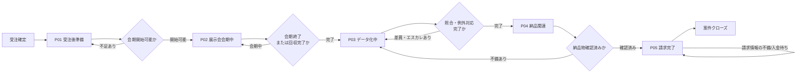
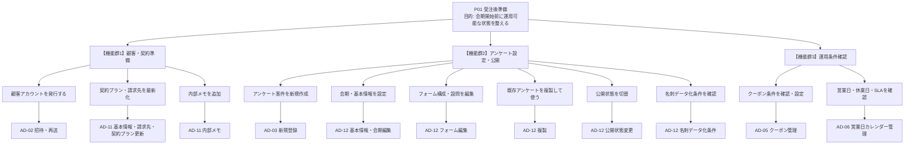
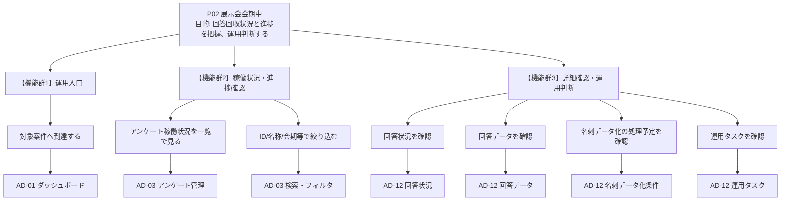
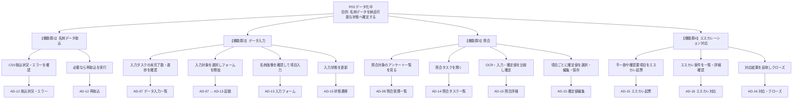
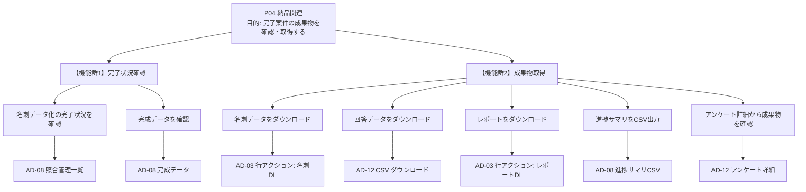
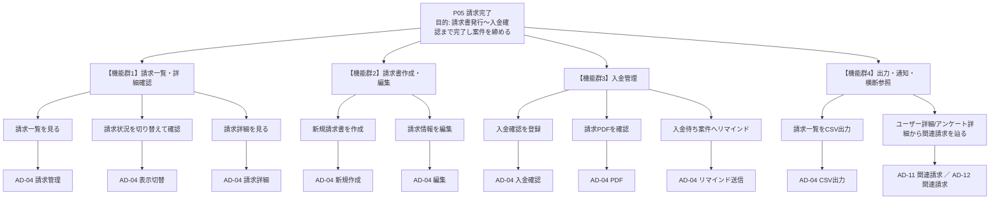
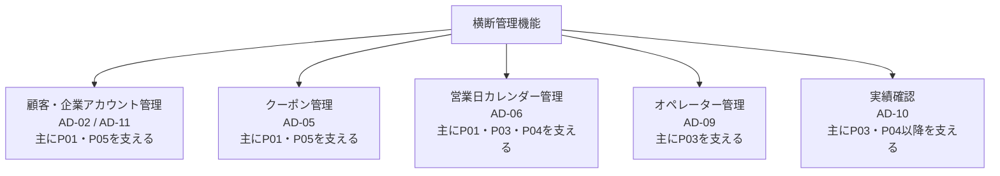

# 管理者画面 アンケート案件ライフサイクル別 業務フロー・最小機能要件

## 1. 目的

- `26_admin_screen_list.md` に含まれる管理者画面機能を、アンケート案件ごとのライフサイクルと業務フローに沿って棚卸しする。
- 初期整理では非機能要件を扱わず、受注後準備から請求完了までを進めるために必要な最小限の機能要件だけを抽出する。
- 画面追加や詳細仕様作成の前に、案件フェーズごとの開始条件、業務ステップ、完了条件、必要機能、対象画面を確認できる状態にする。

## 2. 今回の抽出範囲

### 含めるもの

- 受注後の顧客・契約確認、アンケート準備、展示会会期中の運用、名刺データ化、照合、納品、請求に関する業務機能
- 一覧、検索、詳細確認、登録、編集、状態更新、CSV取込/出力、ダウンロードなど、業務担当者が直接使う操作
- クーポン、営業日、オペレーター、実績など、アンケート案件の各フェーズを支える横断管理機能

### 今回は含めないもの

- 受注前の営業活動、商談管理、提案管理、見積管理
- 権限、認可、MFA、IP制限などのセキュリティ要件
- 操作履歴、監査ログ、証跡ログ、更新ログなどの監査・ログ要件
- 性能、可用性、データ量、バックアップなどの非機能要件
- UI共通部品、テーマ切替、モバイルトグルなどの実装補助機能
- 確認ダイアログ、二重確認、誤操作防止などの安全設計要件

## 3. アンケート案件フェーズ一覧

| フェーズ | 名称 | 目的 | 主な対象画面 |
| --- | --- | --- | --- |
| P01 | 受注後準備 | 顧客、契約、アンケート基本情報、会期、名刺データ化条件を準備する | AD-02, AD-03, AD-05, AD-06, AD-11, AD-12 |
| P02 | 展示会会期中 | 回答状況、会期中の進捗、運用状況を確認する | AD-01, AD-03, AD-12 |
| P03 | データ化中 | 名刺データ取込、入力、照合、エスカレーション対応を進める | AD-07, AD-08, AD-12, AD-13, AD-14, AD-15, AD-16 |
| P04 | 納品関連 | 完成データ、回答データ、レポートなど成果物を確認・取得する | AD-03, AD-08, AD-12, AD-14 |
| P05 | 請求完了 | 請求内容、入金状況を確認し、案件を締める | AD-04, AD-11, AD-12 |

案件ライフサイクル全体の業務フロー:

補足:
- このフローは案件ライフサイクルの主線を示す。会期中に回収済みデータから入力・照合へ先行着手する場合も、フェーズの完了判定は各フェーズの完了条件で行う。
- 納品物確認で不備が見つかった場合は P03 へ戻し、請求内容に不備が見つかった場合は P05 内で請求情報の確認・編集へ戻す。

## 4. フェーズ別の最小機能要件

各フェーズの Mermaid 図は、業務順序ではなく、フェーズ内で必要となる機能群と対象画面の対応を示す機能マップとする。

### P01 受注後準備

開始条件:
- 受注が確定している
- 顧客、契約、アンケート作成に必要な最低情報が揃っている

目的:
受注後に、顧客情報、契約条件、アンケート基本情報、展示会会期、名刺データ化条件を整え、会期開始前に運用可能な状態にする。

業務ステップ:
1. 顧客・契約情報を確認する
2. アンケート案件を作成する
3. 会期、フォーム構成、公開条件を設定する
4. 名刺データ化条件を確認する
5. クーポン、営業日、SLA の前提を確認する

機能マップ:

完了条件:
- 顧客・契約準備: 該当顧客のアカウントが発行され、契約プラン・請求先・利用オプションが最新化されている
- アンケート設定・公開: 案件が登録され、会期・基本情報・フォーム構成が確定し、公開可能な状態である
- 運用条件確認: クーポン条件・営業日・SLA に加え、名刺データ化条件（実施有無・見込み件数・プラン・オプション）が確認され、運用に必要な前提が揃っている

最小機能:
- 利用者/企業アカウントを一覧で確認できる
- 利用者詳細を確認できる
- 基本情報、請求先情報、契約プラン、利用オプションを確認・更新できる
- アンケートを新規登録できる
- アンケート基本情報を確認・編集できる
- 展示会会期を確認・編集できる
- フォーム構成と設問を確認・編集できる
- アンケートを複製できる
- 公開状態を変更できる
- 名刺データ化の実施有無、見込み件数、プラン、オプションを確認できる
- 必要に応じてクーポン条件を確認・設定できる
- 営業日、休業日、SLAに関わる日付情報を確認できる

対象画面:
- AD-02 ユーザー管理
- AD-03 アンケート管理
- AD-05 クーポン管理
- AD-06 営業日カレンダー管理
- AD-11 ユーザー詳細
- AD-12 アンケート詳細

### P02 展示会会期中

開始条件:
- 会期が開始している
- アンケートが公開済みまたは会期中に確認可能な状態である

目的:
展示会会期中に、回答回収状況と案件の進行状況を確認し、会期中の運用判断に必要な情報を把握する。

業務ステップ:
1. 管理者トップから対象案件へ到達する
2. アンケートの稼働状況と回答状況を確認する
3. 会期中の処理予定、運用タスク、名刺データ化条件を確認する
4. 必要に応じてアンケート詳細を確認する

機能マップ:

完了条件:
- 運用入口: 管理者が主要管理機能（アンケート/データ化/請求等）へ即時アクセスできる
- 稼働状況・進捗確認: 全実施中アンケートの稼働状況・進捗が一覧で把握でき、絞り込みで個別案件にも到達できる
- 詳細確認・運用判断: 個別案件の回答データ・処理予定・運用タスクが確認でき、会期中の判断材料が揃っている

最小機能:
- 管理者トップから対象案件へ到達できる
- アンケートの稼働状況を一覧で確認できる
- アンケートID、名称、グループ名、ステータス、会期で検索・絞り込みできる
- 回答状況を確認できる
- 回答データを確認できる
- 名刺データ化の設定状況と処理予定を確認できる
- 運用タスクを確認できる
- 必要に応じてアンケート詳細を確認できる

対象画面:
- AD-01 ダッシュボード
- AD-03 アンケート管理
- AD-12 アンケート詳細

### P03 データ化中

開始条件:
- 会期が終了している、または名刺データの回収・取込を開始できる状態である
- 名刺データ化の対象件数、プラン、オプションが確認済みである

目的:
会期後または回収後に、名刺データを取り込み、入力、照合、エスカレーション対応を進め、納品可能なデータへ確定する。
P03 は納品データの確定までを扱い、顧客へ提出する成果物の確認・取得は P04 で扱う。

業務ステップ:
1. 名刺データの取込状況と取込エラーを確認する
2. 入力タスクの進捗を確認し、入力作業を進める
3. OCR、入力結果、確定値を照合する
4. 差異や確認事項をエスカレーションし、対応結果を反映する
5. 全件の入力・照合・例外対応を完了させる

機能マップ:

完了条件:
- 名刺データ取込: CSV 取込が完了し、取込エラーがゼロまたは再取込で解消されている
- データ入力: 全入力タスクが完了し、未入力・未確認の対象が残っていない
- 照合: 全件の照合が完了し、OCR・入力・確定値の差異が確定値で解消されている
- エスカレーション対応: 起票された全エスカレ案件がクローズされ、納品データに反映されている

例外・戻り条件:
- 取込エラーが残る場合は、取込内容を確認して再取込または対象データの見直しに戻る
- 照合差異や確認事項が残る場合は、エスカレーション対応へ戻る
- 納品確認で不備が見つかった場合は、該当データの照合またはエスカレーション対応へ戻る

最小機能:
- 名刺データCSVの取込状況を確認できる
- 取込エラーを確認できる
- 必要に応じて再取込を実行できる
- 名刺データ入力の未完了数と進捗を確認できる
- 入力対象のタスク一覧を確認できる
- 入力対象を選択して入力フォームを開始できる
- 名刺画像を確認できる
- 名刺項目を入力できる
- 入力内容を下書き保存できる
- 入力対象をスキップできる
- 入力を完了できる
- 照合対象のアンケート一覧を確認できる
- 照合タスク一覧を確認できる
- 照合詳細を開ける
- OCR結果、入力結果、確定値を比較できる
- 項目ごとに確定値を選択・編集できる
- 照合結果を保存できる
- 不一致や確認が必要な項目をエスカレーションへ回せる
- エスカレーション案件を一覧で確認できる
- エスカレーション詳細を確認できる
- 対応結果を登録できる
- 担当者を変更できる
- 状態を更新できる
- クローズできる

対象画面:
- AD-07 データ入力一覧
- AD-08 照合管理一覧
- AD-12 アンケート詳細
- AD-13 データ入力フォーム
- AD-14 照合タスク一覧
- AD-15 照合詳細
- AD-16 エスカレーション対応

BY-* は本フェーズの正本画面ではなく、現行作業画面の参考として扱う。

参考画面:
- BY-212 オペレーター入力画面
- BY-213 オペレーター入力フォーム
- BY-222 照合画面
- BY-223 照合詳細フォーム

### P04 納品関連

開始条件:
- 名刺データの取込、入力、照合、エスカレーション対応が完了している
- 成果物の確認・取得を開始できる状態である

目的:
データ化・照合が完了したアンケート案件について、完成データ、回答データ、名刺データ、レポートなどの成果物を確認・取得する。
P04 は成果物の確認・取得までを扱い、請求書発行と入金確認は P05 で扱う。

業務ステップ:
1. データ化と照合の完了状況を確認する
2. 完成データと回答データを確認する
3. 名刺データ、回答データ、レポート、進捗サマリを取得する
4. 顧客へ提出する納品物が揃っていることを確認する

機能マップ:

完了条件:
- 完了状況確認: 全案件のデータ化完了状況・完成データが確認可能な状態である
- 成果物取得: 名刺データ・回答データ・レポート・進捗サマリが取得可能で、顧客への納品物が揃っている

例外・戻り条件:
- 納品物に不備がある場合は、P03 の照合またはエスカレーション対応へ戻る
- 成果物の不足や取得不可がある場合は、対象画面で状態を確認して再出力または再確認する

最小機能:
- 名刺データ化の完了状況を確認できる
- 完成データを確認できる
- 回答データを確認できる
- 名刺データをダウンロードできる
- 回答データをダウンロードできる
- レポートをダウンロードできる
- 進捗サマリをCSV出力できる
- 必要に応じてアンケート詳細から成果物を確認できる

対象画面:
- AD-03 アンケート管理
- AD-08 照合管理一覧
- AD-12 アンケート詳細
- AD-14 照合タスク一覧

### P05 請求完了

開始条件:
- 納品物が確認済みで、請求対象として扱える状態である
- 請求先、契約プラン、請求予定金額など請求に必要な情報が確認済みである

目的:
アンケート案件に紐づく請求予定、請求書、入金状態を確認・更新し、案件を請求完了状態まで締める。

業務ステップ:
1. 請求対象案件と請求状況を確認する
2. 請求書を作成し、請求内容を確定する
3. 請求PDFや請求情報を確認する
4. 入金確認を登録する
5. 請求完了として案件を締める

機能マップ:

完了条件:
- 請求一覧・詳細確認: 全請求対象案件が一覧で確認でき、案件単位・請求書単位の状況が把握できる
- 請求書作成・編集: 該当案件分の請求書が発行され、請求内容が確定している
- 入金管理: 請求PDFが確認され、入金確認が登録されている
- 出力・通知・横断参照: 必要に応じて請求一覧 CSV 出力、リマインド送信、ユーザー詳細・アンケート詳細からの逆引きが利用できる

例外・戻り条件:
- 入金待ちが継続する場合は、リマインド送信などの入金待ち対応を行い、入金確認へ戻る
- 請求内容に不備がある場合は、請求情報の編集へ戻る

最小機能:
- 請求一覧を確認できる
- アンケート単位/請求書単位で表示を切り替えられる
- 請求詳細を確認できる
- 新規請求書を作成できる
- 請求情報を編集できる
- 入金確認を登録できる
- 請求PDFを確認できる
- 入金待ち案件へリマインド送信できる
- 請求一覧をCSV出力できる
- ユーザー詳細またはアンケート詳細から関連請求を確認できる

対象画面:
- AD-04 請求管理
- AD-11 ユーザー詳細
- AD-12 アンケート詳細

## 5. 横断管理機能

横断管理機能は P01〜P05 のフェーズを横串で支える。

### 顧客・企業アカウント管理

役割:
P01の受注後準備とP05の請求完了を支える顧客・契約・請求先情報の管理。

最小機能:
- 利用者/企業アカウントを一覧で確認できる
- 氏名、メール、アカウントID、会社名、契約ステータスで検索・絞り込みできる
- 利用者を招待・再送・キャンセルできる
- 利用者詳細を確認できる
- 基本情報、請求先情報、契約プラン、利用オプションを更新できる
- 関連アンケートを確認できる
- 内部メモを登録・更新できる

対象画面:
- AD-02 ユーザー管理
- AD-11 ユーザー詳細

### クーポン管理

役割:
P01の条件設定、P05の請求・割引確認を支える割引施策の管理。

最小機能:
- クーポン一覧を確認できる
- コード、名称、ステータス、有効期限で検索・絞り込みできる
- 新規クーポンを作成できる
- クーポン詳細を確認できる
- クーポンを編集できる
- クーポンを一括作成できる
- クーポンを削除できる
- クーポン一覧をCSV出力できる

対象画面:
- AD-05 クーポン管理

### 営業日カレンダー管理

役割:
P01の準備、P03のデータ化、P04の納品予定を支える営業日・SLAの管理。

最小機能:
- 営業日カレンダーを確認できる
- 月表示、年表示を切り替えられる
- 日付ごとの詳細を確認できる
- 特別休業日を設定できる
- 振替営業日を設定できる
- 休業日設定を解除できる
- 個別休業日の一覧を確認・削除できる
- 担当会社のアサインを保存・解除できる
- 募集締切・再募集を切替できる
- 日付メモを登録・編集できる
- 祝日情報を同期できる
- 休業日CSVを取り込める
- カレンダー情報をCSV出力できる

対象画面:
- AD-06 営業日カレンダー管理

### オペレーター管理

役割:
Lv1〜Lv4 の全アカウント（社内/外部問わず）、所属（会社単位グループ）、稼働状態を一元管理する。「オペレーター管理」は本セクションのラベルだが、管理対象は Lv1〜Lv4 全員を含む。階層別の正式呼称・権限は AD-09 個別仕様（28_admin_operator_management_requirements.md §4.4）を参照。

最小機能:
- オペレーター一覧を確認できる
- 氏名、メール、ID、所属グループ、ステータスで検索・絞り込みできる
- オペレーターを招待・登録できる
- オペレーター情報を編集できる
- 所属グループを変更できる
- ステータスを変更できる
- グループを管理できる

対象画面:
- AD-09 オペレーター管理

### 実績確認

役割:
P03の作業配分、P04後の運用改善、次案件の体制検討を支える処理量・品質確認。

最小機能:
- 個人単位の実績を確認できる
- グループ単位の実績を確認できる
- 対象期間で絞り込みできる
- 案件、グループ、稼働状態で絞り込みできる
- 処理数、エラー率、品質指標を確認できる
- 個人別CSVを出力できる
- グループ別CSVを出力できる

対象画面:
- AD-10 実績管理

## 6. 旧フローから新フェーズへの対応表

| 旧フロー | 新しい扱い |
| --- | --- |
| F01 サービス状況を確認する | P02/P03/P05の状態確認、およびAD-01の運用入口として扱う |
| F02 利用者・企業アカウントを管理する | 横断管理機能「顧客・企業アカウント管理」へ移動 |
| F03 アンケートを管理する | 作成・編集・公開設定はP01、回答状況確認はP02、成果物確認はP04へ分解 |
| F04 名刺データを取り込む・出力する | 独立フローとしては廃止。取込・再取込はP03、ダウンロード・レポート取得はP04へ分解 |
| F05 名刺データ入力を進める | P03へ統合 |
| F06 入力結果を照合する | P03へ統合 |
| F07 エスカレーションを対応する | P03の例外対応へ統合 |
| F08 請求を管理する | P05へ移動 |
| F09 クーポンを管理する | 横断管理機能「クーポン管理」へ移動 |
| F10 営業日・対応期限を管理する | 横断管理機能「営業日カレンダー管理」へ移動 |
| F11 オペレーターを管理する | 横断管理機能「オペレーター管理」へ移動 |
| F12 実績を確認する | 横断管理機能「実績確認」へ移動 |

## 7. 初期段階で後回しにする候補

| 候補 | 理由 |
| --- | --- |
| 受注前の営業・商談管理 | 管理者画面の対象は受注後準備からとするため |
| BY-* 画面の正本化 | 現行管理者ポータルと業務特化画面の責務が重なるため、まずAD-*側を正とする |
| 詳細な分析グラフ | 日次運用には処理数、エラー率、進捗があれば足りるため |
| 検索条件保存 | 便利機能だが、初期の業務成立には必須ではない |
| テーマ切替 | サービス運用フローには直接関係しない |
| 自動バッチ設定画面 | 初期は手動運用または別途運用手順で扱い、画面要件からは分ける |
| Slack/Webhook通知設定 | 外部連携は後続要件として扱い、初期は画面内確認を優先する |
| 詳細な権限設定UI | 非機能・管理設計として別途扱う |

## 8. 次に詳細化する順序

1. P01 受注後準備
2. P02 展示会会期中
3. P03 データ化中
4. P04 納品関連
5. P05 請求完了
6. 横断管理機能のうち、顧客・企業アカウント管理
7. 横断管理機能のうち、営業日カレンダー管理
8. 横断管理機能のうち、オペレーター管理
9. 横断管理機能のうち、実績確認
10. 横断管理機能のうち、クーポン管理
