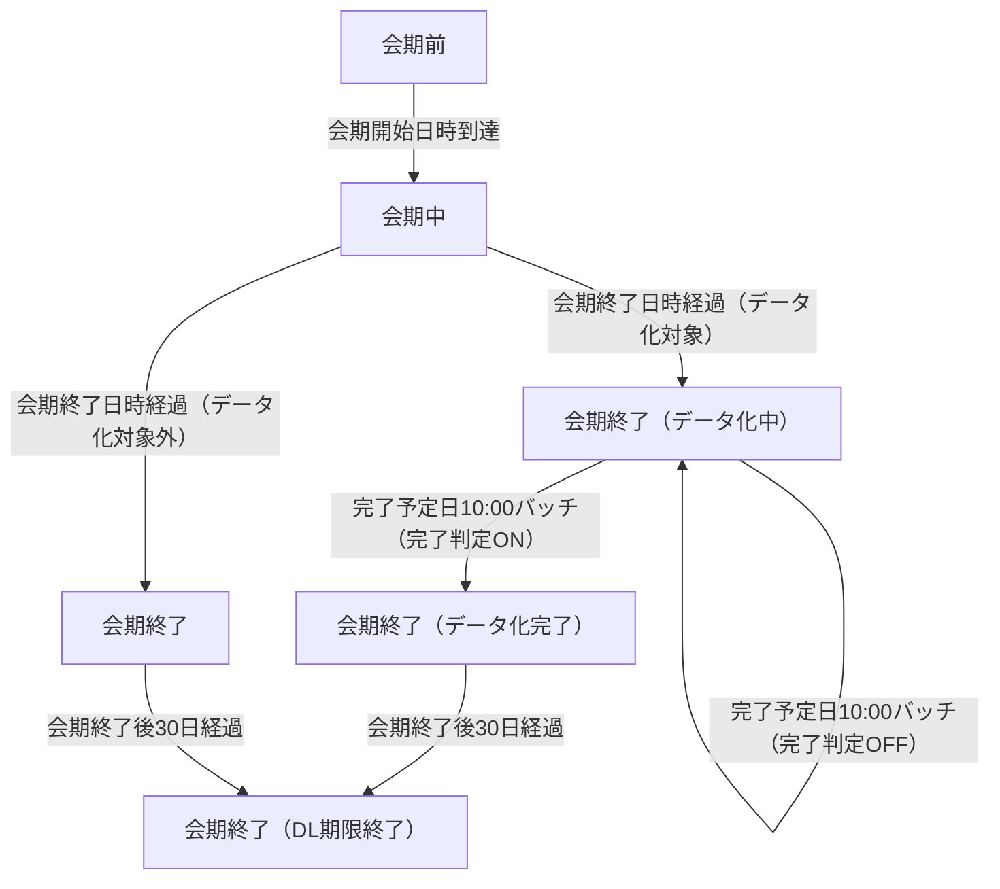

# アンケートステータス草案

## ステータス一覧
| ステータス名 | 状態の定義 | 主な更新トリガー | ダウンロード可否に関する補足 |
|--------------|------------|------------------|------------------------------|
| 会期前 | アンケートに設定された会期開始日の前日23:59までの期間 | 会期設定にもとづく日時判定で自動更新 | プレミアムプランでオンデマンド処理が完了した名刺データのみダウンロード可能／それ以外は不可 |
| 会期中 | 会期開始日0:00から会期終了日23:59までの期間 | 会期設定にもとづく日時判定で自動更新 | プレミアムプランでオンデマンド処理が完了した名刺データのみダウンロード可能／それ以外は不可 |
| 会期終了（データ化中） | 会期終了後、各プランのデータ化完了予定日時（午前10時）に到達する前の状態 | 会期終了直後のバッチ処理でデータ化対象と判断されたタイミングで遷移 | 名刺データのダウンロードは不可 |
| 会期終了（データ化完了） | データ化完了予定日の午前10時バッチで完了判定が有効になった状態 | 各プランの完了予定日10:00の定時バッチで自動更新 | 名刺データのダウンロードが可能（ダウンロード期限内に限る） |
| 会期終了 | データ化対象外、または会期終了後もデータ化が不要な状態 | 会期終了後のバッチでデータ化対象外と判定された際などに設定 | データ化対象外のアンケートは常にダウンロード不可／データ化対象の場合は別ステータスへ遷移 |
| 会期終了（DL期限終了） | 会期終了日を0日目として30日後の23:59を経過しダウンロード期限が終了した状態 | 30日経過を判定するバッチ処理で自動更新 | すべてのプランで名刺データのダウンロードが不可 |

## ステータス遷移の流れ
- 初期状態は「会期前」。会期開始日時を迎えると自動で「会期中」に遷移する。
- 会期終了日時（23:59）を過ぎると、名刺データ化対象アンケートは「会期終了（データ化中）」へ、データ化対象外は「会期終了」へ遷移する。
- 「会期終了（データ化中）」は、各プランに設定されたデータ化完了予定日10:00に実行する定時バッチで完了判定がONになれば「会期終了（データ化完了）」に遷移する。完了判定がOFFであれば据え置き。
- 「会期終了（データ化完了）」および「会期終了」は、会期終了日を0日目として30日後23:59に実行するダウンロード期限バッチで「会期終了（DL期限終了）」へ遷移する。
- 「会期終了（DL期限終了）」は終端状態であり、以降のダウンロードはできない。

## ステータス遷移図（Mermaid）

