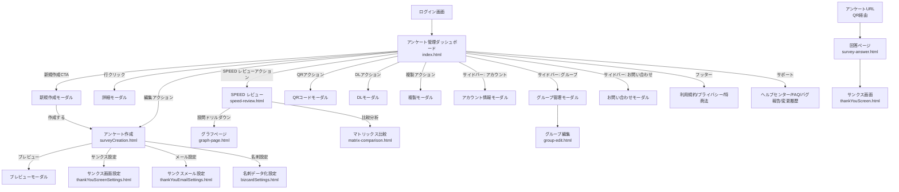

# 画面要件定義書：SpeedAd - アンケート管理ダッシュボード

## 1. 概要

本ドキュメントは、SpeedAd サービスのアンケート管理ダッシュボード画面（`02_dashboard/index.html`）に関する画面要件を定義する。本画面は、ユーザーがアンケートのライフサイクル全体を管理するための中心的なインターフェースとして機能する。

### 1.1. 対象読者

- 製品企画・UI/UX デザイナー
- フロントエンド／バックエンド開発者
- QA エンジニア
- 運用・サポート担当

### 1.2. 画面遷移図

本書が対象とする全画面とモーダルの導線を以下に示す。モーダルは実線矢印、別画面への遷移はラベル付き矢印で表現する。

上記は本ドキュメント策定時点の主要導線であり、詳細な遷移仕様は `./01_screen_flow.md` を参照。

## 2. 用語集

本文書中で使用する主要用語を以下に定義する。

| 用語 | 定義 |
|:---|:---|
| **アンケート名** | 社内向け識別子。`surveys.json` の `name.ja`（既定ロケール）を表示する。 |
| **表示タイトル** | 回答者に提示する公開タイトル。アンケート回答ページに表示される。 |
| **グループ** | アンケートを束ねる単位。ユーザーは複数グループに所属可能。 |
| **プラン値の表記規則** | プラン値は JSON 側（`plan-capabilities.json`）は小文字 `free/standard/premium/premiumPlus`、UI 表示は大文字頭（Free/Standard/Premium）。本書では JSON 言及時は小文字、UI 言及時は大文字頭を用いる。 |
| **会期前** | 現在日時が `periodStart` より前の状態。 |
| **会期中** | 現在日時が `periodStart` 以降 `periodEnd` 以前の状態。 |
| **会期終了** | `periodEnd` を過ぎ、データ化プランが未契約、もしくはデータ化未開始の状態。 |
| **会期終了（データ化中）** | データ化プラン受注済かつデータ化作業進行中の状態。 |
| **会期終了（データ化完了）** | データ化完了済かつダウンロード期限内の状態。 |
| **会期終了（DL期限終了）** | ダウンロード期限（`downloadDeadline`）を経過した状態。 |
| **見込み請求額** | データ化完了前に算出される概算請求額。 |
| **確定請求額** | データ化完了後に確定する最終請求額。 |
| **期間フィルター** | アンケート一覧画面における、日付範囲での絞り込み UI。 |
| **期間指定** | データダウンロードモーダルにおける、開始・終了の日時範囲指定 UI。 |
| **会期** | アンケートが回答受付可能な期間。`periodStart` から `periodEnd` まで（JST）。 |
| **SPEED レビュー** | 回答データを可視化する分析画面（`02_dashboard/speed-review.html`）。回答総数、時間帯別回答数、属性別集計、設問別集計、詳細分析テーブルを表示する。 |
| **データ化プラン** | 紙の名刺やアンケート用紙を手入力でデジタル化するオプションサービス。`bizcardSettings` で契約し、完了後にダウンロード可能となる。プラン種別は `normal`/`express`/`superExpress`/`onDemand`（`plan-capabilities.json` の `bizcard.speedPlans` 参照）。 |
| **データ化完了** | データ化プラン受注後、入力作業が完了し `lifecycleMeta.dataConversionCompleted = true` となった状態。 |
| **名刺入力データ** | データ化プランで手入力されたデジタルデータ（氏名、会社名、メール等）。ダウンロードモーダル（§5.5.4）の対象の一つ。 |
| **ダウンロード期限** | データ化完了後、ダウンロード可能な期限（`downloadDeadline`）。経過すると「会期終了（DL期限終了）」ステータスに遷移し、データは §8.2 に従い 90 日後に自動削除される。 |
| **監査ログ** | データダウンロード操作および権限変更操作の記録（§8.3）。 |

### 2.1. ステータス遷移

アンケートは以下の 6 ステータスを遷移する。遷移トリガーは日時到達またはシステムイベント。

| 遷移元 → 遷移先 | トリガー |
|:---|:---|
| （新規作成） → 会期前 | アンケート作成完了 |
| 会期前 → 会期中 | 現在日時が `periodStart` に到達 |
| 会期中 → 会期終了 | 現在日時が `periodEnd` を超過 |
| 会期終了 → 会期終了（データ化中） | データ化プラン受注、データ化ジョブ開始 |
| 会期終了（データ化中） → 会期終了（データ化完了） | `lifecycleMeta.dataConversionCompleted = true` 更新 |
| 会期終了（データ化完了） → 会期終了（DL期限終了） | 現在日時が `downloadDeadline` を超過 |

- ステータス変化時はダッシュボードのバッジ・ダウンロード可否・詳細モーダル内ヘルプ文言を即時更新する。
- 内部ステータス `削除済み` は本画面では表示・選択肢として露出しない。
- **ステータスバッジ（色・アイコン）**:

    | ステータス | 色トークン | アイコン | 説明 |
    |:---|:---|:---|:---|
    | 会期前 | Gray-500（中立） | `schedule` | 回答受付前 |
    | 会期中 | Primary-Green（アクティブ） | `radio_button_checked` | 回答受付中 |
    | 会期終了 | Gray-700（完了） | `check_circle_outline` | 受付終了、データ化未契約 |
    | 会期終了（データ化中） | Info-Blue（処理中） | `sync` | データ化作業中 |
    | 会期終了（データ化完了） | Success-Green（完了） | `task_alt` | ダウンロード可能 |
    | 会期終了（DL期限終了） | Warning-Amber（注意） | `hourglass_disabled` | ダウンロード不可 |

    色トークンは Material Design 3 準拠（§6.2 参照）。Material Icons 名を併記。実装が異なる場合は `02_dashboard/src/services/statusService.js` を確認して調整可。

## 3. 画面目的

ユーザーが自身のアンケートのライフサイクル（作成、会期、データ化、ダウンロード）を一元管理するための中心画面。
一覧把握、詳細確認、ステータス監視、関連データへのアクセスを迅速に行える UI を提供する。

## 4. レイアウトとレスポンシブ対応

### 4.1. 基本レイアウト

- **ヘッダー**: 画面上部に固定。ブランドロゴ、ユーザー情報、モバイルメニューボタンを配置する。
- **サイドバー**: 画面左側。プロファイル表示、グループ管理、主要機能ナビゲーション、サポートリンク、テーマ切替を提供する。
- **メインコンテンツ**: 画面中央の主要エリア。アンケートテーブルおよび関連操作パネルを配置する。
- **フッター**: 画面下部。補足的なリンク（ヘルプセンター、お問い合わせ、会社情報、特定商取引法に基づく表記、利用規約、プライバシーポリシー）とコピーライトを表示する。
- **ヘルプ導線**: 主要導線はサイドバーの「サポート」に集約し、フッターの「ヘルプセンター」リンクは補助導線として併置する。

### 4.2. レスポンシブ挙動

| ブレークポイント | 閾値 | サイドバー挙動 |
|:---|:---|:---|
| デスクトップ | ≥1024px | 既定で折りたたみ（幅 4rem、アイコンのみ）。ホバーで展開（幅 16rem）。 |
| モバイル | <1024px | 既定で非表示。ヘッダーのハンバーガーボタンで左からオーバーレイ表示。 |

- **タッチデバイス**: ホバーが存在しないため、デスクトップ幅（≥1024px）であってもタッチ操作時はサイドバーのアイコンを **タップで展開状態に固定**（再タップで折りたたみ）する。
- **キーボード操作**: Tab でサイドバー内要素にフォーカスが入った時点で展開し、フォーカスがサイドバー外へ外れた時点で折りたたむ。
- モバイル表示でサイドバーが開いている間、背景のスクリム（半透明黒）をタップ／クリックすると閉じる。ESC キーでも閉じる。
- CSS のブレークポイントおよび各幅は `02_dashboard/service-top-style.css` を正とする。

## 5. 機能要件

### 5.1. ヘッダー

- **5.1.1. ブランドロゴ**: クリックでダッシュボードトップ（本画面）に遷移。
- **5.1.2. ユーザー表示**: ログイン中ユーザーのメールアドレス（末尾に「さん」を付与）を表示。クリックでアカウント情報モーダル（§5.5.5）を開く。
- **5.1.3. モバイルメニューボタン**: モバイル表示時のみ表示。クリックでサイドバーの開閉を切り替える。

### 5.2. サイドバー

- **5.2.1. プロファイル表示**: ユーザーアイコン、メールアドレス、現在選択中のグループ名を表示する。
- **5.2.2. グループ管理**:
    - **グループ選択ドロップダウン**: 所属グループを一覧表示し、選択と同時に即時切替。切替時、キーワード検索・期間フィルター・ステータスフィルターは **リセットせず維持** する（**ページ番号のみ 1 ページ目に戻す**）。
    - **グループ新規作成ボタン**: クリックでグループ管理モーダル（§5.5.6）を開く。
- **5.2.3. ナビゲーション**:
    - **アンケート管理 → アンケート一覧**: 本画面へのリンク。新規作成はテーブル右上の CTA から行う（§5.4.1）。
    - **アカウント・設定 → アカウント情報**: アカウント情報モーダル（§5.5.5）を開く。
    - **アカウント・設定 → ログアウト**: ログアウト処理を実行し、ログイン画面に遷移。
    - **サポート**: ヘルプセンター（本画面外）に遷移。
- **5.2.4. テーマ切替**: サイドバー下部に配置。ライト／ダークモードを切り替える。設定は `localStorage` の `theme` キーに保存し、次回アクセス時に復元する。

### 5.3. フッター

- 表示リンク: ヘルプセンター、お問い合わせ、会社情報、特定商取引法に基づく表記、利用規約、プライバシーポリシー、コピーライト。
- 外部遷移リンクは新規タブで開く（`target="_blank"` + `rel="noopener"`）。

### 5.4. メインコンテンツ（アンケート一覧）

#### 5.4.1. アンケート新規作成

- **操作**: 「アンケート新規作成」ボタン（`#openNewSurveyModalBtn`）をクリック。
- **結果**: 新規アンケート作成モーダル（`newSurveyModal`、§5.5.1）を開く。

#### 5.4.2. 検索・フィルタリング

- **フィルターとデータソース**:

    | フィルター | UI | 検索対象（`data/core/surveys.json` のキー） |
    |:---|:---|:---|
    | キーワード検索 | 検索ボックス | `name`, `displayTitle`, `id` |
    | ステータスフィルター | ドロップダウン | `periodStart`, `periodEnd`, プラン契約状況から動的算出 |
    | 期間フィルター | カレンダー UI（初期値: 当月の開始日〜終了日、タイムゾーンは `Asia/Tokyo` (JST) 固定） | `periodStart`, `periodEnd` |
    | グループフィルター | サイドバーのグループ選択（§5.2.2） | `groupId` |

- **ステータス選択肢**: 会期前／会期中／会期終了／会期終了（データ化中）／会期終了（データ化完了）／会期終了（DL期限終了）。`削除済み` などの内部ステータスは選択肢に含めない。
- **リセット**: 「フィルターをリセット」テキストボタンでキーワード・ステータス・期間フィルターを初期化する。グループフィルターはサイドバー側で制御するためリセット対象外。
- **結合ルール**: すべてのフィルターは **AND** で結合する。グループフィルターを含む。
- **即時反映**: 入力・選択のたびにアンケートテーブルが即座に更新される。

#### 5.4.3. アンケートテーブル

- **列定義**:

    | 表示項目 | データソース | 備考 |
    |:---|:---|:---|
    | アンケート ID | `data/core/surveys.json` → `id` | ソート可 |
    | アンケート名 | `data/core/surveys.json` → `name` | 社内向け識別子。多言語対応のオブジェクト（ja/en）で、表示は既定ロケール `ja`。詳細モーダル（§5.5.2）で表示タイトルとの差異を説明 |
    | ステータス | 算出値（`periodStart`, `periodEnd`, プラン情報） | §2 で定義する 6 種のいずれか。`削除済み` 等の内部ステータスは表示しない |
    | 回答数 | `data/responses/survey-answers.json` | `surveyId` に紐づく回答件数 |
    | 展示会会期 | `data/core/surveys.json` → `periodStart`, `periodEnd` | `YYYY/MM/DD - YYYY/MM/DD` |

- **ソート**:
    - すべての列ヘッダクリックで昇順／降順をトグル。
    - **初期状態は「会期開始日（`periodStart`）降順」** とする。`createdAt` を用いた「作成日時降順」が本来望ましいが、現行 `surveys.json` には `createdAt` フィールドが未投入のため、暫定として `periodStart` を採用する（`createdAt` 追加投入後に切替予定）。
- **行アクション（各行の操作列）**:
    - **編集**: アンケート編集画面 `02_dashboard/surveyCreation.html?surveyId={id}&surveyName={encodedName}` へ遷移する（実装: `02_dashboard/src/tableManager.js` の `button[title="アンケートを編集"]` クリックハンドラ）。`surveyName` は `encodeURIComponent` でエンコードした表示名を引き継ぐ。
    - **SPEED レビュー**: SPEED レビュー画面 `02_dashboard/speed-review.html?surveyId={id}` へ遷移する（実装: `02_dashboard/src/tableManager.js` の `button[title="SPEEDレビューを開く"]` クリックハンドラ。title 属性値は実装由来のためスペースなし）。レポートは「回答総数」「時間帯別回答数（時系列チャート）」「回答内容の内訳（属性別集計）」「設問別の集計データ」「詳細分析（個別回答テーブル：回答ID／回答日時／設問回答）」を主要構成要素とする（`02_dashboard/src/speed-review.js`、`02_dashboard/src/ui/speedReviewRenderer.js`、`02_dashboard/src/services/speedReviewService.js`）。
    - **QR コード**: QR コードモーダル（§5.5.3）を開く。
    - **データダウンロード**: データダウンロードモーダル（§5.5.4）を開く。
    - **複製**: 複製モーダル（§5.5.8）を開く。設問構成・設定を引き継ぎ、アンケート ID は新規採番して新しいアンケートとして作成する。
- **行クリック**: 行自体のクリックでアンケート詳細モーダル（§5.5.2）を開く。

#### 5.4.4. ページネーション

- **1 ページあたりの表示件数**: ドロップダウンで 10／25／50 件から選択。既定値は 10 件。
- **操作**: ページ番号クリック、または「前へ」「次へ」ボタンで遷移。
- **空結果時（0 件）**: テーブル本体の代わりに空状態メッセージを表示し、ページネーション UI は非表示（文言・初回ログインCTAは §5.9.6 参照）。
- **総件数 ≦ 1 ページ分**: ページネーション UI を非表示。

### 5.5. モーダルウィンドウ

#### 5.5.0. 共通仕様（全モーダル共通）

- 背景はスクリム（半透明黒）で覆い、中央にコンテンツを配置する。
- **ESC キー** でモーダルを閉じる。
- **スクリム（背景）クリック** でもモーダルを閉じる。ただし、入力中の新規アンケート作成モーダル（§5.5.1）およびグループ管理モーダル（§5.5.6）については「変更を破棄しますか？」の確認ダイアログを挟む。
- モーダルを開いている間は **フォーカストラップ** を適用し、Tab/Shift+Tab はモーダル内で循環する。
- **WAI-ARIA 属性（要件）**: すべてのモーダルに `role="dialog"`、`aria-modal="true"`、`aria-labelledby` を付与する。

#### 5.5.1. 新規アンケート作成モーダル（`newSurveyModal`）

- **フォーム項目**: 以下を入力後、「作成する」ボタンでアンケート作成ページ（`02_dashboard/surveyCreation.html`）へ遷移する。

    | 項目名 | フィールドID | 必須/任意 | 型・制約 |
    |:---|:---|:---:|:---|
    | アンケート名 | `surveyName` | 必須 | text。社内向け識別子。空文字不可（trim 後判定） |
    | 表示タイトル | `displayTitle` | 必須 | text。回答者向けタイトル。空文字不可（trim 後判定） |
    | メモ | `surveyMemo` | 任意 | textarea（3行）。空欄の場合はクエリに含めない |
    | 回答期間 | `newSurveyPeriodRange` | 必須 | flatpickr 範囲選択（`Y-m-d`）。`minDate=翌日`、開始日 > 当日、終了日 > 開始日 |

- **引き継ぎクエリパラメータ**: `URLSearchParams` で構築し、各値はブラウザ標準の `application/x-www-form-urlencoded` エンコード（`URLSearchParams` 仕様に準拠）で安全にシリアライズする。遷移先 URL は `surveyCreation.html?{query}` 形式。

    | キー | 値 | 備考 |
    |:---|:---|:---|
    | `surveyName` | アンケート名（trim 済み） | 常に付与 |
    | `displayTitle` | 表示タイトル（trim 済み） | 常に付与 |
    | `memo` | メモ（trim 済み） | メモが空でない場合のみ付与 |
    | `periodStart` | 開始日（`YYYY-MM-DD`） | 常に付与 |
    | `periodEnd` | 終了日（`YYYY-MM-DD`） | 常に付与 |

- バリデーションエラー時はフィールド直下にインライン表示し、遷移は行わない。

#### 5.5.2. アンケート詳細モーダル（`surveyDetailsModal`）

- **開き方**: アンケートテーブルの行クリック（§5.4.3）。
- **編集可否ルール**: ステータスが「会期前」の場合のみ、以下のフィールドが編集可能。それ以外は読み取り専用とし、`disabled` 属性を付与、視覚的にグレーアウト、ヘルプアイコン（`?`）のホバー／フォーカスで理由をツールチップ（Material Tooltip）で表示する。
- **ツールチップ文言テンプレート**（ステータス別。※「会期前」は編集可のためツールチップ非表示）:

    | ステータス | ツールチップ文言 |
    |:---|:---|
    | 会期中 | 会期中のため編集できません。 |
    | 会期終了 | 会期が終了しているため編集できません。 |
    | 会期終了（データ化中） | データ化処理中のため編集できません。 |
    | 会期終了（データ化完了） | データ化が完了しているため編集できません。 |
    | 会期終了（DL期限終了） | ダウンロード期限を経過したため編集できません。 |

    | 表示項目 | データソース | 編集条件 |
    |:---|:---|:---|
    | アンケート名 | `data/core/surveys.json` → `name` | 会期前のみ |
    | 表示タイトル | `data/core/surveys.json` → `displayTitle`（※将来追加予定。現行 `surveys.json` 未投入） | 会期前のみ |
    | メモ | `data/core/surveys.json` → `memo`（※将来追加予定。現行 `surveys.json` 未投入） | 会期前のみ |
    | プラン | `data/core/surveys.json` → `plan` | 会期前のみ |
    | 請求額 | `02_dashboard/src/services/bizcardCalculator.js` | 編集不可 |
    | データ化完了予定日 | `data/core/surveys.json` → `deadline`（※将来追加予定。現行 `surveys.json` 未投入） | 編集不可 |
    | ダウンロード期限 | `data/core/surveys.json` → `downloadDeadline`（※将来追加予定。現行 `surveys.json` 未投入） | 編集不可 |

- **「将来追加予定」フィールドの暫定動作**: `displayTitle` / `memo` / `deadline` / `downloadDeadline` は新規作成時に §5.5.1 の引き継ぎクエリパラメータ経由で初期値が投入される想定。現行モックでは `surveys.json` に未投入のため、表示時は既定値（空文字または計算値）で代用する。

- **UI 補足**:
    - 「アンケート名（社内向け）」と「表示タイトル（回答者向け）」の違いをヘルプアイコン＋ポップオーバーで説明する。
    - 請求額ラベルは、データ化完了判定（`lifecycleMeta.dataConversionCompleted`）が偽のとき「見込み請求額」、真のとき「確定請求額」に切り替える。
    - アンケート URL 欄はクリック・Enter・Space のいずれでもクリップボードにコピーし、成功時はトーストで通知する。

#### 5.5.3. QR コードモーダル（`qrCodeModal`）

- アンケート URL と QR コード画像を表示する。
- 「URL をコピー」「QR コード画像をダウンロード」の両ボタンは、モーダル表示直後は `disabled`（`aria-disabled="true"`）で初期化する。**アンケートデータの読み込み（API レスポンス受信および DOM 反映）が完了したタイミングで有効化する**。
- URL コピー失敗、QR 生成失敗などエラー発生時はエラートーストを表示し、該当ボタンを `disabled` に戻す。

#### 5.5.4. データダウンロードモーダル（`downloadOptionsModal`）

- **ダウンロード対象**: 「回答データ」「名刺入力データ」「名刺入力＋回答データ」「画像データ」から選択。文言はユーザー向けに統一し、「名刺入力データ」と表記する。
- **期間**: 「全て」または「期間指定」のラジオカードで選択する。「期間指定」を選んだ場合のみ、開始日時・終了日時の入力フィールドを表示する。
    - **時刻初期値**: 開始 `00:00:00`、終了 `23:59:59`（タイムゾーン: `Asia/Tokyo`）。ISO 8601 拡張表記の `24:00` は非推奨のため使用しない。
    - **日付初期値**: 当該アンケートの `periodStart` / `periodEnd`（無い場合は `periodStart` で代用）。`minDate` は `periodStart`、`maxDate` は `periodEnd`。
- **実行前確認**: ダウンロード実行前に、対象件数と推定ファイルサイズを表示する。
    - **対象件数**: 選択した「ダウンロード対象」と「期間」に合致する `data/responses/survey-answers.json` の件数（名刺データの場合は `bizcardCompletionCount`、画像データの場合は `bizcardRequest`）。
    - **推定ファイルサイズ算出ロジック**:
        - 回答データ／名刺入力データ／名刺入力+回答データ: `対象件数 × 約2KB（メタデータ含む基準値）`。
        - 画像データ: 対象画像ファイルの実サイズ合計（取得不可のときは `1件あたり約500KB` を基準値として概算）。
    - **表示単位**: 1MB 未満は KB（小数第1位）、1MB 以上は MB（小数第1位）、1GB 以上は GB（小数第2位）。
    - **許容誤差**: 表示値はあくまで目安であり ±20% 程度の誤差を許容する旨をツールチップで補足する。

#### 5.5.5. アカウント情報モーダル（`accountInfoModal`）

- ユーザー自身の連絡先・請求先情報を表示・編集するフォーム。
- データソースは `data/core/users.json`（取得は `02_dashboard/src/services/userService.js` の `fetchUserByEmail` 経由）。永続化も同サービスを単一窓口とする。
- **フィールド一覧**:

    | セクション | 項目名 | フィールドID | データソース（`users.json`） | 必須/任意 | 編集可否 | 権限 |
    |:---|:---|:---|:---|:---:|:---|:---|
    | アカウント基本情報 | プロフィール画像 | （ファイル選択） | （未投入） | 任意 | 可（JPG/PNG/GIF, 最大5MB） | 本人 |
    | アカウント基本情報 | メールアドレス | `userEmail` | `email` | 必須 | 不可（`readonly`。変更は別フロー） | 本人 |
    | アカウント基本情報 | パスワード | （別画面遷移） | （認証基盤側） | — | 「パスワードを変更する」リンクから別フロー（遷移先は frontmatter `out_of_scope` のため本書対象外） | 本人 |
    | 会社情報 | 会社名 | `companyName` | `companyName` | 任意 | 可 | 本人 |
    | 会社情報 | 部署名 | `departmentName` | `departmentName` | 任意 | 可 | 本人 |
    | 会社情報 | 役職名 | `positionName` | `positionName` | 任意 | 可 | 本人 |
    | 個人連絡先・請求情報 | 氏名（姓） | `lastName` | `lastName` | 任意 | 可 | 本人 |
    | 個人連絡先・請求情報 | 氏名（名） | `firstName` | `firstName` | 任意 | 可 | 本人 |
    | 個人連絡先・請求情報 | 電話番号 | `phoneNumber` | `phoneNumber` | 任意 | 可 | 本人 |
    | 個人連絡先・請求情報 | 郵便番号 | `postalCode` | `postalCode` | 任意 | 可 | 本人 |
    | 個人連絡先・請求情報 | 住所 | `address` | `address` | 任意 | 可 | 本人 |
    | 個人連絡先・請求情報 | 建物名・階数 | `buildingFloor` | `buildingFloor` | 任意 | 可 | 本人 |
    | 個人連絡先・請求情報 | ご請求書の宛名 | `billingAddressType`（`same`/`different`） | `billingAddressType` | 必須 | 可（ラジオ） | 本人 |
    | 請求先（`billingAddressType=different` のときのみ表示） | 会社名（請求先） | `billingCompanyName` | `billingCompanyName` | 任意 | 可 | 本人 |
    | 請求先 | 部署名（請求先） | `billingDepartmentName` | `billingDepartmentName` | 任意 | 可 | 本人 |
    | 請求先 | 氏名 姓（請求先） | `billingLastName` | `billingLastName` | 任意 | 可 | 本人 |
    | 請求先 | 氏名 名（請求先） | `billingFirstName` | `billingFirstName` | 任意 | 可 | 本人 |
    | 請求先 | 電話番号（請求先） | `billingPhoneNumber` | `billingPhoneNumber` | 任意 | 可 | 本人 |
    | 請求先 | 郵便番号（請求先） | `billingPostalCode` | `billingPostalCode` | 任意 | 可 | 本人 |
    | 請求先 | 住所（請求先） | `billingAddress` | `billingAddress` | 任意 | 可 | 本人 |
    | 請求先 | 建物名・階数（請求先） | `billingBuildingFloor` | `billingBuildingFloor` | 任意 | 可 | 本人 |

- 永続化は `02_dashboard/src/services/userService.js` 経由で行う。

#### 5.5.6. グループ管理モーダル（`newGroupModal` 他）

- グループの新規作成・編集。
- メンバーの招待および役割（管理者／一般）の管理もここで行う。
- **役割と権限マトリクス**:

    | 操作 | 管理者 | 一般 |
    |:---|:---:|:---:|
    | アンケート作成・編集・削除 | ○ | ○ |
    | グループ内アンケート閲覧 | ○ | ○ |
    | データダウンロード | ○ | ○ |
    | メンバー招待・除名 | ○ | × |
    | 役割変更（管理者 ⇄ 一般） | ○ | × |
    | グループ名・設定変更 | ○ | × |
    | グループ削除 | ○ | × |
    | 課金情報閲覧・変更 | ○（`billing.type=group` のとき） | × |

- グループに管理者が 1 名以上残るよう、最後の管理者の降格・除名・退会は抑止する。
- `billing.type=creator` の場合、課金情報の編集権限はグループ作成者のみに限定する。
- **招待フロー**:
    - **招待手段**:
        - メールアドレス指定による招待リンク発行（`02_dashboard/group-edit.html` の「新しいメンバーを招待」入力欄でメールと役割を指定し『招待する』を押下）。
        - 既存アカウント（`data/core/users.json` の `email` 一致）が存在する場合は招待リンク経由のグループ自動追加、未登録メールアドレスの場合は新規登録誘導フロー。
    - **メンバーステータス**: `グループ加入済` / `グループ招待中` / `アドレスエラー` の 3 種を表示する（`02_dashboard/src/groupEdit.js` 準拠）。
    - **招待リンク有効期限**: 発行から **7 日間**。期限切れの場合はリンク無効化メッセージを表示し、招待者による再発行が必要。
    - **招待受諾時の動作**: メール内リンクをクリック → 既存アカウントはログイン、未登録は新規登録 → 完了と同時に対象グループへ自動追加（ステータスが `グループ招待中` → `グループ加入済` に遷移）。
    - **除名時の挙動**: 該当グループでの権限を即時失効する。除名後の再招待は可能。
    - **エラー時の挙動**: メール配信失敗（バウンス等）が確認された招待は `アドレスエラー` ステータスで表示し、招待者が再入力・再招待できるようにする。

#### 5.5.7. お問い合わせモーダル（`contactModal`）

- サービス提供者への問い合わせフォーム（件名、内容、連絡用メールアドレス）。
- 送信後はトーストで「お問い合わせを受け付けました」を表示し、自動で閉じる。

#### 5.5.8. 複製モーダル（`duplicateSurveyModal`）

- **開き方**: アンケート一覧の行アクション「複製」（§5.4.3）。
- **主な機能**: 複製元アンケートのアンケート名・表示タイトル・メモ・回答期間を初期値として表示し、編集後「複製して作成」で設問構成・設定を引き継いだ新規アンケートを作成する。アンケート ID は新規採番し、設問構成・設定のみ継承する。
- **閉じ方**: §5.5.0 共通仕様に従う。

#### 5.5.9. プレビューモーダル（`surveyPreviewModal` / `surveyPreviewModalV2`）

- **開き方**: アンケート作成・編集画面のプレビューボタン。V2 は次世代 UI（`surveyCreation-v2.html`）で利用。
- **主な機能**: スマートフォン／タブレットの 2 デバイスで切替表示。V2 は iframe で実回答ページをサンドボックス読み込みし「プレビューモード — 回答データは送信されません」を上部バナーで明示する。
- **閉じ方**: §5.5.0 共通仕様に従う。

#### 5.5.10. 確認モーダル（`confirmationModal`）

- **開き方**: 削除等の不可逆操作を伴う各種ボタンから汎用的に呼び出される。
- **主な機能**: タイトル・メッセージ・任意の追加入力（テキスト等）を動的に差し込み、「実行」（赤系プライマリ）／「キャンセル」の二択で操作確定を取る。
- **閉じ方**: §5.5.0 共通仕様に従う。

#### 5.5.11. キャンセル確認モーダル（`cancelConfirmationModal`）

- **開き方**: 編集中の破棄やプレミアムプラン解約など、進行中の操作を中止する局面で呼び出す。
- **主な機能**: 危険な操作の影響範囲（プレミアム機能停止、日割りなし等）を明示し、「はい、解約する」「いいえ、キャンセル」の二択で意思確認する。
- **閉じ方**: §5.5.0 共通仕様に従う。

#### 5.5.12. メンバー詳細モーダル（`memberDetailModal`）

- **開き方**: グループ管理（§5.5.6）または `group-edit.html` のメンバー行クリック。
- **主な機能**: 対象メンバーの氏名・メールアドレス・役割・参加ステータス（§5.5.6 の 3 種）を読み取り専用で表示する。
- **閉じ方**: §5.5.0 共通仕様に従う。

#### 5.5.13. DL 期限切れモーダル（`downloadExpiredModal`）

- **開き方**: ステータスが「会期終了（DL期限終了）」のアンケートでデータダウンロードを試行した際に自動表示。
- **主な機能**: ダウンロード期限を経過している旨と取得可能だった期間を提示し、ダウンロード操作を抑止する。
- **閉じ方**: §5.5.0 共通仕様に従う。

#### 5.5.14. 名刺画像モーダル（`cardImagesModal`）

- **開き方**: SPEED レビュー画面または回答詳細モーダル（§5.5.18）から名刺サムネイルをクリック。
- **主な機能**: 名刺の表面・裏面画像を並列表示し、各面ごとに左右 90 度回転、クリックでの拡大表示が可能。
- **閉じ方**: §5.5.0 共通仕様に従う。

#### 5.5.15. 設問テンプレ選択モーダル（`questionSelectModal`）

- **開き方**: アンケート作成画面（§5.10.8）の設問追加 UI から呼び出す。
- **主な機能**: 既定の設問テンプレート一覧を読み込み表示し、選択した設問を編集中アンケートに追加する。
- **閉じ方**: §5.5.0 共通仕様に従う。

#### 5.5.16. プレミアム機能訴求モーダル（`premiumFeatureModal`）

- **開き方**: プラン制限により利用不可の機能（§5.8）にアクセスを試みた際に自動表示。
- **主な機能**: 制限内容の案内と「プレミアムプランに加入する」CTA を提示し、アップセル導線（プラン変更ページ等）へ誘導する。誘導先のプラン契約フローは frontmatter `out_of_scope` に従い本書対象外。
- **閉じ方**: §5.5.0 共通仕様に従う。

#### 5.5.17. エクスポートオプションモーダル（`exportOptionsModal`）

- **開き方**: SPEED レビュー画面の「Excel レポート出力」ボタン等から呼び出す。
- **主な機能**: 目次シート／グラフ画像／マトリクス全項目／対象外設問リストの含有有無をチェックボックスで選択し、「レポートを生成」で Excel 形式の集計レポートを出力する。
- **閉じ方**: §5.5.0 共通仕様に従う。

#### 5.5.18. SPEED レビュー詳細モーダル（`reviewDetailModal`）

- **開き方**: SPEED レビュー画面（§5.10.5）の個別回答テーブル行クリックでドリルダウン。
- **主な機能**: 名刺情報（画像・OCR 結果）と当該回答者のアンケート回答内容を 1 画面で確認し、「編集する」ボタンから編集モードに遷移する。
- **閉じ方**: §5.5.0 共通仕様に従う。

### 5.6. アンケート回答ページ

- **ページ**: `02_dashboard/survey-answer.html`（本ダッシュボードとは別画面）。
- **動的表示**: URL クエリパラメータ `surveyId` に基づき、該当アンケートのタイトル、説明、設問を動的に生成する。
- **回答フォーム**: 設問種別に応じた入力コントロールを表示する。サポートする設問種別は以下の通り（`02_dashboard/src/surveyCreation-v2.js` の `QUESTION_TYPES` 定義および `data/core/surveys.json` の `type` 値を正典とする）。

    | type 値 | 表示名 | UI コンポーネント | 主なバリデーション規則 |
    |:---|:---|:---|:---|
    | `free_answer`（旧 `free_text`） | フリーアンサー | 複数行 textarea | 必須チェック、最大文字数（既定 1000 文字） |
    | `text` | 単一行テキスト | 単一行 input[type=text] | 必須チェック、最大文字数（既定 100 文字） |
    | `single_answer`（旧 `single_choice`） | シングルアンサー | ラジオボタン群 | 必須チェック（1 件選択） |
    | `multi_answer`（旧 `multi_choice`） | マルチアンサー | チェックボックス群 | 必須チェック（最小 1 件以上）、最大選択数（設問定義値） |
    | `dropdown` | ドロップダウン回答 | select 要素 | 必須チェック（既定値以外を選択） |
    | `rating_scale` | 評定尺度 | 横並びラジオ（5 段階既定、N 段階カスタム入力可） | 必須チェック |
    | `number_answer`（旧 `number`） | 数値回答 | input[type=number] | 必須チェック、最小値・最大値、整数/小数判定 |
    | `matrix_sa` | マトリックス（単一選択） | 行×列のラジオ表 | 必須チェック（行ごとに 1 件選択） |
    | `matrix_ma` | マトリックス（複数選択） | 行×列のチェックボックス表 | 必須チェック（行ごとに最低 1 件） |
    | `date_time`（旧 `date` / `time`） | 日付/時間 | input[type=date] / input[type=time] | 必須チェック、許容範囲チェック |
    | `handwriting`（旧 `handwriting_space`） | 手書きスペース | Canvas 描画領域 | 必須チェック（描画ありの判定） |
    | `image`（旧 `image_upload`） | 画像アップロード | input[type=file] + プレビュー | 必須チェック、ファイル形式（jpeg/png）、上限サイズ |
    | `explanation`（旧 `explanation_card`） | 説明カード | テキスト表示のみ（入力なし） | バリデーション対象外 |

- 種別名の旧表記（`free_text`/`single_choice`/`multi_choice`/`number`/`date`/`time`/`handwriting_space`/`image_upload`/`explanation_card`）は `data/core/surveys.json` および `02_dashboard/src/survey-answer.js` の互換レンダリング経路で併存する。新規実装では `QUESTION_TYPES` 定義側の正規名を用いる。
- **リアルタイムバリデーション**: `input` および `blur` イベントで検証し、エラーメッセージをフィールド直下に表示する。
- **回答の保存**: 「回答を送信する」クリックで、入力内容を `localStorage` に保存する。バックエンド連携は本フェーズの対象外。
- **完了表示**: 送信後は `02_dashboard/thankYouScreen.html` へ遷移し、「ご回答ありがとうございます」を表示する。

### 5.7. 状態管理（ローディング／空／エラー）

本画面では以下の状態を統一 UI で表現する。

| 状態 | UI 表現 |
|:---|:---|
| ローディング | テーブル領域に半透明オーバーレイ + スピナーを表示。ボタン等の操作は一時的に不可。スピナーの初回表示までは **300ms の遅延** を設け、それ以下の応答時間ではスピナーを表示しない（フリッカー防止）。 |
| 空（0 件） | §5.9.6 空状態・オンボーディングに従い、メッセージと初回ログインCTAを表示。 |
| データ取得失敗 | トーストで「データの取得に失敗しました。再読み込みしてください。」を表示し、再読み込みボタンを併設。 |
| モーダル送信中 | 送信ボタンを `disabled` にし、スピナーアイコンを重ねる。二重送信を防止。 |

- **API リクエストのタイムアウト**: 単一リクエストにつき **15 秒** でタイムアウト扱いとし、エラー状態に遷移する。
- **リトライ戦略**: タイムアウトおよび 5xx 系エラー時は **指数バックオフで最大 3 回リトライ** する（初回 1 秒、2 回目 2 秒、3 回目 4 秒）。3 回失敗後は自動リトライを停止し、再読み込みボタンを有効化してユーザーに明示的な再試行を促す。4xx 系（クライアントエラー）はリトライ対象外とする。

### 5.8. プラン別機能制限

本画面の操作可否は所属グループの契約プラン（`data/core/plan-capabilities.json`）に連動する。

| 項目 | free | standard | premium | premiumPlus |
|:---|:---:|:---:|:---:|:---:|
| 同時アクティブアンケート数 | 1 | 10 | 50 | 100 |
| 1アンケートあたり最大設問数 | 20 | 200 | 500 | 1000 |
| 多言語対応 | × | × | ○（最大3） | ○（最大5） |
| 条件分岐ロジック | × | × | ○ | ○ |
| 外部連携 | — | Slack | Slack / CRM | Slack / CRM / Webhook / SSO |

- **アンケート新規作成 CTA**: `limits.activeSurveys` に達している場合、CTA を `disabled` にし、ツールチップで上限到達とアップセル導線を表示する。
- **ダウンロードモーダル**: 有効化される出力形式はプラン capabilities に基づき出し分ける。許可されない形式は選択肢から除外する。
- **プラン制約の判定**: `02_dashboard/src/services/planCapabilityService.js` を単一の判定窓口とする。

### 5.9. 共通UI規約

本節は画面横断で適用される UI 標準を定義する。実装は `02_dashboard/src/utils.js`（`showToast`）および各画面ファイルに分散しているが、仕様としてはここに一元化する。

#### 5.9.1. トースト通知

- **表示位置**: 画面右下固定（`fixed`）。
- **スタック挙動**: 最大同時 3 件まで表示し、上限超過時は古いものから自動消失させる。
- **自動消失時間**: success / info = 4 秒、warning = 6 秒、error = **手動閉じ**（✕ボタンクリックまで残置）。
- **種別と配色／アイコン**: success = プライマリグリーン + `check_circle` アイコン、error = レッド + `error` アイコン、warning = イエロー + `warning` アイコン、info = ブルー + `info` アイコン。
- **`aria-live`**: success / info = `polite`、error / warning = `assertive`。スクリーンリーダー利用者にも種別に応じた緊急度で読み上げる。
- **実装参照**: `02_dashboard/src/utils.js` の `showToast(message, type, duration)`。新規ページでも本関数経由で発火する。

#### 5.9.2. 日時フォーマット統一

- **画面表示**: `YYYY/MM/DD HH:mm`（JST）。日付のみで足りる箇所は `YYYY/MM/DD`。
- **URL クエリ・データ通信（JSON 等）**: ISO 8601 形式（`YYYY-MM-DD` または `YYYY-MM-DDTHH:mm:ssZ`）。
- **タイムゾーン**: 全画面で `Asia/Tokyo` 固定とする（モックアップ範囲では UTC 切替やユーザー設定の TZ には未対応）。
- **相対時間表記の禁止**: 「3 分前」「昨日」等の相対表現は使用せず、常に絶対時刻で表示する（誤解防止のため）。

#### 5.9.3. ダウンロードファイル仕様

- **CSV**: 文字コード UTF-8（**BOM 付き**）、改行コード CRLF、値のエスケープは RFC4180 準拠（カンマ・改行・ダブルクォートを含むセルはダブルクォートで囲み、内部のダブルクォートは二重化）。
- **ZIP**: 画像データなど複数ファイルをまとめる場合に使用。命名規則は `{surveyId}_{種別}_{YYYYMMDDHHmm}.zip`（例: `sv_0001_26001_answers_202604171530.zip`）。内部構造は `images/{responseId}.jpg` のように種別ディレクトリ配下に配置する。
- **ダウンロード進捗**: 単一ファイル生成はブラウザ標準のダウンロード UI に委譲する。複数ファイルをサーバー側／クライアント側で組み立てる場合は、進捗トースト（0–100%）を表示し、完了時に success トーストへ差し替える。

#### 5.9.4. ブラウザ離脱・未保存変更

- **`beforeunload` 警告**: 編集差分（dirty フラグ）が残っている場合のみ `beforeunload` イベントで離脱確認ダイアログを表示する。差分がない場合は警告を出さない（実装例: `02_dashboard/src/groupEdit.js`、`bizcardSettings.js`、`graph-page.js`、`password_change.js`）。
- **モーダル内編集中の閉鎖操作**: モーダル内でフォーム編集中にスクリムクリックまたは ESC 押下があった場合は、§5.5.0 の確認ダイアログ（破棄／キャンセル）を経由してから閉じる。
- **モーダルの積み重ね禁止**: モーダル上にさらに別モーダルを開く運用は原則禁止。やむを得ず別モーダルへ遷移する場合は、既存モーダルを一度閉じてから次を開くこと。

#### 5.9.5. フォーカス管理

- **モーダル開時**: 最初のフォーカス可能要素（`input` / `textarea` / `select` / `button` のうち `disabled` でない最初のもの）に初期フォーカスを当てる。
- **モーダル閉時**: モーダルを開く直前にフォーカスしていたトリガー要素へフォーカスを復帰させる（キーボード操作の文脈喪失を防ぐ）。
- **モーダル内のフォーカストラップ**: §5.5.0 のフォーカストラップ仕様に従う（Tab / Shift+Tab はモーダル内で循環）。

#### 5.9.6. 空状態・オンボーディング

- **アンケート 0 件時のメッセージ**: 「該当するアンケートがありません。フィルターをリセットしてください。」を表示する。
- **初回ログイン時**: 上記メッセージに加え、イラストと「最初のアンケートを作成」CTA を併記する。
- **初回ログイン判定**: `localStorage` の `dashboard.firstLogin = true`（または既存実装の `startFirstLoginTutorial` キー）で判定し、CTA クリックまたは明示的なスキップ操作で `false`（あるいはキー削除）に更新する。
- **実装参照**: `02_dashboard/src/first-login-tutorial.js` 等。

#### 5.9.7. エラー時の入力保持

- **入力値保持**: フォーム送信失敗時は入力値を保持したまま、エラー内容をトースト（type=error）で通知する。フォーム自体はリセットしない。
- **再送信ボタン**: モーダル内に「再送信」ボタンを配置し、クリックで再試行する。連打防止のため再試行中は disabled とする。
- **再試行回数**: §5.7 のリトライ戦略（指数バックオフ最大 3 回、初回 1 秒・2 秒・4 秒）に準拠する。

#### 5.9.8. ステータスバッジ色・アイコン対応

- ステータス値ごとのバッジ配色とアイコンの対応表は §2.1 ステータス遷移節に集約する（重複定義回避のため、本節からは §2.1 を参照すること）。

### 5.10. 付帯ページ

本ダッシュボード本体（`02_dashboard/index.html`）と連携する周辺ページ群。各ページの詳細仕様は別途個別ドキュメントで定義し、本節では役割と参照パスのみを示す。

#### 5.10.1. サンクス画面（`thankYouScreen.html`）

- アンケート回答完了時に表示する公開ページ。回答送信完了後、`02_dashboard/survey-answer.html` から自動遷移する（§5.6）。アンケートごとにカスタマイズしたメッセージや遷移先 URL を提示する。

#### 5.10.2. サンクス画面設定（`thankYouScreenSettings.html`）

- 各アンケートごとにサンクス画面の文言・画像・遷移リンクをカスタマイズする管理ページ。アンケート編集画面から遷移する。

#### 5.10.3. サンクスメール設定（`thankYouEmailSettings.html`）

- 回答完了後に回答者へ自動送信するメールのテンプレート（件名・本文・差出人名）を設定する管理ページ。プラン制限あり（§5.8）。

#### 5.10.4. 名刺データ化設定（`bizcardSettings.html`）

- データ化プランの選択、出力フィールド（氏名・会社名・メール等）の有効／無効、納品形式の指定を行う管理ページ。アンケート編集の関連設定として配置する。

#### 5.10.5. SPEED レビュー（`speed-review.html`）

- 回答データを集計・可視化する分析画面。アンケート一覧の行アクション「SPEED レビュー」（§5.4.3）から遷移する。回答総数、時間帯別チャート、属性別内訳、設問別集計、個別回答テーブルを主要構成とする。

#### 5.10.6. グラフページ（`graph-page.html`）

- SPEED レビュー（§5.10.5）配下の設問別グラフ詳細ページ。設問単位でグラフタイプ（円・棒・ヒートマップ等）を切替表示する。

#### 5.10.7. マトリックス比較（`matrix-comparison.html`）

- 設問間の相関・クロス分析を行う詳細ページ。任意の 2 設問を選択し、回答分布のクロス集計を可視化する。

#### 5.10.8. アンケート作成・編集（`surveyCreation.html` / `surveyCreation-v2.html`）

- 新規アンケート作成モーダル（§5.5.1）または編集行アクション（§5.4.3）から遷移する作成・編集ページ。`v2` は次世代 UI で、設問追加・並べ替え・条件分岐などの編集体験を刷新する。

#### 5.10.9. グループ編集（`group-edit.html`）

- グループ管理モーダル（§5.5.6）から遷移する詳細管理ページ。メンバー一覧、招待、役割変更、グループ設定の編集を提供する。

#### 5.10.10. 請求書関連（`invoiceList.html` / `invoice-detail.html` / `invoice-print.html`）

- 課金・請求書関連ページ群。請求書一覧、個別請求書の明細表示、印刷用ビューを提供する。

#### 5.10.11. サポートページ（`help-center.html` / `help-content.html` / `faq.html` / `bug-report.html` / `changelog.html`）

- ヘルプ系の静的ページ群。ヘルプセンタートップ、個別記事、FAQ、不具合報告フォーム、変更履歴を提供する。サイドバーのサポート導線（§5.2.3）およびフッター（§5.3）から到達する。

#### 5.10.12. 法務ページ（`terms-of-service.html` / `personal-data-protection-policy.html` / `specified-commercial-transactions.html`）

- 利用規約、個人情報保護方針、特定商取引法に基づく表記の各静的ページ。フッター（§5.3）からリンクする。

## 6. 非機能要件

### 6.1. パフォーマンス

- **計測条件**: Chrome 最新安定版、デスクトップ（メモリ 8GB 以上、有線もしくは高速 Wi-Fi）、アンケート保有件数 1,000 件、キャッシュ温状態。
- **目標**（各値は **p95（95 パーセンタイル）** とする。p50 は目標値の 50% 以内を目安とする）:
    - 初回ロード（DOMContentLoaded 到達まで）: 3 秒以内（p95）。
    - フィルタリング／ソート／ページネーションの画面応答: 1 秒以内（p95）。
    - アンケート詳細モーダルの表示完了: 500ms 以内（p95）。

### 6.2. スタイル

- `02_dashboard/service-top-style.css` および Tailwind CSS（プロジェクト設定に準拠）を使用する。
- カラートークン・Elevation・Typography は Material Design 3 のガイドラインに準拠する。

### 6.3. アクセシビリティ

- **準拠レベル**: WCAG 2.1 Level AA。
- **コントラスト比**: 通常テキスト 4.5:1 以上、大きなテキスト（18pt 以上または 14pt 太字以上）3:1 以上。
- **フォーカス可視性**: `:focus-visible` の outline は最小 2px、プライマリカラー使用、隣接色とのコントラスト比 3:1 以上を確保する。
- **キーボード操作**: 主要操作はすべてキーボードのみで完結可能。Tab 順序は視覚順序と一致させる。
- **WAI-ARIA**: すべてのモーダルに `role="dialog"` と `aria-modal="true"` を付与。インタラクティブ要素には適切な `aria-label` を設定する。
- **モーション軽減**: `prefers-reduced-motion: reduce` に準拠し、トランジション／アニメーションを無効化する。
- **エラー表示**: 色のみに依存せず、アイコン（警告／エラー）と文言の併記でエラーを示す。

### 6.4. バリデーション

- 入力フォーム全般で **リアルタイム（`input`／`blur`）** および **送信時** の二段階バリデーションを実施する。
- エラーメッセージはフィールド直下にインライン表示し、赤色アイコン＋文言で示す（色依存しない）。
- 主要ルール例:
    - 必須項目: 「この項目は必須です。」
    - メールアドレス: RFC 5322 準拠の形式チェック。
    - 日付範囲: `periodStart ≦ periodEnd` を保証。

### 6.5. ブラウザサポート

| ブラウザ | 対応バージョン |
|:---|:---|
| Chrome (desktop) | 最新 2 メジャーバージョン |
| Firefox | 最新 2 メジャーバージョン |
| Safari (macOS) | 14 以降 |
| Edge | 最新 2 メジャーバージョン |
| iOS Safari | 14 以降 |
| Android Chrome | 最新 2 メジャーバージョン |

- Internet Explorer 11 および Legacy Edge は対象外とする。

### 6.6. 国際化

- UI 文言の既定ロケールは日本語（ja）。翻訳辞書は `02_dashboard/src/services/i18n/messages.js` を経由して取得する。
- アンケート本文（タイトル、設問、選択肢）は premium プラン以上で多言語入力を許可する（最大ロケール数はプラン capabilities に従う。§5.8 参照）。

## 7. セキュリティ要件

- **7.1. XSS 対策**: アンケート名、メモ、表示タイトル等のユーザー入力はレンダリング時に必ずエスケープする。DOM 挿入には `textContent` を優先し、`innerHTML` を使用する箇所は DOMPurify 等で無害化する。
- **7.2. 機密情報の露出防止**: メールアドレス等は HTTP ログ、エラートラッキング、URL クエリパラメータに含めない。

## 8. プライバシー・データ保護

- **8.1. 個人情報の取り扱い**: 日本の個人情報保護法に準拠する。利用目的は利用規約およびプライバシーポリシーに明記する。
- **8.2. データ保有期間**:
    - 回答データ・名刺入力データ: ダウンロード期限（`downloadDeadline`）経過後 90 日で自動削除。
    - アカウント情報: 退会後 30 日以内に完全削除。
    - **削除バッチの実行頻度**: 削除バッチは **毎日深夜 2:00 JST** に実行する。削除対象の抽出基準は **期限日を超過した時点で確定** する（バッチ実行時に再判定はしない）。
- **8.3. 監査ログ**: データダウンロード操作および権限変更操作はサーバー側で監査ログを記録する。
- **8.4. 第三者提供**: 利用規約で同意を得た範囲でのみ実施する。

## 9. 変更履歴

| バージョン | 日付 | 変更概要 |
|:---|:---|:---|
| 2.4.0 | 2026-04-17 | 提出前最終レビュー反映。 ・§1.2／§2.1 の見出しレベルを h3 に修正。 ・§5.4.3 ソート初期値を `periodStart` 降順へ戻す（`createdAt` 未投入のため暫定）。 ・§5.5.8〜§5.5.18 の「閉じ方」記述を §5.5.0 共通仕様参照に統一。 ・表記ゆれ修正（「SPEED レビュー」「アンケート ID」「サーバー」）。 ・空状態文言を §5.9.6 に一元化し §5.4.4／§5.7 を参照化。 ・§5.5.2 にツールチップ非表示条件と「将来追加予定」フィールドの暫定動作を明記。 ・§5.5.5 パスワード変更リンクと §5.5.16 プラン変更誘導に out_of_scope 注記。 ・§5.5.8 で複製時のアンケート ID 新規採番を明示。 ・§5.5.4 の `24:00` を「非推奨」に修正、半角ダブルクォートを鉤括弧に統一。 ・Mermaid 同名ラベルを差別化、frontmatter scope に請求書関連を追加。 |
| 2.3.0 | 2026-04-17 | 開発会社提出前の整備（モックアップ定義書スコープ）。frontmatter の scope/out_of_scope を明示化、related_docs を 11 件に拡充、§2 用語集に 7 語追加、§1.2 画面遷移図（Mermaid）新設、§2.1 ステータスバッジ色・アイコン対応表追加、§5.4.3 行アクションに「複製」追加、§5.5.8〜§5.5.18 モーダル 11 件新設、§5.9 共通UI規約新設、§5.10 付帯ページ（12ページ）新設、`bizcardCalculator.js` のパス誤記修正。 |
| 2.2.0 | 2026-04-17 | 曖昧表現を実装準拠で具体化。§5.4.3 編集/SPEEDレビューの遷移先URL・レポート構成明記、§5.5.1 新規作成フォーム項目と引き継ぎクエリパラメータの表形式定義、§5.5.2 ツールチップ文言テンプレート追加、§5.5.4 時刻初期値を `00:00:00〜23:59:59`（JST）に正規化・推定ファイルサイズ算出ロジック明記、§5.5.5 アカウント情報フィールド一覧（20 項目）列挙、§5.5.6 招待フロー（有効期限7日、ステータス3種、受諾・除名・配信エラー）追加、§5.6 設問種別 13 種を完全列挙、§5.7 ローディング閾値（300ms）・タイムアウト（15秒）・リトライ戦略（指数バックオフ最大3回）追加、§6.1 パフォーマンス目標を p95 基準に明記、§4.2 タッチ・キーボード挙動追加、§5.2.2 グループ切替時のフィルター維持仕様追加、§8.2 削除バッチ実行頻度（毎日 2:00 JST）追加、§5.4.2 期間フィルターのタイムゾーン（Asia/Tokyo）明記。 |
| 2.1.0 | 2026-04-17 | 品質レビュー結果を反映。データキー `surveyId` を `id` に訂正、`name` の多言語構造明記、プラン値（free/standard/premium/premiumPlus）を実データ準拠に統一、CSS 実在パス修正、初期ソートを `createdAt` 基準に変更、§5.5.6 権限マトリクスと §5.8 プラン別機能制限と §2.1 ステータス遷移を新設、サーバ・インフラ要件（§6.7/§7.2/§7.3/§7.5/§7.6/§7.7/§8.1.1）を frontmatter のスコープに整合させて削除、§1.2/§3 の重複を整理、複製機能・i18n の記述を実装準拠に更新。 |
| 2.0.1 | 2026-04-17 | 並列品質レビューに基づく微調整。ページネーション表示件数を 10／25／50 件にモック整合化、ダウンロードモーダル期間 UI を「全て／期間指定」2 択に修正、モーダル ARIA 属性の現状ギャップを明記、§6.7 エラーロギング、§7.6 レート制限、§7.7 エラーメッセージ汎化、§8.1.1 適用範囲（GDPR スコープ）を追加。※ §6.7／§7.2〜7.7／§8.1.1 は後続の 2.1.0 で frontmatter スコープ整合のため削除済み。 |
| 2.0.0 | 2026-04-17 | モックアップ整合レビューおよび全面リライト。文書メタデータ、用語集、セキュリティ、プライバシー、ブラウザサポート、状態管理の各節を新設。テーマ切替の記述を §5.2.4 に集約。ステータス 6 区分、初期ソート、グループフィルター結合、検索対象 `id` 追加、DL 対象ラベル、QR ボタン有効化タイミング、ページネーション挙動、モーダル共通仕様、非機能要件の計測条件・WCAG レベル明示等を確定。 |
| 1.x 以前 | 〜2025-10-04 | 初版およびダッシュボード要件整合までの改訂（詳細は `2025-10-04_dashboard_requirement_alignment.md` 参照）。 |
