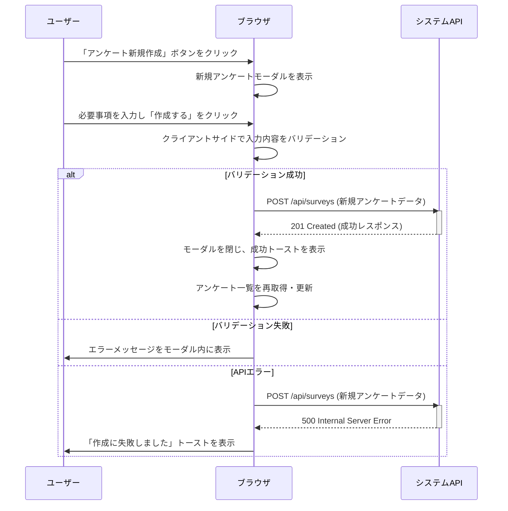
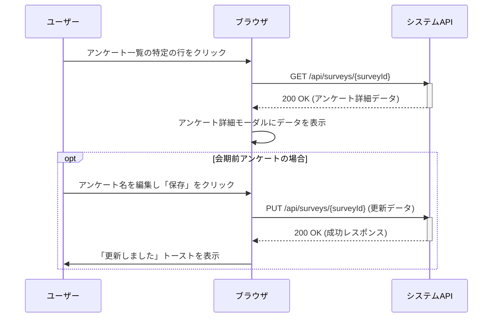

# 画面フロー定義書: SpeedAd - アンケート管理ダッシュボード

## 1. 概要

このドキュメントは、「SpeedAd - アンケート管理ダッシュボード」におけるユーザーの操作に伴う画面遷移、モーダル表示、およびシステム処理のフローを定義します。正常系フローに加え、主要な異常系フローも記述します。

## 2. シーケンス図による主要フロー定義

### 2.1. アンケートの新規作成フロー

### 2.2. アンケート詳細の確認・更新フロー

## 3. 主要フロー詳細（テキスト版）

### 3.1. 初期表示

1.  **トリガー**: ユーザーがログインに成功する。
2.  **アクション**: 
    - ブラウザは**アンケート管理ダッシュボード** (`index.html`) を表示する。
    - バックエンドに対し、現在選択中のグループに紐づくアンケート一覧を要求する (`GET /api/surveys?group={groupId}`)。
    - APIから受け取ったデータをメインコンテンツエリアのテーブルに描画する。
    - サイドバーにユーザー情報と所属グループ情報を表示する。
3.  **初期状態**: アンケート一覧テーブルには最新のデータが表示され、各種フィルターは初期状態になっている。

### 3.2. アンケートの新規作成

1.  **トリガー**: ユーザーが「アンケート新規作成」ボタン (`#new-survey-btn`) をクリックする。
2.  **アクション**: **新規アンケート作成モーダル** (`#newSurveyModal`) が表示される。フォームは空の状態。
3.  ユーザーが必要事項（アンケート名、会期など）を入力し、「作成する」ボタン (`#create-survey-submit`) をクリックする。
4.  **[正常系]** クライアントサイドバリデーションをパスした場合:
    - システムはバックエンドAPI (`POST /api/surveys`) にリクエストを送信する。
    - APIから成功レスポンスが返却された場合、「新規アンケートが作成されました」という成功トーストが表示され、モーダルが自動で閉じる。
    - アンケート一覧が自動的に更新され、新しく作成されたアンケートがテーブルの最上部に追加される。
5.  **[異常系]** バリデーションに失敗した場合:
    - モーダルは閉じず、エラー箇所と具体的なエラーメッセージ（例: 「必須項目です」）を表示する。
6.  **[異常系]** API通信に失敗した場合:
    - 「作成に失敗しました。時間をおいて再度お試しください」というエラートーストを表示する。モーダルは開いたままで、ユーザーは再試行できる。

### 3.3. アンケート詳細の確認と編集

1.  **トリガー**: ユーザーがアンケート一覧テーブルのいずれかの行をクリックする。
2.  **アクション**: 
    - バックエンドに対し、クリックされた行のアンケート詳細データを要求する (`GET /api/surveys/{surveyId}`) 。
    - **アンケート詳細モーダル** (`#surveyDetailsModal`) が表示され、取得したデータが読み取り専用でフォームに設定される。
3.  **[編集フロー]** アンケートのステータスが「会期前」の場合:
    - 特定のフィールド（アンケート名など）が編集可能になる。
    - ユーザーが情報を編集し、「保存」ボタンをクリックする。
    - バックエンドAPI (`PUT /api/surveys/{surveyId}`) に更新リクエストを送信する。
    - 成功すれば「更新しました」というトーストを表示し、モーダルを閉じる。失敗すればエラーメッセージを表示する。
4.  **[画面遷移]** モーダル内の「SPEEDレビュー」ボタンをクリックすると、該当アンケートのSPEEDレビュー画面 (`speed-review.html?surveyId={surveyId}`) に遷移する。

### 3.4. QRコードの表示とダウンロード

1.  **トリガー**: ユーザーがアンケート一覧テーブルのアクション列にある「QRコード」アイコンをクリックする。
2.  **アクション**: **QRコードモーダル** (`#qrCodeModal`) が表示される。
3.  モーダルには、該当アンケートの回答ページURL (`https://example.com/survey?surveyId={surveyId}`) と、そのURLから生成されたQRコード画像が表示される。
    - **モック画面専用**: 現行のモック実装では相対パスの `survey-answer.html?surveyId={surveyId}` を表示し、QRコード画像はプレースホルダーを使用する。
4.  ユーザーは「URLコピー」ボタンでURLをクリップボードにコピーしたり、「QRコードをダウンロード」ボタンで画像ファイル（`qr_{surveyId}.png`）を保存したりできる。

### 3.5. グループの切り替え

1.  **トリガー**: ユーザーがサイドバーのグループ選択ドロップダウンから別のグループを選択する。
2.  **アクション**: 
    - 選択されたグループIDをパラメータとして、アンケート一覧を再取得する (`GET /api/surveys?group={newGroupId}`) 。
    - テーブルの表示が、新しく選択されたグループのアンケート一覧に更新される。
    - サイドバーの表示も新しいグループ名に更新される。
3.  **[異常系]** データ取得に失敗した場合:
    - 「グループの切り替えに失敗しました」というエラートーストを表示する。
    - 表示は元のグループのまま維持される。
