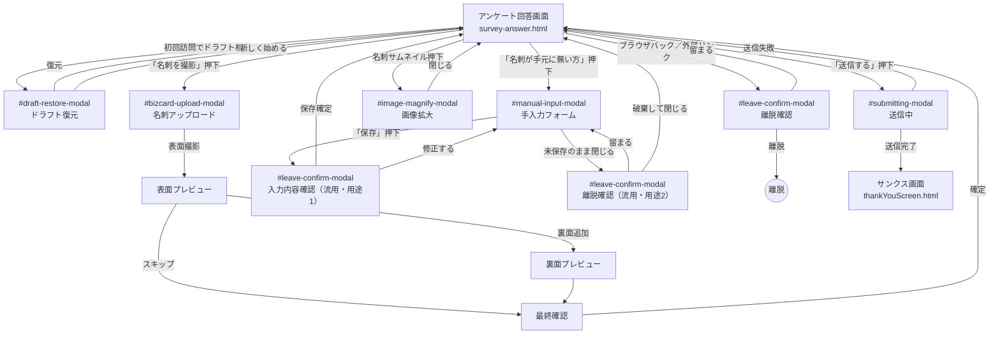

# 13. アンケート回答画面 要件定義書

**本書はアンケート回答画面の要件定義書である。** 本書の記述が正式仕様であり、受領先の開発会社は本書を根拠として本番実装を行う。本書と付随するモックアップ実装（[`02_dashboard/survey-answer.html`](../../../02_dashboard/survey-answer.html) および [`02_dashboard/src/survey-answer.js`](../../../02_dashboard/src/survey-answer.js)）に差異がある場合は本書を正とし、モックアップ実装は本書の内容を視覚的に確認できる参考資料として提供する。現行フェーズではバックエンド API が未接続であり、回答データ・ドラフト・手入力による名刺情報は `localStorage` を暫定ストレージとして利用している（本番移行要件は §4.8 参照）。受領先の開発会社は、実装上の制約および今後の対応予定を把握するため、本書の §6（未実装項目）および §9（変更履歴）を必ず参照すること。

## 1. 概要

### 1.1 目的
本書は、イベント来場者・被調査者が SpeedAd の配信URLからアクセスして回答を行う「アンケート回答画面」の要件を定義する。画面構造・UI挙動・モーダル遷移・ドラフト保存仕様を一元的に記述し、本番実装の単一の根拠資料として利用されることを目的とする。

### 1.2 対象読者
| 役割 | 本書の使い方 |
| --- | --- |
| 製品企画 | 機能スコープ・モーダル遷移・プラン制限の把握。顧客向け説明時の一次資料。 |
| フロントエンド開発者 | DOM 構造・クラス命名・イベントフロー・ドラフト保存キーの実装根拠。 |
| QA | 画面レイアウト・モーダル遷移・バリデーション・ドラフト復元の受け入れ基準。 |
| 運用サポート | ユーザー問い合わせ対応時の画面挙動リファレンス。 |
| 開発委託先 | 本番実装の根拠となる正式仕様。§6（未実装項目）および §9（変更履歴）を併せて参照すること。 |

### 1.3 基本動作
- 配信URLから匿名アクセス可能。ログイン不要。
- URL のクエリパラメータ (`?surveyId=...`) で指定されたアンケート ID を元に、アンケート定義 JSON（`data/surveys/{surveyId}.json`）を非同期で読み込み、タイトル・説明・設問を動的に描画する。
- プレビューモード（`?preview=1`）時は、`localStorage` の `surveyPreviewData` を読み込みソースとして利用する（アンケート作成画面からのプレビュー表示用）。
- 回答中のデータは `localStorage` に **ドラフト保存** され、同一ブラウザで再訪すると「ドラフト復元モーダル」で復元を促す。
- 回答送信時には名刺撮影（または手入力）を任意／必須の設定に従い要求する。送信完了後は **サンクス画面**（既定: `thankYouScreen.html`）へ遷移する。
- モバイルファースト。最大幅 768px のカラムに中央寄せされ、PC からのアクセスでも同幅のレイアウトを維持する。
- 多言語切替（`#language-select`）に対応。言語切替時も入力内容は保持される。単一言語のアンケートでは **言語切替コンテナ（`#language-switcher-container`）ごと非表示になる（`hidden` クラス付与）**。

### 1.4 モーダル遷移図
回答画面を中心とした主要モーダル間の関係を以下に示す。`#leave-confirm-modal` は **画面離脱確認** と **手入力保存確認** の複数箇所で登場するが、これは同一モーダルを用途別に流用していることを示す（詳細は §2.5 / §3.4 参照）。

---

## 2. 画面レイアウト

### 2.1 最上位ラッパ
| 要素 | セレクタ | 役割・スタイル |
| --- | --- | --- |
| ページルート | `#survey-main-wrapper` | 画面全体を包むラッパ。背景色 `#E0F2F7`、`min-height: 100vh`。`<body>` 直下に配置され、すべての回答UI・フッター・モーダル・トーストを内包する。 |

### 2.2 ローディングインジケーター
| 要素 | セレクタ | 状態・挙動 |
| --- | --- | --- |
| フルスクリーンローダー | `#loading-indicator` | 画面全面を覆うオーバーレイ。**初期表示 visible**（`html` 読み込み直後に見える）。`survey-answer.js` が設問データの取得・レンダリングを完了した時点で `hidden` クラスを付与し非表示化する。API 失敗時は `#error-container` に切り替えて非表示。 |

### 2.3 メインコンテンツ
- コンテナ: `<main id="main-content">` 配下の `.survey-content-wrapper`
- 最大幅: **768px**（中央寄せ、左右余白はビューポート幅に応じて可変）
- 内側余白: 上下にゆとりを持たせ、フッターの固定要素に被らないよう `padding-bottom` を確保

#### 2.3.1 言語選択エリア
| 要素 | セレクタ | 説明 |
| --- | --- | --- |
| 言語切替コンテナ | `#language-switcher-container` | メインコンテンツ最上部、**右寄せ** 配置。単一言語のアンケートでは **コンテナごと非表示になる（`hidden` クラス付与）**。 |
| 言語切替セレクト | `#language-select` | `<select>` 要素。設問・UI ラベルの言語を切替える。切替時も入力値は保持。多言語アンケートでのみ可視化され、単一言語時は親コンテナごと非表示化される。 |

#### 2.3.2 タイトル・フォーム
| 要素 | セレクタ | 説明 |
| --- | --- | --- |
| アンケートタイトル | `#survey-title-container` | アンケート名・説明文・展示会名などを表示。 |
| 設問フォーム本体 | `#survey-form` | 設問群の動的レンダリング先。設問種別ごとの UI を JS が注入する。ページネーションは行わない（§6 参照）。 |

#### 2.3.3 名刺プレビューエリア
名刺撮影または手入力完了後に可視化され、表面／裏面のサムネイルと操作ボタン群を内包する領域。実装（`02_dashboard/survey-answer.html`）における DOM のすべての ID と親子関係・初期可視性を以下に列挙する。

| 要素 | セレクタ | 親要素 | 初期可視性 | 役割 |
| --- | --- | --- | --- | --- |
| プレビュー外枠 | `#bizcard-preview-area` | `.survey-content-wrapper` | hidden（`hidden` クラス付き） | 名刺撮影または手入力完了後に表示される外枠コンテナ。 |
| 表面コンテナ | `#bizcard-preview-front-container` | `#bizcard-preview-area` 内の表面カラム | visible（親が可視化された時） | 表面のサムネイル画像と操作ボタンを包む相対配置ボックス（`group`）。 |
| 表面画像 | `#bizcard-preview-front` | `#bizcard-preview-front-container` | visible（親が可視化された時） | 表面画像サムネイル（``）。クリックで `#image-magnify-modal` が開く。 |
| 表面 再撮影ボタン | `#bizcard-retake-front` | `#bizcard-preview-front-container` 内ホバーオーバーレイ | ホバー時のみ visible | 表面を再度 `#bizcard-upload-modal` で取り直す。 |
| 表面 削除ボタン | `#bizcard-delete-front` | `#bizcard-preview-front-container` 内ホバーオーバーレイ | ホバー時のみ visible | 表面画像をクリアする（確認ダイアログ付き）。 |
| 裏面ラッパ | `#bizcard-preview-back-wrapper` | `#bizcard-preview-area` 内の裏面カラム | visible（親が可視化された時） | 裏面側カラム全体のラッパ。 |
| 裏面コンテナ | `#bizcard-preview-back-container` | `#bizcard-preview-back-wrapper` | visible（親が可視化された時） | 裏面のサムネイル・プレースホルダ・操作ボタンを包む相対配置ボックス（`group`）。 |
| 裏面画像 | `#bizcard-preview-back` | `#bizcard-preview-back-container` | hidden（`hidden` クラス付き。裏面登録時に可視化） | 裏面画像サムネイル（``）。クリックで `#image-magnify-modal` が開く。 |
| 裏面プレースホルダ | `#bizcard-preview-back-empty` | `#bizcard-preview-back-container` | visible（裏面未登録時） | 裏面未登録時に表示される「裏面を追加」プレースホルダ。**`
` 全体がクリック対象**（内部に独立した `<button>` は持たず、div 自身に `cursor-pointer` と `hover` スタイルを付与して押下領域とする）。押下で裏面撮影フローへ進む。 |
| 裏面操作オーバーレイ | `#bizcard-preview-back-actions` | `#bizcard-preview-back-container` | 裏面未登録時は非表示。裏面登録後にホバー時のみ visible | 裏面登録済み時に表示される再撮影・削除ボタン群のラッパ。 |
| 裏面 再撮影ボタン | `#bizcard-retake-back` | `#bizcard-preview-back-actions` | 親に準ずる | 裏面を再度 `#bizcard-upload-modal` で取り直す。 |
| 裏面 削除ボタン | `#bizcard-delete-back` | `#bizcard-preview-back-actions` | 親に準ずる | 裏面画像をクリアする（確認ダイアログ付き）。 |

> 注: 裏面プレースホルダ（`#bizcard-preview-back-empty`）は仕様上「裏面を追加」ボタンとして機能するが、実装上は `<button>` 要素ではなく **`
` に `cursor-pointer` を付与したクリック可能領域** として構築されている。キーボード操作でのアクセシビリティ対応は §4.5 および §6 を参照。

#### 2.3.4 エラー表示エリア
| 要素 | セレクタ | 説明 |
| --- | --- | --- |
| エラーコンテナ | `#error-container` | **初期は `hidden`**。アンケートデータ取得失敗・無効な URL・公開期間外などの致命的エラーを表示する。表示中はフォーム・フッターを非活性化する。 |

### 2.4 フッター
`<footer>` はビューポート下部に固定表示され、メインコンテンツのスクロールに追従しない。

#### 2.4.1 上段（2列グリッド）
| 要素 | セレクタ | 説明 |
| --- | --- | --- |
| 名刺撮影ボタン | `#bizcard-camera-button` | デフォルトラベル **「名刺を撮影」**。押下で `#bizcard-upload-modal` を開く。名刺登録済み（表面の撮影または手入力完了）状態では **ラベルが「撮影済み」に変化** し、非活性化される（§3.3 参照）。 |
| 送信ボタン | `#submit-survey-button` | ラベル **「送信する」**。押下で入力値のバリデーションを行い、問題なければ `#submitting-modal` を表示して送信処理を実行。送信完了でサンクス画面へ遷移。 |

#### 2.4.2 下段
| 要素 | セレクタ | 説明 |
| --- | --- | --- |
| 手入力ボタン | `#bizcard-manual-button` | ラベル文言 **「名刺が手元に無い方」**。**テキストリンク** として中央配置。押下で `#manual-input-modal` を開く。名刺撮影ボタン（`#bizcard-camera-button`）の代替手段として常時表示される。 |

### 2.5 モーダル群（DOM 列挙）
すべてのモーダルは `#survey-main-wrapper` 配下に配置し、初期は `hidden`。表示時は背景オーバーレイでメインコンテンツを覆い、スクロールを抑止する。各モーダルの **閉じる手段** は以下のとおり、用途・キャンセル可否によって異なる扱いとする。

| モーダル | セレクタ | 役割 | 表示条件 | 閉じる手段 |
| --- | --- | --- | --- | --- |
| 送信中進捗 | `#submitting-modal` | 回答送信処理中のプログレスを表示（キャンセル不可）。 | `#submit-survey-button` 押下後、送信処理が開始されてから完了／失敗まで。 | **閉じる手段なし**（×ボタン・ESC・オーバーレイクリックのいずれも無効）。送信完了でサンクス画面へ遷移、送信失敗時は自動的に閉じて回答画面に戻る。 |
| 名刺アップロード | `#bizcard-upload-modal` | 名刺撮影フロー（表面→裏面→最終確認）を担うメインモーダル。 | `#bizcard-camera-button`、または各プレビューの「再撮影」「裏面を追加」ボタン押下時。 | ×ボタン／ESC／オーバーレイクリック いずれも許可。未保存の撮影結果がある場合は離脱確認モーダル（`#leave-confirm-modal`）を経由して確認する。 |
| 手入力 | `#manual-input-modal` | 名刺情報をフォームから手入力するモーダル。 | `#bizcard-manual-button` 押下時。 | ×ボタン／ESC／オーバーレイクリック いずれも許可。未保存変更がある場合は離脱確認モーダル（`#leave-confirm-modal` を流用）を経由して確認する。 |
| 離脱／保存確認 | `#leave-confirm-modal` | 画面離脱確認、および **手入力モーダルの保存確認ダイアログとしても流用**（§1.5 参照）。 | ブラウザバック／外部リンク押下、手入力モーダルで未保存変更がある状態での閉じる操作時、手入力保存時の確認ステップ。 | ×ボタン／ESC は **「キャンセル（留まる）」扱い**。**オーバーレイクリックは無効**（誤操作による離脱・確定を防ぐため）。 |
| ドラフト復元 | `#draft-restore-modal` | 既存ドラフトを検知した際に復元可否を問う。 | 画面ロード時に `localStorage` 内に該当アンケートの **ドラフト保存** データが存在する場合。 | ×ボタン／ESC は **「新しく始める」扱い**（ドラフト破棄）。**オーバーレイクリックは無効**（誤操作によるドラフト喪失を防ぐため）。 |
| 画像拡大 | `#image-magnify-modal` | 名刺プレビュー等のサムネイルを拡大表示。 | `#bizcard-preview-front` / `#bizcard-preview-back` の画像サムネイル押下時。 | ×ボタン／ESC／オーバーレイクリック いずれも許可。 |

### 2.6 共通通知
| 要素 | セレクタ | 説明 |
| --- | --- | --- |
| トースト本体 | `#toast-notification` | 画面中央に短時間表示される通知コンテナ。成功・警告・エラーの種別でスタイルを切替。表示時間・挙動の仕様は §4.7 を参照。 |
| トーストメッセージ | `#toast-message` | 実テキストの差し込み先。「ドラフト保存しました」「裏面を削除しました」などの短文メッセージを表示する。 |

---

## 3. 機能要件

### 3.0 プラン区分の定義

本画面におけるプラン区分は、実装上 **`free` / `premium` の 2 値** として取り扱う[^plan-impl]。

- **無料プラン**: `surveyData.plan` が `premium` 以外（未定義含む）の場合。基本機能のみ利用可能。
- **プレミアムプラン**: `surveyData.plan` が `premium` の場合。§3.6 に定めるプレミアム機能（連続回答、多言語対応、`rating_scale` の段階数カスタム指定、手書きスペース設問 等）が有効化される。
- **上位プラン（`standard` / `premiumPlus` 等）**: プレミアムプランの上位互換として、本画面では `premium` と同等に扱う想定（将来拡張。本書の直接対象外）。
- **他仕様書との整合**: プラン別機能制限の最終定義は [`11_plan_feature_restrictions.md`](./11_plan_feature_restrictions.md) に従う。本書の記述と齟齬がある場合は 11 側を優先する。

本章以降、「プレミアムプラン」と記載する場合は上記の `premium` 判定成立を指す。

[^plan-impl]: 実装判定は `surveyData.plan === 'premium'` の真偽による 2 値分岐。

### 3.1 回答プロセスフロー

1. **アクセス**: 回答者は QR コードまたは URL からアンケート画面にアクセスする。URL のクエリで対象アンケート ID を指定する。
2. **回答入力**: 画面に表示された設問に回答を入力する。言語選択ドロップダウンで表示言語を切り替えた場合、入力済みの回答は保持したまま表示文言のみが切り替わる。
3. **送信**: フッターの「送信する」ボタンを押下する。
4. **バリデーション**: 必須項目・入力制約のチェックを行う。エラーがあれば送信を中断し、該当箇所を強調表示する（詳細は §4.6）。
5. **送信中 UI**: 送信モーダル（`#submitting-modal`）を表示し、プログレスバー（現行は擬似進行）を描画する。送信ボタンは非活性化し二重送信を防止する。
6. **データ保存**: 回答データをオブジェクトとして収集し、ローカルストレージに保存する。
    - **保存キー形式**: `survey_response_{surveyId}_{timestamp}`（`timestamp` は保存時点のエポックミリ秒）
    - **保存オブジェクトの主要フィールド**:
        - `surveyId`: 対象アンケートの ID
        - `submittedAt`: 送信完了時刻（ISO 8601 形式）
        - `answerLocale`: 送信時点の回答ロケール
        - `answers`: 設問 ID をキーとする回答値の集約オブジェクト
7. **ドラフト削除**: 送信完了後、当該セッションのドラフト（§3.2 参照）を削除する。
8. **画面遷移**: アンケート設定のサンクス画面遷移先（未設定時は `thankYouScreen.html`）に、以下のクエリを付与して遷移する。
    - `surveyId`: 対象アンケートの ID
    - `answerLocale`: 回答時の表示ロケール
    - `continuous=true`: **プレミアムプラン（§3.0）の場合のみ** 付与
    - プレビューモード時は遷移を行わず、サンクス画面相当の内容を本画面上にインライン描画する。
    - _脚注: 既知の制限 — 遷移先 URL に既存クエリ文字列が含まれる場合のマージは現行実装では非対応（§6 参照）。_

### 3.2 回答のドラフト保存機能

- **手動保存**: 専用の一時保存ボタンは設けない（§6 参照）。
- **自動保存**: 30 秒間隔で、未保存の変更がある場合に限りローカルストレージへドラフト保存する。
    - **保存キー形式**: `survey_draft_{surveyId}_{sessionId}`
    - **セッション識別子**: スクリプトロード時に生成する一意な識別子（タブ間で独立）。
    - **保存対象外**: 名刺画像はドラフトに含めない（Base64 形式によるストレージ容量超過を回避するため）。手入力で入力された個人情報フィールドはドラフトに含める（復元時の利便性のため）。
- **ドラフトの復元**: ページ読み込み時に有効なドラフトが存在する場合、ドラフト復元モーダル（`#draft-restore-modal`）を表示し「復元する」「新しく始める」を選択させる。
- **離脱警告**: 未送信の入力内容の損失を防ぐため、以下の条件で離脱確認モーダル（`#leave-confirm-modal`）を表示する。
    - **ハッシュ遷移を伴わないリンク操作時**: 外部 URL や別ページへの遷移が発生するリンク押下で警告する。ページ内アンカー（同一オリジン・同一パスかつ `#...` ハッシュのみの遷移）は警告しない。
    - **ブラウザの「戻る」ボタン操作時**: `popstate` イベントを捕捉して警告する。捕捉のため、ページ読み込み時に `history.pushState()` による履歴エントリを追加してフックする。
    - **現行未実装**: `beforeunload` によるブラウザ再読込／タブ閉じ時のネイティブ警告は未実装（§6 参照）。

### 3.3 名刺画像アップロードフロー

フッターの「名刺を撮影」ボタン押下で、名刺アップロードモーダル（`#bizcard-upload-modal`）による以下のフローが開始する。

- **入力言語の優先順**: アンケートの優先回答言語（`defaultAnswerLocale`）を初期値とし、回答画面の言語選択で上書きする。OCR 結果は補助表示であり、入力言語決定の優先順位には影響しない（§3.3.1 参照）。

1. **アップロード方法の選択**: モーダル上で「ストレージから選択」「カメラで撮影」のいずれかを選ぶ。
2. **表面の撮影・選択**: 選択肢に応じてカメラ起動またはファイル選択を行い、表面画像を取得する。
3. **表面のプレビューと次アクション**: 取得した表面画像をモーダル内でプレビューし、次のいずれかを選ぶ。
    - **裏面を撮影する**: 裏面の撮影ステップへ進む。
    - **裏面をスキップ**: 最終確認へ進む。
    - **撮り直す / 再選択**: 前ステップへ戻る。
4. **裏面の撮影・選択（任意）**: 表面と同様の手順で裏面を取得する。
5. **裏面のプレビューと次アクション（任意）**: 「最終確認へ進む」「撮り直す / 再選択」を選べる。
6. **最終確認とアップロード**: 選択された画像一覧をモーダル内でプレビューし、「アップロード」で確定する。確定後、ページ上の名刺プレビューエリア（§2.3.3）にサムネイルを表示する。

- **「名刺を撮影」ボタンのトグル挙動**:
    - 名刺画像のアップロード完了後、フッターの「名刺を撮影」ボタンは **ラベルが「撮影済み」に切り替わり、非活性化**される（再押下による重複登録を防止）。
    - サムネイル操作で名刺画像がすべて削除されると、ボタンラベルは **元の「名刺を撮影」に戻り、再び活性化**される。
- **添付の任意性**: 名刺画像の添付は任意。現行実装ではアンケート設定の名刺必須／任意による送信前の未添付確認モーダルは **未実装**（§6 参照）。
- **サムネイルからの操作**: ページ上のサムネイルから「再撮影」「削除」、空の裏面欄から「裏面を追加」を実行できる。サムネイルクリックで画像拡大モーダル（`#image-magnify-modal`）を開く。

#### 3.3.1. 【未実装・要検証】名刺言語の自動判別 (OCR)

- **目的**: 名刺画像から記載言語を OCR（光学文字認識）により判別し、後続のデータ入力効率化を図る。
- **現行実装**: **名刺アップロードモーダル（`#bizcard-upload-modal`）の最終確認ステップ内** に「OCR言語: 日本語 (ダミー)」のダミー表示のみ（プレースホルダ実装、実際の画像解析は未実装）。§2.3.3 のメイン画面上の名刺プレビュー領域（`#bizcard-preview-area`）とは別の表示箇所である。
- **フォールバック方針（将来）**: 判別不能時は、現在アンケートが表示されている言語を既定値（フォールバック値）として扱う。
- **注記**: 本機能は技術的な実現可能性検証および実装が必要（§6 参照）。

### 3.4. 名刺なし回答フロー（手入力）

1. **モーダル表示**: フッターの「名刺が手元に無い方」リンク押下で、手動入力モーダル（`#manual-input-modal`）が表示される。
2. **入力項目**: 以下を入力する。
    - **姓 / 名** （2 フィールドに分離。保存時に結合して氏名として扱う）
    - メールアドレス
    - 会社名
    - 部署名
    - 役職名
    - 電話番号
    - 郵便番号
    - 住所
    - 建物名
3. **バリデーション方針**:
    - 全項目は **任意入力** であり、未入力でも保存可能。
    - **現行実装では形式チェック・必須チェックを一切行わない**。`<input type="email">` を使用するメールアドレス欄についても、JS 側の形式バリデーションは実装されていない（ブラウザ標準の HTML5 検証は通常のフォーム送信を伴わないため発火しない）。
    - メールアドレスの形式チェックは将来実装候補（§6 参照）。
4. **2 段階保存**:
    1. モーダル内の「保存」ボタン押下時、**入力内容確認モーダル**（`#leave-confirm-modal` を流用）を表示し、入力内容の確認と「保存」「修正する」を選択させる。
    2. 「保存」を選択した場合に限り、入力内容を回答データの一部として確定保持する。「修正する」を選択した場合は手動入力モーダルに戻り再編集できる。
5. **離脱確認**: モーダル編集中にキャンセル等で閉じる場合、**離脱確認モーダル**（`#leave-confirm-modal`）を表示する。「破棄して閉じる」を選択すると入力内容は破棄される。

### 3.5. サポートする設問タイプ

設問種別に応じて適切な入力コントロールを描画する。旧形式（`date` / `time` 等）は現行キーへ正規化される。

| 設問タイプ | データモデル上のキー | 説明 |
| :--- | :--- | :--- |
| フリーアンサー | `free_answer` | テキストエリアで自由記述。最小／最大文字数のリアルタイム警告あり。 |
| シングルアンサー | `single_answer` | ラジオボタンで一つを選択。 |
| マルチアンサー | `multi_answer` | チェックボックスで複数選択。`maxSelections` で上限制御可能（3.5.1 補足参照）。 |
| 数値回答 | `number_answer` | 整数または小数。最小値・最大値・単位を設定可能。 |
| ドロップダウン回答 | `dropdown` | `<select>` によるリスト選択。 |
| マトリックス (SA) | `matrix_sa` | 複数の行に対し、共通の列から一つだけを選ぶ。 |
| マトリックス (MA) | `matrix_ma` | 複数の行に対し、共通の列から複数を選ぶ。 |
| 評価スケール | `rating_scale` | ラジオボタンによる N 段階評価（3.5.2 補足参照）。 |
| 日付 / 時刻回答 | `date_time` | 日付／時刻／両方の入力を設定に応じて表示。 |
| 説明カード | `explanation_card` | 質問ではなく説明文や案内をカードとして挿入する特殊タイプ（入力不可、表示のみ）。 |
| 手書きスペース | `handwriting_space` | キャンバス上で手書き入力（§3.6.3 参照）。 |
| 画像アップロード | `image_upload` | 回答者がファイルを添付する設問。プレビュー表示対応。 |

#### 3.5.1 `multi_answer` の `maxSelections` 補足
- 上限到達時、追加のチェックボックス操作は **DOM レベルで無効化される**（未選択項目のチェックボックスが `disabled` となる）。
- 上限到達を告知するトースト通知等は **表示しない**（UI 側の `disabled` 表現のみで伝達する）。
- 上限未達のままでの送信は許容される（「最低 n 件選択」等の必須回答数の概念は、本設定とは別の設問設定で制御される）。

#### 3.5.2 `rating_scale` のプラン別挙動
- 回答画面側では **プランに応じた制限ロジックを持たない**。設問メタ `ratingScaleConfig.points` の値をそのまま段階数として描画する。
- 設問設定で段階数が未指定の場合は **5 段階** を既定として適用する。
- ラベル設定（min / mid / max）はメタ値をそのまま描画する。
- プランごとの段階数カスタム可否の制約は **作成画面側で完結** する（無料プランでは 5 段階固定、プレミアムプランではカスタム可、といった制限は作成画面で適用される）。プラン別機能制限の最終定義は [`11_plan_feature_restrictions.md`](./11_plan_feature_restrictions.md) に従う。

#### 3.5.3 マトリックスの集計キー
- 回答値はフォーム入力の `name` 属性で識別される。
- マトリックス (SA): `{questionId}-{rowId}` の形式で行単位に 1 値。
- マトリックス (MA): `{questionId}-{rowId}-{colId}` の形式で行×列の組み合わせ単位。

#### 3.5.4 フリーアンサーの文字数警告
- 最小／最大文字数に対するリアルタイム警告は **警告表示のみ** の役割であり、送信時バリデーションとは独立して動作する。設定された文字数範囲を超えていても警告は表示されるが、送信ブロックの判定ロジック（§4.6）は別途評価される。

### 3.6. プレミアムプラン限定機能

#### 3.6.1. 連続回答機能
サンクス画面における「連続で回答する」導線の有効化機能。

- **有効化条件（現行実装）**: **プレミアムプランであること（§3.0）** のみ。`surveyData.plan === 'premium'` が真の場合、サンクス画面遷移時に `continuous=true` が付与される（§3.1）。
- 条件が不成立の場合、`continuous=true` は付与されず、サンクス画面側で連続回答導線は非表示となる。
- **既知の制限**: アンケート作成者側の設定項目 `allowContinuousAnswer`（[`08_thank_you_screen_settings.md`](./08_thank_you_screen_settings.md) で定義）は、**現行実装では参照していない**。将来的にはアンケート設定による無効化を可能とする予定（§6 参照）。

#### 3.6.2. 多言語対応

- **言語選択 UI**: メインコンテンツ最上部右側のドロップダウン（`#language-select`）でリアルタイムに表示言語を切り替える。
- **利用可能言語の抽出ソース**: 以下を総合して判定する。
    - アンケート定義の言語設定項目（`supportedLocales` / `activeLanguages` / `languages` のいずれか存在するもの）
    - アンケートのタイトル・説明の多言語テキストに登場するロケールキー
    - 各設問（設問文・選択肢ラベル等）の多言語テキストに登場するロケールキー
    - **利用可能言語リストは常に日本語（`ja`）を含む**（実装上の保証）。抽出結果が空となるケースは発生しない。
- **フォールバック規則**: 現在の表示言語（クエリ指定／既定回答言語）が利用可能言語リストに含まれない場合、**利用可能言語リストの先頭**（通常 `ja`、もしくはアンケート定義に最初に登場する言語）にフォールバックする。リストは常に `ja` を含むため、フォールバック先が存在しないケースは発生しない。
- **対応言語と表示ラベル**（現地表記に準拠）:

| ISO コード | 表示ラベル |
| --- | --- |
| `ja` | 日本語 |
| `en` | English |
| `zh-CN` | 中文(简体) |
| `zh-TW` | 中文(繁體) |
| `vi` | Tiếng Việt |

#### 3.6.3. 手書きスペース設問

- **有効化条件**: プレミアムプランで作成されたアンケートでのみ設問として利用可能（作成側の制約）。
- **機能**: 回答者が手書きで文字や図形を入力できるキャンバス領域と描画ツールを提供する。
- **動作**: 回答画面側ではプランに応じた制限ロジックは持たず、アンケート定義に当該設問が含まれていれば常に回答可能である。プラン制限は作成画面側で完結する。

---

## 4. 非機能要件

### 4.1 レスポンシブ対応
- スマートフォン / タブレット / デスクトップの各ビューポートで回答可能であること。モバイルでは 1 カラムレイアウトを基本とする。
- 主要ブレークポイントは共通スタイル（Tailwind CSS ベース）に準拠する。

### 4.2 複数タブセッション
- 同一端末内で複数タブを開いた場合でも、それぞれのタブが独立して回答・ドラフト保存を行えること。
- ドラフトの `localStorage` キーには `sessionId`（`session_{Date.now()}` 形式）を含め、タブ単位の分離を担保する。
- 同一アンケートを別タブで送信した場合、ドラフト削除は当該 `sessionId` のキーに限定され、他タブの進行中ドラフトには影響しない。

### 4.3 パフォーマンス

**計測条件**（[`00_screen_requirements.md`](./00_screen_requirements.md) §6.1 準拠）:
- ブラウザ: Chrome 最新安定版
- 端末メモリ: 8GB
- 回線: 有線 LAN 相当
- 回答端末: 中位スマートフォン相当（例: Pixel 6a 相当）

**目標値**:
- モーダル表示・ボタンクリック等、主要 UI 操作の応答時間 **p95 < 1 秒**
- アンケート JSON 取得後のフォーム描画は **設問数 50 問で初回レンダリング p95 < 2 秒**
- `localStorage` への書き込みはメインスレッドをブロックしない（デバウンス済）

**注記**: 本項の数値は **目標値** であり、本契約の **検収条件とするかは別途協議** とする。検収条件化する場合は、計測手順・計測ツール・合否判定ロジックを合意の上で別紙化する。

> **補足**: 現行実装にはパフォーマンス計測ロジック（`performance.mark` / Long Task Observer 等）は含まれていない。目標値の検証には別途計測インフラの実装が必要（§6 参照）。

### 4.4 スタイル・UI
- 共通スタイル（`service-top-style.css` 等）および Tailwind CSS ユーティリティクラスを利用し、ダッシュボード全体と統一感を持つデザインとする。
- アイコンは Material Symbols を基本とする。

### 4.5 アクセシビリティ

**対応方針**:
- 本画面のアクセシビリティ対応レベルは **「現フェーズではベストエフォート」** とし、**WCAG 2.1 Level AA 準拠は本契約のスコープに含めない**。
- 将来的には [`00_screen_requirements.md`](./00_screen_requirements.md) §6.3 が掲げる WCAG 2.1 Level AA に揃える方針。

**現状対応項目**:
- キーボード操作による回答入力・送信（Tab / Shift+Tab / Enter / Space）
- 日付入力（`<input type="date">`）・時刻入力（`<input type="time">`）への `aria-label` 付与
- `prefers-reduced-motion` による動きの抑制（共通スタイルシートで一括制御）
- セマンティック HTML（`<label>` と `<input>` の `for` / `id` 紐付け）

**未対応項目**（§6 参照）:
- `aria-required` / `aria-live` / `aria-invalid` の体系的な付与
- モーダル内のフォーカストラップ
- 色コントラスト比の WCAG AA 準拠検証
- スクリーンリーダー（NVDA / VoiceOver / TalkBack）での動作検証
- `#bizcard-preview-back-empty` の div クリック領域のキーボードアクセシビリティ対応

### 4.6 バリデーション
- 現行実装で送信時のブロッカとするのは、**必須項目（`required`）の未入力チェックのみ**。
- 文字数制約（最小／最大）、数値範囲、`maxSelections` の最小件数、メール形式等の **型制約バリデーションは実装していない**（§6 参照）。
- バリデーション発火タイミング: 各設問の入力変更（`change` イベント）時、および送信時。
- エラー時は対象 fieldset に赤系の強調スタイル（`border-error border-2`）を付与する。
- 送信時に必須未入力のエラーがあれば、画面中央のトーストで必須項目未入力の旨を通知する。**フォーカスの自動移動・自動スクロールは行わない**（§6 参照）。
- フリーアンサーの最小／最大文字数は、入力中のリアルタイム警告表示のみを行い、送信そのものはブロックしない（§3.5.4 参照）。

### 4.7 UI フィードバック

- **ロード中**: 初期読み込み時、ローディングインジケーター（`#loading-indicator`）を表示する。
- **送信中**: 送信モーダル（`#submitting-modal`）で進捗（擬似プログレス）を表示し、送信ボタンを非活性化して二重送信を防止する。100% 到達後にサンクス画面へ遷移する。
- **送信失敗時の現行実装**: 送信モーダルを閉じた上で、**`#error-container` にエラーメッセージを表示し、回答フォームを非表示にする**（全画面エラー表示）。入力内容自体は `state.answers` に保持されるが、フォームが非表示になるため回答者側で再送信ボタンは見えない状態となる。
    - 現行の `simulateUpload()` は常に成功する擬似プログレスのみで、実際の失敗経路は未実装（catch 節は事実上デッドコード）。
    - 本番バックエンド連携時にトースト通知・再送信導線と合わせて刷新する（§6 参照）。
- **エラー表示（データ取得失敗等）**: JSON 読み込み失敗時等には `#error-container` にユーザーフレンドリーなエラーメッセージを表示し、フォームは非表示とする。

**トースト通知（`#toast-notification`）の現行仕様**:
- 表示時間: **一律 3 秒**（成功・情報・エラー・警告の種別別切替は未実装。§6 参照）。
- 種別指定: `showToast(message)` は引数 1 個のみで、種別パラメータは持たない。
- 連続発生時の挙動: 最新メッセージで上書き表示（キューイングせず）。上書き時に既存タイマーはクリアされず、後続の `setTimeout` が独立に走るため早期 hide が起こり得る（既知の挙動）。
- 発生条件の例:
    - 必須項目が未入力のまま送信を試みた際のバリデーションエラー通知
    - ドラフト保存の自動保存完了通知
    - 既存ドラフト復元時の情報通知
    - `localStorage` 書き込み失敗時の通知

**`aria-label` 付与済み箇所**:
- 日付入力（`<input type="date">`）
- 時刻入力（`<input type="time">`）

### 4.8 セキュリティ

#### 現フェーズ（モックアップ）での取扱い
- 回答データ・手入力の個人情報（氏名 / メール / 電話 / 住所 等）は `localStorage` に暫定保存されている。
- これは **モックアップのための暫定措置** であり、本番運用開始前に **必ず廃止する**。

#### 本番運用移行時の要件（検収条件候補）
- 回答データのサーバー送信は **HTTPS（TLS 1.2 以上）** で実施する。
- 個人情報はサーバー側で **保管時暗号化（AES-256 相当）** を行う。
- `localStorage` への PII 保存は **本番リリース前に完全に廃止** し、`sessionStorage` または JS メモリ内状態に置換する。
- 移行作業の担当範囲は **本契約スコープ外** とし、別途バックエンド連携フェーズで対応する。
- **移行未完了での本番リリースは禁止**（リリース判定基準）。

#### プライバシー関連
- 回答画面の初回表示時にプライバシーポリシー同意 UI を表示する要件は、本書スコープ外（別途規定）。
- 回答データの保存期間・削除請求対応は [`00_screen_requirements.md`](./00_screen_requirements.md) §8 を参照。

### 4.9 アーキテクチャ方針
- **アクション駆動アーキテクチャ**: 全ての状態変更はユーザー操作（入力・クリック等）起点のイベントでトリガーし、一元管理された `state` を更新、状態に基づき UI を再描画することで、データと表示の整合性・予測可能性を担保する。
- 回答画面のロジックは `02_dashboard/src/survey-answer.js` を中心に集約し、共通ユーティリティは `02_dashboard/src/utils/` 配下のモジュールを参照する。
- データパスの解決は `resolveDashboardDataPath()` を通じて行い、プレビューモード / 本番モードの切替に対応する。

### 4.10 モバイル固有動作
- **Pull-to-Refresh の無効化**: 本画面では `document.body.style.overscrollBehaviorY = 'contain'` を適用し、回答中の意図しないページ再読み込みを防ぐ。
- iOS Safari など一部ブラウザでは `overscroll-behavior` の効果が限定的な場合があるため、完全な抑止は保証されない。

---

## 5. エラーケースとハンドリング

### 5.1 エラー発生時の UI と回復手段

| エラー種別 | 発生条件 | UI 対応 | 回答者が取れる回復手段 |
| --- | --- | --- | --- |
| アンケート JSON 取得失敗 | 404 / ネットワークエラー | `#error-container` に案内表示、フォーム非表示 | ブラウザリロード（F5）を案内文言に明示 |
| 不正な surveyId | クエリパラメータ欠落 / 存在しない ID | `#error-container` にエラーメッセージ表示 | 主催者へ URL 確認を案内 |
| `localStorage` 容量超過 | ドラフト保存 / 回答保存時の書き込み失敗 | トースト通知で保存失敗を明示 | ブラウザキャッシュクリア案内（将来対応、§6） |
| 画像アップロード失敗 | ファイル形式 / サイズエラー | モーダル内でインラインエラー表示 | 別ファイル選択のやり直し |
| 送信中のネットワーク断 | 送信モーダル表示中に通信失敗（※現行は擬似進行のため発生しない） | 送信モーダルを閉じ、`#error-container` にエラーメッセージを表示（フォームは非表示） | ブラウザリロードで再試行（トースト通知・再送信導線は §6 で対応予定） |
| 多言語データ欠損 | 選択言語のラベル / テキストが未定義 | 既定言語（`ja`）にフォールバックして表示 | 言語切替セレクトで別言語を選択 |
| QR コード誤読 / 不正 URL | 回答者が不正な URL を開いた | ブラウザ標準エラーまたは `#error-container` に誘導 | 主催者へ URL 確認を案内 |

### 5.2 バリデーション失敗時の挙動
- 必須未入力の fieldset に赤系強調（`border-error border-2`）を適用する。
- 送信時、必須未入力があれば画面中央のトーストで必須項目未入力の旨を通知する。
- **現行実装では、フォーカスの自動移動・自動スクロールは行わない**（§6 参照）。
- 現行実装のバリデーション対象は `required` のみ。文字数・数値範囲・`maxSelections` の最小件数・メール形式等は検証対象外（§6 参照）。
- バリデーションは入力変更（`change` イベント）および送信時の両方で発火する。

---

## 6. 未実装項目一覧

> **本契約スコープ外であることの宣言**
> 本章に列挙する項目は、**本フェーズの成果物に含めない**。以降の機能追加フェーズまたは別途オプション契約での対応対象とする。各項目の工数・要件定義は別途協議の上で確定する。

| 項目 | 区分 | 想定タスク概要 |
| --- | --- | --- |
| ドラフトの手動一時保存ボタン | 機能追加 | フッターに明示的保存ボタンを配置 |
| `beforeunload` によるタブ閉じ警告 | 機能追加 | ブラウザネイティブ警告のフックのみ |
| 名刺画像の言語自動判別（OCR）本実装 | 要検証・要別途見積 | OCR エンジン選定、精度目標、対応言語の定義が必要 |
| ページネーション（設問の分割表示） | 機能追加 | 分割ルール、ナビゲーション UI、バリデーション連携が必要 |
| サンクス画面遷移 URL の既存クエリマージ | 不具合修正 | URL パース処理の改修 |
| `aria-required` / `aria-live` / `aria-invalid` 等 WCAG 完全対応 | アクセシビリティ拡張 | §4.5 参照 |
| `#bizcard-preview-back-empty`（div クリック領域）のキーボード対応 | アクセシビリティ修正 | `role="button"` / `tabindex` / キーハンドラの付与 |
| 画像アップロードのサイズ / 形式バリデーション | 機能追加 | 閾値の決定者（発注側）の判断待ち |
| 送信失敗時のリトライ導線 | 機能追加 | 自動 / 手動リトライ、指数バックオフの仕様が必要 |
| `localStorage` 容量超過時のキャッシュクリア導線 | 機能追加 | 回答者が実行可能な回復手段の提示 |
| メールアドレスの形式バリデーション | バリデーション拡張 | 手入力モーダルのメール欄に RFC 5322 準拠簡易チェックを追加 |
| エラーフィールドへのフォーカス自動移動・スクロール | アクセシビリティ拡張 | 送信時バリデーション失敗でエラー位置へ誘導 |
| 文字数制約・数値範囲・`maxSelections` 最小件数の送信時バリデーション | バリデーション拡張 | 現行は `required` のみ検証 |
| 連続回答の `allowContinuousAnswer` 連携 | 機能追加 | アンケート作成者側の設定による無効化。現行は `plan === 'premium'` 単独判定 |
| 送信時 名刺未添付確認モーダル | 機能追加 | アンケート設定「名刺必須」との連携。現行は送信前チェック自体が未実装 |
| 送信失敗時のトースト通知切替 | UI 改善 | 現行は `#error-container` にフォーム差替表示。トースト通知と再送信導線への刷新 |
| トースト表示時間の種別別切替 | UI 改善 | 現行は一律 3 秒。成功 3 秒 / エラー 5 秒 等の差別化 |
| トースト上書き時の既存タイマークリア | 不具合修正 | 現行は既存タイマーをクリアせず後続 `setTimeout` が並走 |
| パフォーマンス計測ロジック | 機能追加 | §4.3 の目標値検証のための計測インフラ |
| 実送信 API 連携（`simulateUpload()` の置換） | 機能追加 | 現行は擬似進行のみで catch 節はデッドコード |
| バックエンド連携（`localStorage` 廃止） | 別契約スコープ | §4.8 参照 |

---

## 7. 付録: 実装内部名マッピング

本書の論理名と実装内部名の対応を示す。**実装内部名は本文中ではなく本付録に集約する**。

| 論理概念 | 実装内部名 |
| --- | --- |
| 未保存変更フラグ | `hasUnsavedChanges` |
| 設問タイプ正規化関数 | `normalizeQuestionType()` |
| データパス解決 | `resolveDashboardDataPath()` |
| 言語ラベルマッピング | `LANGUAGE_LABELS` |
| プレビューモード用キー | `surveyPreviewData`（`localStorage`） |
| 名刺画像状態 | `bizcardImages` |
| セッション識別子 | `sessionId`（`session_{Date.now()}`） |
| 回答データ保存キー | `survey_response_{surveyId}_{timestamp}` |
| ドラフト保存キー | `survey_draft_{surveyId}_{sessionId}` |
| プラン判定 | `surveyData.plan === 'premium'` |
| 連続回答設定 | `allowContinuousAnswer`（アンケート設定）※現行実装では未参照（§6 参照） |
| サンクス画面遷移先設定 | `thankYouScreenSettings.url`（アンケート設定） |

---

## 8. 受入基準

### 8.1 機能検収項目
- §2 で列挙した全 DOM 要素が画面に存在すること。
- §2.5 のモーダル群がすべて表示条件・閉じる手段の通りに開閉できること。
- §3.5 の設問タイプ全 12 種が設問定義に応じてレンダリングされること。
- §3.1 の保存キー形式（`survey_response_{surveyId}_{timestamp}`）で `localStorage` に書き込まれること。
- §3.2 のドラフト保存・復元が動作すること。
- §3.4 の 2 段階保存（入力内容確認モーダル経由）が動作すること。
- §3.6.1 の連続回答条件（プレミアムプラン単独判定）が正しく評価されること。
- §3.6.2 の多言語フォールバック規則が動作すること。

### 8.2 非機能検収項目
- §4.1 主要デバイス（PC Chrome 最新 / iOS Safari 最新 / Android Chrome 最新）で表示崩れがないこと。
- §4.3 パフォーマンス **目標値**（検収必須化は別途協議）。
- §4.5 現フェーズ対応項目のみ検収対象（WCAG 2.1 Level AA は本契約対象外）。
- §4.10 モバイル Pull-to-Refresh 抑制が動作すること（iOS Safari での限定的挙動は除外）。

### 8.3 明示的な検収対象外
- §6 未実装項目の全項目
- バックエンド API 連携
- 本番インフラ・デプロイ構成
- プライバシーポリシー同意 UI の実装（§4.8 参照）
- WCAG 2.1 Level AA 準拠検証

---

## 9. 変更履歴

| バージョン | 日付 | 変更概要 | 担当 |
| --- | --- | --- | --- |
| 1.3.0 | 2026-04-17 | 対外提出版への整備。frontmatter から `document_type`/`impl_ref`/`owner`/`contact` を削除、冒頭・§1.1・§1.2・§6・§9 の「モックアップを正／実装を正」系表現を本書を正とする言い回しに統一 | 製品企画 |
| 1.2.0 | 2026-04-17 | 実装照合レビュー反映。レビュー指摘に基づき記述を訂正: ・§3.1 step 5（名刺未添付確認）削除、§3.1.1 セクション削除 ・§3.4 メール形式チェック削除 ・§3.5.2 rating_scale を責務境界明示（回答画面はプラン非分岐）に訂正 ・§3.6.1 連続回答を AND 条件から `plan === 'premium'` 単独条件に訂正 ・§4.6 / §5.2 フォーカス自動移動・スクロール記述を削除、検証範囲を `required` のみに縮小 ・§4.7 送信失敗時挙動を `#error-container` 方式に訂正、トースト種別別時間を一律 3 秒に訂正 ・§5.1 ネットワーク断行を訂正 ・§6 未実装項目に 10 件追加 ・§7 `allowContinuousAnswer` を「現行未参照」注記 ・§8 検収項目を AND 条件から単独判定に訂正 | 製品企画 |
| 1.1.0 | 2026-04-17 | 開発会社提出前レビュー反映。プラン区分定義（§3.0）、送信時名刺未添付確認（§3.1.1）、手入力バリデーション整合（§3.4）、`rating_scale` プラン別挙動（§3.5.2）、連続回答 AND 条件（§3.6.1）、多言語フォールバック実態反映（§3.6.2）、アクセシビリティ WCAG 整合（§4.5）、PII 取扱い検収条件化（§4.8）、UI フィードバック詳細化（§4.7）、未実装項目スコープ外宣言（§6）、受入基準（§8）、変更履歴（§9）を追加。モーダル閉じる手段・mermaid 分岐補完・用語統一を全面反映。 | 製品企画 |
| 1.0.0 | 2026-04-17 | 初版。回答画面の要件を全面整備 | 製品企画 |
