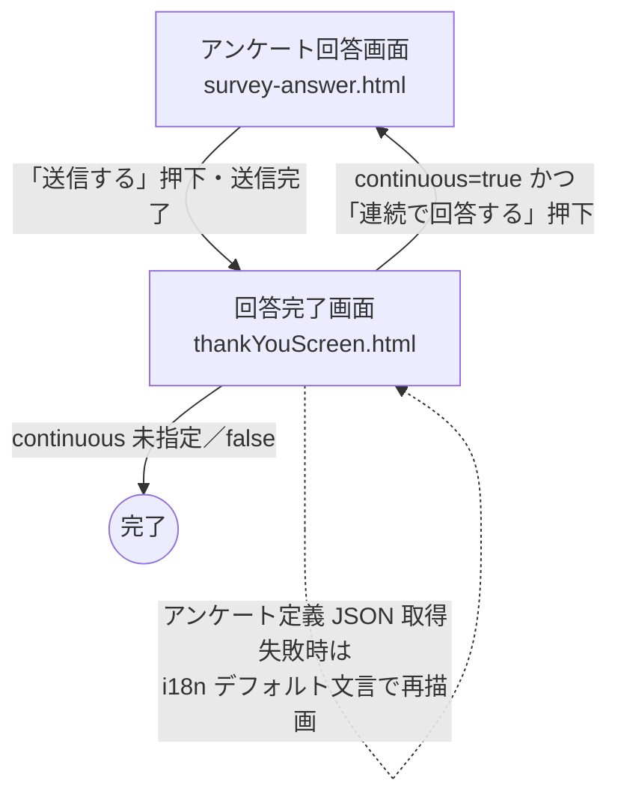

# 20. 回答完了画面 要件定義書

**本書は回答完了画面の要件定義書である。** 本書の記述が正式仕様であり、受領先の開発会社は本書を根拠として本番実装を行う。本書と付随するモックアップ実装（[`02_dashboard/thankYouScreen.html`](../../../02_dashboard/thankYouScreen.html) および [`02_dashboard/src/thankYouScreen.js`](../../../02_dashboard/src/thankYouScreen.js)）に差異がある場合は本書を正とし、モックアップ実装は本書の内容を視覚的に確認できる参考資料として提供する。サンクス画面の「設定」側（アンケート作成者が表示内容を編集する画面）は [`08_thank_you_screen_settings.md`](./08_thank_you_screen_settings.md)、アンケート回答画面からの遷移経路は [`13_survey_answer_screen.md`](./13_survey_answer_screen.md) を参照のこと。

## 1. 概要

### 1.1 目的
本書は、回答者がアンケートを送信した後に到達する「回答完了画面（サンクス画面）」の要件を定義する。画面構造・表示メッセージの解決順序・連続回答ボタンの表示条件を一元的に記述し、本番実装の単一の根拠資料として利用されることを目的とする。なお、本書は「回答完了画面」を正式名称として採用し、「サンクス画面」は互換呼称として扱う（画面ファイル名の `thankYouScreen` との整合を優先）。

### 1.2 対象読者
| 役割 | 本書の使い方 |C:\Users\user\Desktop\workspace20\SPPED-AD-TEST\docs\画面設計\仕様\00_screen_requirements.md

C:\Users\user\Desktop\workspace20\SPPED-AD-TEST\docs\画面設計\仕様\13_survey_answer_screen.md

C:\Users\user\Desktop\workspace20\SPPED-AD-TEST\docs\画面設計\仕様\20_thank_you_completion_screen.md
| --- | --- |
| 製品企画 | 回答完了画面の表示要素・連続回答モードの発動条件の把握。顧客向け説明時の一次資料。 |
| フロントエンド開発者 | DOM 構造・要素 ID・メッセージ解決順序・URL クエリパラメータの実装根拠。 |
| QA | 画面レイアウト・連続回答ボタンの表示条件・ロード失敗時のフォールバック挙動の受け入れ基準。 |
| 運用サポート | ユーザー問い合わせ対応時の画面挙動リファレンス。 |
| 開発委託先 | 本番実装の根拠となる正式仕様。§6（未実装項目）および §9（変更履歴）を併せて参照すること。 |

### 1.3 基本動作
- 回答者がアンケート回答画面（[`survey-answer.html`](../../../02_dashboard/survey-answer.html)）から回答送信を完了した後に遷移するランディング先として機能する。ログイン不要、匿名アクセス可能。
- URL のクエリパラメータとして `surveyId`（対象アンケート ID）、`continuous`（連続回答モードの要否、`true` で有効）、`answerLocale`（表示ロケール）を受け取る。
- `surveyId` が指定された場合、アンケート定義 JSON（`data/surveys/{surveyId}.json`）を非同期で読み込み、そのサンクス画面設定（`thankYouScreenSettings` または `settings.thankYouScreen` のいずれか先に見つかった方）からお礼メッセージを取得して本文に差し込む。
- 表示ロケールは URL クエリ `answerLocale` を最優先とし、未指定時はアンケート定義側の値にフォールバックする（詳細な優先順は §3.2 参照）。
- タイトル文言・本文のフォールバック文言・連続回答ボタン文言・ドキュメントタイトル（`<title>`）は、いずれも i18n メッセージ辞書から解決する。
- `continuous=true` が指定された場合に限り「連続で回答する」ボタンを表示し、押下で同一アンケートの回答画面に戻るループを構成する（他のモードではボタン領域は `hidden` クラスによる非表示状態のまま）。
- アンケート定義の読み込みに失敗した場合は、コンソールにエラーログを記録し、i18n デフォルト文言のみで画面を描画する（連続回答ボタンは **表示しない**）。

### 1.4 画面遷移図
回答完了画面を中心とした画面遷移を以下に示す。通常送信後は本画面に到達して完了するが、**連続回答モード（`continuous=true`）** 時のみ、本画面のボタンから回答画面へ戻るループが形成される。

---

## 2. 画面レイアウト

### 2.1 ページ全体
| 要素                 | セレクタ／属性                                          | 役割・スタイル                                                                                                                                                                                                     |
| -------------------- | ------------------------------------------------------- | ------------------------------------------------------------------------------------------------------------------------------------------------------------------------------------------------------------------ |
| HTML ルート          | `<html lang="ja">`                                      | 初期は `ja`。JS が確定したロケールで `document.documentElement.lang` を上書きする。                                                                                                                                |
| ページボディ         | `<body class="bg-gray-50">`                             | ページ全体の背景色はグレー（`bg-gray-50`）。                                                                                                                                                                       |
| ボディ追加スタイル   | `<style>` 内 `body { padding-left: 0 !important; }`     | ダッシュボード共通レイアウトで付与されるサイドバー分の左パディングを **強制的に打ち消す** ためのインラインスタイル。回答完了画面は単独フルスクリーン表示のため、サイドバー分の余白を消去して中央配置を成立させる。 |
| ドキュメントタイトル | `<title>SpeedAd - アンケート回答完了</title>`（初期値） | 初期値は日本語固定。JS ロード後に i18n メッセージ `thankYouScreen.documentTitle` で上書きされる。                                                                                                                  |

### 2.2 外枠コンテナ
| 要素         | クラス                                                                                | 役割                                                                                                                                                                                                           |
| ------------ | ------------------------------------------------------------------------------------- | -------------------------------------------------------------------------------------------------------------------------------------------------------------------------------------------------------------- |
| 外枠 `
` | `min-h-screen flex items-center justify-center bg-blue-50 py-12 px-4 sm:px-6 lg:px-8` | ビューポート全高を確保し、内側のカードを縦横中央揃えで配置する。背景色はボディの `bg-gray-50` より淡い青（`bg-blue-50`）を重ねる。左右余白はブレークポイントに応じて `px-4` → `sm:px-6` → `lg:px-8` と広がる。 |

### 2.3 メインカード
| 項目       | 値                                                             | 備考                                                                           |
| ---------- | -------------------------------------------------------------- | ------------------------------------------------------------------------------ |
| クラス一式 | `max-w-md w-full space-y-8 p-10 bg-white rounded-lg shadow-xl` | —                                                                              |
| 最大幅     | `max-w-md`（28rem / 448px）                                    | 小さめの単一カードで完結させる意図。                                           |
| 横幅       | `w-full`                                                       | ブレークポイント未満では親コンテナの横幅に追従。                               |
| 内側余白   | `p-10`（2.5rem）                                               | 上下左右とも均一な内側余白。                                                   |
| 角丸       | `rounded-lg`                                                   | —                                                                              |
| シャドウ   | `shadow-xl`                                                    | カードを背景から浮き立たせる。                                                 |
| 背景色     | `bg-white`                                                     | 外枠の `bg-blue-50` 上で白面を形成。                                           |
| 子要素間隔 | `space-y-8`（縦 2rem）                                         | 「ロゴ＋タイトル＋本文」ブロックと「連続回答ボタンコンテナ」の間に適用される。 |

### 2.4 カード内要素
| 要素             | セレクタ／ソース                                                                                                                                                                                   | 役割・スタイル                                                                                                                                             | 初期可視性                                                                                                                                                                                                                                                               |
| ---------------- | -------------------------------------------------------------------------------------------------------------------------------------------------------------------------------------------------- | ---------------------------------------------------------------------------------------------------------------------------------------------------------- | ------------------------------------------------------------------------------------------------------------------------------------------------------------------------------------------------------------------------------------------------------------------------ |
| ロゴ画像         | ``、クラス `mx-auto h-12 w-auto`                                                                                                         | SpeedAd ロゴ。高さ `h-12`（3rem）、横幅はアスペクト比に応じて自動（`w-auto`）、`mx-auto` で水平中央寄せ。                                                  | visible（常時表示）                                                                                                                                                                                                                                                      |
| タイトル         | `#thank-you-title`（`<h2>`）、クラス `mt-6 text-center text-3xl font-extrabold text-gray-900`                                                                                                      | お礼メッセージの見出し。文字色濃灰、太字（`font-extrabold`）、サイズ `text-3xl`、中央寄せ。ロゴからの上マージン `mt-6`。                                   | **初期は空文字**。JS が i18n メッセージ `thankYouScreen.title` を差し込んで可視化する。                                                                                                                                                                                  |
| 本文メッセージ   | `#thank-you-body`（`
`）、クラス `mt-2 text-center text-sm text-gray-600`                                                                                                                        | タイトル直下のお礼本文。文字色中間灰、サイズ `text-sm`、中央寄せ。タイトルからの上マージン `mt-2`。                                                        | **初期は空文字**。JS が順に「アンケート設定の `thankYouMessage` → `description` → i18n デフォルト文言」のいずれかを差し込んで可視化する（詳細は §3.3 参照）。                                                                                                            |
| 連続回答コンテナ | `#continuous-answer-container`（`
`）、クラス `hidden`                                                                                                                                         | 連続回答ボタンのラッパ。カードの `space-y-8` によりタイトル・本文ブロックから縦 2rem 離れた位置に配置される。                                              | **初期 `hidden`**。`continuous=true` の URL パラメータ指定時のみ JS が `hidden` クラスを除去して可視化する。                                                                                                                                                             |
| 連続回答ボタン   | `#continuous-answer-button`（`<a>`）、クラス `mt-4 inline-flex w-full items-center justify-center rounded-full bg-blue-600 px-5 py-3 text-sm font-semibold text-white shadow-sm hover:bg-blue-700` | 「連続で回答する」アクションのボタン。丸角ピル形状（`rounded-full`）、青背景（`bg-blue-600` / ホバー時 `bg-blue-700`）、白文字、横幅いっぱい（`w-full`）。 | 親コンテナ（`#continuous-answer-container`）の可視性に従う。`href` は初期値 `#` でレンダリング直後は無効。JS が `survey-answer.html?surveyId=...&answerLocale=...` を組み立てて設定し、ラベル文言も i18n メッセージ `thankYouScreen.continuousAnswerButton` で差し込む。 |

### 2.5 画面上に存在しない要素（明示）
本画面は回答完了を知らせる単一カード構成のランディングとして設計されており、以下の UI 要素は **一切持たない**。実装にも DOM として存在しない。

- ダッシュボード共通ヘッダー、サイドバー、フッター、ブレッドクラム
- モーダル、ダイアログ、確認ウィンドウ
- トースト、スナックバー、通知バナー
- ローディングインジケーター、スピナー、スケルトン UI
- エラー表示コンテナ（読み込み失敗時も専用の UI は持たず、i18n デフォルト文言へのフォールバックで処理する）
- 言語切替ドロップダウン・言語選択 UI（表示ロケールは URL クエリ `answerLocale` のみで決定する）
- 回答画面への戻るリンク・ホームへのリンク等、連続回答ボタン以外のナビゲーション要素

---

## 3. 機能要件

### 3.1 URL クエリパラメータの受け取り

本画面は `URLSearchParams` を用いて以下の 3 種のクエリパラメータを読み取る。いずれも任意指定であり、欠落していても初期化処理はエラーとならない。

| パラメータ名   | 型     | 必須 | 役割                                                                                                                                     |
| -------------- | ------ | ---- | ---------------------------------------------------------------------------------------------------------------------------------------- |
| `surveyId`     | 文字列 | 任意 | アンケート定義 JSON の読み込み対象。未指定の場合は JSON 読み込みをスキップし、`survey` は `null` 扱い。                                  |
| `continuous`   | 文字列 | 任意 | 文字列 `'true'` と **厳密一致** する場合のみ連続回答ボタンを表示。それ以外の値（`'1'`, `'yes'`, `'TRUE'`, 未指定 等）は全て false 扱い。 |
| `answerLocale` | 文字列 | 任意 | 表示言語の優先指定。`normalizeLocale()` で正規化される。                                                                                 |

### 3.2 表示言語の決定ロジック（優先順）

表示言語は以下の優先順で決定し、最終的に `normalizeLocale()` で正規化する。

1. URL パラメータ `answerLocale`
2. アンケート定義の `defaultAnswerLocale`
3. アンケート定義の `editorLanguage`
4. `'ja'`（最終フォールバック）

決定した言語は以下の要素に適用される。

- `<html>` 要素の `lang` 属性（`document.documentElement.lang`）
- ドキュメントタイトル（`document.title`）
- 見出し・本文・ボタンラベル（i18n 文言および多言語データの解決ロケール）

### 3.3 メッセージ描画

| 項目                 | 描画元 DOM                    | 決定ロジック                                                                            |
| -------------------- | ----------------------------- | --------------------------------------------------------------------------------------- |
| ドキュメントタイトル | `<title>`（`document.title`） | i18n 固定キー `thankYouScreen.documentTitle`。                                          |
| 見出し               | `#thank-you-title`            | 常に i18n 固定文言 `thankYouScreen.title`。**作成者が設定したタイトルは読み込まない。** |
| 本文メッセージ       | `#thank-you-body`             | 以下の優先順位で決定（先頭から非空の値を採用）。                                        |

本文メッセージの優先順:

1. アンケート定義の **サンクス画面設定オブジェクト**（`thankYouScreenSettings` を最優先し、無ければ `settings.thankYouScreen` にフォールバック）内の `thankYouMessage` フィールド（多言語対応。`resolveLocalizedValue()` で現在のロケールに解決）
2. 同設定オブジェクトの `description` フィールド（多言語対応）
3. i18n デフォルト文言 `thankYouScreen.body`

> **08 とのデータモデル差異に関する注記**: サンクス画面「設定」側の仕様書 [`08_thank_you_screen_settings.md`](./08_thank_you_screen_settings.md) §5 では `Survey.thankYouMessage` をフラットかつ単言語の文字列として記述しているが、本書（20）では `thankYouScreenSettings.thankYouMessage` を多言語オブジェクトとして定義する。**データモデルの正式定義は本書（20）を優先し、08 側を本書に合わせて整合化する**（§6 参照）。

### 3.4 連続回答ボタンの表示条件

以下の AND 条件を **すべて** 満たすときのみ、連続回答ボタンが表示される。

- `continuous` パラメータが文字列 `'true'` と厳密一致
- `surveyId` パラメータが非空
- 描画対象 DOM (`#continuous-answer-container`, `#continuous-answer-button`) が存在

表示時の挙動:

- `#continuous-answer-container` から `hidden` クラスを除去
- `#continuous-answer-button` の `href` を `survey-answer.html?surveyId={encoded}&answerLocale={encoded}` に設定（両パラメータとも `encodeURIComponent` で URL エンコード）
- ボタンラベルは i18n 文言 `thankYouScreen.continuousAnswerButton`

> **責務分界**: プラン判定（`plan === 'premium'` 等）および `allowContinuousAnswer` フラグの評価は **本画面では行わない**。`continuous=true` を URL に付与するか否かは呼び出し元（[`13_survey_answer_screen.md`](./13_survey_answer_screen.md) §3.6.1）の責務とする。

### 3.5 アンケート定義読み込み失敗時のフォールバック

`loadSurveyById()` が例外を投げた場合（404 / ネットワークエラー 等）、以下のサイレントフォールバックが動作する。

- `console.error('Failed to initialize thank-you screen:', error)` にログ出力
- 表示言語は URL パラメータ `answerLocale`、無ければ `'ja'` を採用（アンケート定義由来のロケールは取得できないため）
- 本文は i18n デフォルト文言（`thankYouScreen.body`）のみで描画
- 連続回答ボタンは **表示しない**（`isContinuous: false` を強制）

ユーザーへのエラー通知 UI（トースト／モーダル／`#error-container`）は **存在しない**。サイレントにデフォルト文言へフォールバックする。

---

## 4. 非機能要件

### 4.1 レスポンシブ対応

- スマートフォン / タブレット / デスクトップ全対応
- 単一カードは `max-w-md`（448px）を上限に中央配置
- `px-4 sm:px-6 lg:px-8` でビューポート幅に応じた横余白を確保
- 最小縦サイズは `min-h-screen` により常にビューポート高さを充填

### 4.2 パフォーマンス

- 実装はランディング UI 相当の軽量な画面。外部通信は単一の `fetch`（アンケート定義 JSON）のみ。
- 本画面固有のパフォーマンス目標値は設けず、検収対象としない。
- パフォーマンス計測ロジック（RUM / Web Vitals 収集等）は実装に含まれていない（計測インフラは §6 参照）

### 4.3 スタイル・UI

- Tailwind CSS CDN（`forms`, `container-queries` プラグイン）、共通スタイル `service-top-style.css`、Material Icons、Google Fonts（Inter / Noto Sans JP）を読み込み
- 背景は `bg-gray-50`（`<body>`）と `bg-blue-50`（外枠コンテナ）の二層構造
- サイドバー領域は `padding-left: 0 !important` で打ち消す（ダッシュボード共通スタイルの影響回避）
- カードは `bg-white rounded-lg shadow-xl` で一段浮いたカード表現

### 4.4 アクセシビリティ

- **現フェーズではベストエフォート**。WCAG 2.1 Level AA 準拠は本契約スコープ外（§6 参照）
- 現状対応:
    - `<html lang>` の言語属性を決定ロケールに同期
    - ロゴ画像に `alt` 属性（`"SpeedAd Logo"`）を付与
    - セマンティック要素（`<h2>`, `
`, `<a>`）による構造化
- 未対応（§6 参照）:
    - フォーカス管理（到達時の見出しへのフォーカス等）
    - 色コントラスト比の WCAG AA 準拠検証
    - `aria-*` 属性の体系的な付与

### 4.5 国際化

- **現行実装のサポート言語**: 日本語（`ja`）/ 英語（`en`）の 2 言語のみ。i18n メッセージ辞書（`02_dashboard/src/services/i18n/messages.js`）には上記 2 言語のキーセットのみが定義されている。
- URL クエリ `answerLocale` に `zh-CN` / `zh-TW` / `vi` 等が渡された場合も、辞書未定義のため `normalizeLocale` 経由で `ja` にフォールバックして描画される。
- 本画面には **言語切替 UI は無い**。URL パラメータおよびアンケート定義で決定した言語で固定表示。
- 多言語データ欠損時は i18n デフォルト文言にフォールバック（§3.3 参照）。
- 対応言語の拡充（`zh-CN` / `zh-TW` / `vi` の辞書整備）は §6 参照。

### 4.6 セキュリティ

- 本画面では個人情報を扱わない
- 受け取るパラメータは `surveyId` / `answerLocale` / `continuous` の 3 種のみで、いずれもサーバー送信やストレージ保存を行わない
- 連続回答ボタンの `href` 生成時、`surveyId` と `locale` は `encodeURIComponent` で **URL パラメータとして適切にエンコード** される。遷移先画面側での値の取り扱い（DOM 挿入時のエスケープ等）は当該画面の責務とする。

---

## 5. エラーケース

| エラー種別               | 発生条件                                      | UI 対応（現行実装）                                                                                                                       | 回答者が取れる回復手段                                                          |
| ------------------------ | --------------------------------------------- | ----------------------------------------------------------------------------------------------------------------------------------------- | ------------------------------------------------------------------------------- |
| `surveyId` 未指定        | URL クエリ欠落                                | JSON 読み込みをスキップし、i18n デフォルト文言のみで描画。連続回答ボタンは表示しない。                                                    | なし（元のアンケート URL からやり直し）                                         |
| アンケート JSON 取得失敗 | 404 / ネットワークエラー                      | `console.error` にログ、i18n デフォルト文言で描画。連続回答ボタンは表示しない。**画面上のエラー通知は無い**（サイレントフォールバック）。 | ブラウザリロード（アンケート JSON が復旧していれば再描画成功）                  |
| 不正な `continuous` 値   | `'true'` 以外（例: `'1'`, `'TRUE'`, `'yes'`） | 連続回答ボタンを表示しない（エラーではなく仕様動作）。                                                                                    | — （連続回答機能を利用するには URL パラメータを正しく `true` にして再アクセス） |
| 不正な `answerLocale` 値 | 未対応ロケール                                | `normalizeLocale()` で `ja` にフォールバック。                                                                                            | 言語切替 UI が無いため、URL を修正して再アクセス                                |
| 多言語データ欠損         | 選択言語のメッセージが未定義                  | i18n デフォルト文言にフォールバック。                                                                                                     | — （仕様動作。辞書整備は §6 参照）                                              |

---

## 6. 未実装項目一覧

> **本フェーズスコープ外であることの宣言**
> 本章に列挙する項目は、**本フェーズの成果物に含めない**。本番実装時の追加開発項目として、開発委託先は本章を起点に差分見積もりを行うこと。

| 項目                                         | 区分                 | 想定タスク概要                                                                                                                                |
| -------------------------------------------- | -------------------- | --------------------------------------------------------------------------------------------------------------------------------------------- |
| JSON 取得失敗時のユーザー通知 UI             | 機能追加             | 現行は `console.error` のみで画面上に通知されない。トースト／インラインエラー表示の実装が必要。                                               |
| 言語切替 UI                                  | 機能追加             | 現行は URL で決定した言語で固定。回答完了画面上での言語切替セレクタは未実装。                                                                 |
| `aria-*` 属性の体系的な付与                  | アクセシビリティ拡張 | §4.4 参照。`aria-live`、`aria-label` 等の整備が必要。                                                                                         |
| フォーカス管理（到達時の h2 フォーカス等）   | アクセシビリティ拡張 | スクリーンリーダー利用者向けの初期フォーカス制御。                                                                                            |
| 色コントラスト比の WCAG AA 準拠検証          | アクセシビリティ拡張 | 現行のテキスト／背景色組み合わせに対する AA 準拠検証は未実施。                                                                                |
| パフォーマンス計測ロジック                   | 機能追加             | §4.2 参照。RUM / Web Vitals 等の計測インフラは未実装。                                                                                        |
| プレビューモード対応                         | 機能追加             | 現行はプレビュー表示は呼び出し元（13）側でインライン描画されるため、本画面側にプレビューモード分岐は存在しない。                              |
| i18n 辞書の多言語拡充                        | 機能追加             | `zh-CN` / `zh-TW` / `vi` の i18n メッセージ辞書を整備し、§4.5 のサポート言語を拡張する                                                        |
| 08（サンクス画面設定）とのデータモデル整合化 | ドキュメント整備     | 08 §5 データモデルを本画面（20）の実装に合わせて更新する（`thankYouScreenSettings` ネスト構造 / 多言語対応 / `description` フィールドの追加） |

---

## 7. 付録: 実装内部名マッピング

論理概念と実装内部名（関数名・i18n キー・設定オブジェクト名）の対応を示す。仕様書内の論理表現と実装コードを相互参照する際に利用すること。

| 論理概念                                                                                                                                                                  | 実装内部名                                                |
| ------------------------------------------------------------------------------------------------------------------------------------------------------------------------- | --------------------------------------------------------- |
| アンケート読み込み関数                                                                                                                                                    | `loadSurveyById()`                                        |
| ロケール決定関数                                                                                                                                                          | `getLocale()`                                             |
| `thankYouMessage` 取得ヘルパ（設定オブジェクト内の `thankYouMessage` のみを解決。`description` や i18n デフォルトへのフォールバックは `renderThankYouPage` 内で別途実行） | `getThankYouMessage()`                                    |
| ページレンダリング関数                                                                                                                                                    | `renderThankYouPage()`                                    |
| データパス解決                                                                                                                                                            | `resolveDashboardDataPath()`                              |
| ロケール正規化                                                                                                                                                            | `normalizeLocale()`                                       |
| 多言語値解決                                                                                                                                                              | `resolveLocalizedValue()`                                 |
| i18n メッセージ取得                                                                                                                                                       | `formatMessage()`                                         |
| i18n キー: ページタイトル                                                                                                                                                 | `thankYouScreen.documentTitle`                            |
| i18n キー: 見出し                                                                                                                                                         | `thankYouScreen.title`                                    |
| i18n キー: 本文既定                                                                                                                                                       | `thankYouScreen.body`                                     |
| i18n キー: 連続回答ボタン                                                                                                                                                 | `thankYouScreen.continuousAnswerButton`                   |
| サンクス画面設定（アンケート定義内）                                                                                                                                      | `thankYouScreenSettings` または `settings.thankYouScreen` |

---

## 8. 受入基準

### 8.1 機能検収項目

- §3.1 URL パラメータ 3 種（`surveyId` / `continuous` / `answerLocale`）が正しく読み取られること
- §3.2 表示言語が優先順位通りに決定されること（`answerLocale` → `defaultAnswerLocale` → `editorLanguage` → `'ja'`）
- §3.3 本文メッセージが `thankYouMessage` → `description` → i18n デフォルトの順でフォールバックすること
- §3.4 連続回答ボタンが 3 条件（`continuous === 'true'` AND `surveyId` 非空 AND 描画対象 DOM 存在）の AND で表示制御されること
- §3.5 JSON 取得失敗時にサイレントフォールバックで描画されること（`console.error` ログ、i18n デフォルト文言、連続回答ボタン表示しない）

### 8.2 非機能検収項目

- §4.1 主要デバイス（PC Chrome 最新 / iOS Safari 最新 / Android Chrome 最新）で表示崩れがないこと
- §4.5 現行実装サポートの 2 言語（`ja` / `en`）で文言が切り替わること。`zh-CN` / `zh-TW` / `vi` が指定された場合は `ja` にフォールバックすること（辞書整備は §6 参照）。

### 8.3 明示的な検収対象外

- §6 未実装項目の全項目
- WCAG 2.1 Level AA 準拠検証
- バックエンド API 連携
- プラン判定ロジック（呼び出し元に集約）

---

## 9. 変更履歴

| バージョン | 日付       | 変更概要                                                                                                                                                                                                                                                                                                                                                                                                                                                                                                                                                                                                                             | 担当     |
| ---------- | ---------- | ------------------------------------------------------------------------------------------------------------------------------------------------------------------------------------------------------------------------------------------------------------------------------------------------------------------------------------------------------------------------------------------------------------------------------------------------------------------------------------------------------------------------------------------------------------------------------------------------------------------------------------ | -------- |
| 1.2.0      | 2026-04-17 | 対外提出版への整備。frontmatter から `document_type`/`impl_ref`/`owner`/`contact` を削除、冒頭・§1.1・§1.2・§3.3 注記・§6 冒頭・§9 の「モックアップを正／実装を正」系表現を本書を正とする言い回しに統一 | 製品企画 |
| 1.1.0      | 2026-04-17 | 最終レビュー反映。レビュー指摘に基づき訂正: ・サポート言語を `ja`/`en` の現行実装準拠に修正（`zh-CN`/`zh-TW`/`vi` は §6 へ） ・§3.3 本文メッセージ優先順を順序付き優先に訂正、08 とのデータモデル差異注記 ・§5 回復手段「—」を具体化 ・§6 本画面責務外の項目削除、i18n 辞書拡充・08 整合化を追加 ・§8.2 言語数訂正 ・mermaid 破線を TY 自己ループに訂正 ・frontmatter 括弧混在修正、17 を related_docs に追加 ・用語「サンクス画面」→「回答完了画面」統一（設定オブジェクト名と 08 参照は除外） ・§4.6 「URL インジェクション耐性」→「URL パラメータとして適切にエンコード」 ・§7 付録の責務範囲明確化 | 製品企画 |
| 1.0.0      | 2026-04-17 | 初版。回答完了画面の要件を新規作成。                                                                                                                                                                                                                                                                                                                                                                                                                                                                                                                                                                                                  | 製品企画 |
