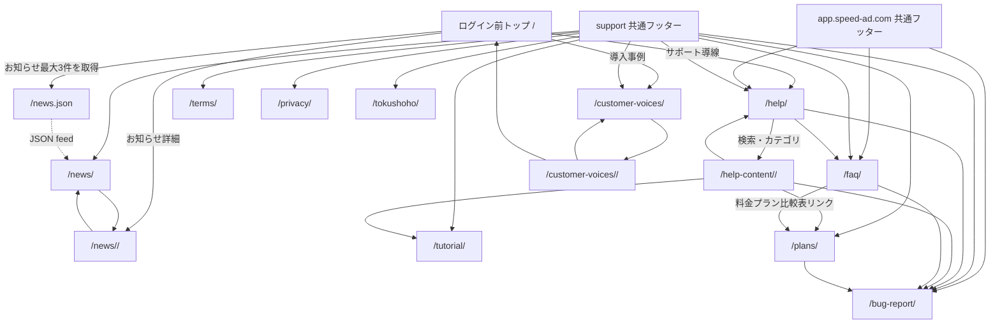

# サポートサイト分離 仕様書

## 1. 概要

### TL;DR（3行サマリ）

- ヘルプ・FAQ・規約などの静的ページを、ダッシュボード（`app.speed-ad.com`）から `support.speed-ad.com` サブドメインへ切り出す方針の備忘メモである。
- 本書は**モックアップ段階の将来改修方針**であり、決定事項ではない。実装着手前に別途PRD/ADR（Architectural Decision Record：設計判断の記録）で確定事項化する。
- KPI・ROI・予算承認・詳細スケジュールは本書スコープ外。法務合意（§9#4）・マーケ合意などは実装前提条件として別途取得する。

### 1.1 想定読者・前提知識・スコープ外

**想定読者**

| 読者 | 推奨章 |
|---|---|
| CS | §1・§2・§11・§12・§14・§15 |
| PO | §1・§2・§9・§10・§15 |
| 開発リード | 全章 |
| QA | §6・§7・§11・§12・§13 |
| 法務 | §4・§6.5・§9#4・§13.4 |

**前提知識**
- サブドメイン構成（`app.speed-ad.com` / `support.speed-ad.com`）の基礎
- 静的サイトホスティング（CloudFront / Netlify / Vercel 等）の基礎
- HTTP 301リダイレクト（恒久的な転送。旧URLのSEO評価を新URLへ引き継ぐ用途）と SEO の基本

**スコープ外（本書では数値定義しない）**
- KPI定義・ROI試算・予算承認
- 詳細なリリース計画・体制構築・採用計画
- 各ページのUI/UX詳細設計
- ダッシュボード機能側（`app.speed-ad.com`）の機能要件

**「スコープ外」は『本書で数値を定義しない』の意であり、実施不要という意味ではない。** §9#4（マーケ・法務合意）・§11.5（DoD）は実装の前提条件として扱う。

---

## 2. 背景

**この章のサマリ：** なぜサブドメイン分離を検討するのか、背景と期待メリットを整理する。法令対応（電気通信事業法外部送信規律・GDPR）もこの段階で論点化する。

ダッシュボード配下に、ヘルプ・FAQ・問い合わせ・各種規約などの「アプリ機能ではない静的画面」が混在している。責務分離のため、別サブドメインへ切り出す案を検討した。

### 2.1 分離の狙い

| 観点 | 内容 |
|---|---|
| デプロイサイクル分離 | ヘルプ記事の更新をダッシュボードの再デプロイなしに実施できる。CS／コンテンツ担当が独立して更新可能。 |
| SEO観点でのドメイン権威性 | サポートコンテンツ専用ドメインとして検索評価を集中させる。 |
| Cookie／セッションのスコープ分離 | ダッシュボードの認証Cookieとサポートサイトのセッションを独立管理し、セキュリティリスクを局所化する（§4 参照）。 |
| 将来の運用チーム分離余地 | サポートサイトをCS／コンテンツチームが独立管理する体制への移行を容易にする。 |

### 2.2 法令要件の概要（詳細は §4・§9#8）

- **電気通信事業法外部送信規律**（2023年施行。GAやreCAPTCHA等でユーザーデータを外部へ送信する際、利用者への通知・公表を義務付ける規律）への対応方式選定はM2（法務合意取得）時点までに必須。
- EU域内ユーザーのアクセスを想定する場合は **GDPR**（EU一般データ保護規則。EUユーザーの個人データ取扱い条件）対応も必要。同意取得前のトラッキングスクリプト読込遅延などが要件に含まれる。

---

## 3. 振り分け方針

**この章のサマリ：** どの画面が `app.speed-ad.com` に残り、どの画面が `support.speed-ad.com` へ移るかを一覧する。Before/After URL表はこの章の核となる。

### 3.1 配置判断基準

本番環境化時の配置先は、画面の責務で判断する。

| 配置先 | 判断基準 | 代表例 |
|---|---|---|
| `app.speed-ad.com` | 認証、保存、申込、回答送信、集計、請求、設定変更など、ユーザー操作によりサービス状態が変わる動的機能画面 | ダッシュボード、アンケート作成、回答、分析、請求、プラン申込、アカウント設定 |
| `support.speed-ad.com` | 公開説明、ヘルプ、FAQ、法務表示、お知らせ、導入事例、料金表、チュートリアル案内など、静的に閲覧できる情報提供画面 | ヘルプ、FAQ、規約、料金プラン比較表、お知らせ、導入事例、初回ログインチュートリアル案内 |

初回ログインチュートリアルは、従来の `04_first-login/index.html` を本番の独立アプリ画面として維持せず、サポートサブドメインの `/tutorial/` に移行する。ログイン後アプリ側に残るものは、必要に応じて `/tutorial/` へ送る導線またはアプリ内の補助起動ポイントに限定する。

導入事例一覧・詳細は、ログイン前トップから接続される信頼補強コンテンツであり、サービス状態を変更しない静的画面のため、`support.speed-ad.com/customer-voices/` 配下へ置く。

### 3.2 15番仕様との矛盾解消

本書のURL構造は `/help/`・`/help-content/<slug>/`・`/faq/` 等を正本とする。`15_help_center_requirements.md` §8 の `/help/`・`/faq/` と一致（従来案内していた `/help-center/` は廃止、`/help/` に統一）。要件変更により `/tutorial/` はサブドメイン配下の独立ページとして扱い、ヘルプ記事データ内のカテゴリ `tutorial` と相互に接続する。

### 3.3 サブドメイン別のCookie／計測方針（概要）

- **Cookie scope：** Domain属性を `.speed-ad.com` とすればサブドメイン間でCookie共有される。共有するか個別にするかは §4 で詳細定義。
- **CSRFトークン：** サポートサイトのフォーム（`/bug-report/` 等）は独立したCSRFトークン（Cross-Site Request Forgery。別サイトからユーザー権限で意図しないリクエストを送らせる攻撃への対策トークン）を発行する。
- **Cookie同意：** サブドメイン間で同意状態を共有する方針。詳細は §9#8。

### 3.4 URL振り分け表（Before → After）

**何が起きるか：** 旧URL（リポジトリ内の既存HTMLパス／ダッシュボード配下）にアクセスがあった場合、新URL（サポートサブドメイン）へ301リダイレクトされる。ブックマークや外部リンクも切れない。

`tokushoho` はローマ字のまま維持する（特定商取引法は日本固有の法律用語で、英語統一の根拠に乏しく、既存URL変更のSEO・ブックマーク破壊コストを避けるため）。

| 画面 | 現在のパス（Before） | 新URL（After） |
| --- | --- | --- |
| ヘルプセンター | `02_dashboard/help.html` | `https://support.speed-ad.com/help/` |
| 記事詳細 | `02_dashboard/help-content.html` | `https://support.speed-ad.com/help-content/<slug>/` |
| よくある質問 | `02_dashboard/faq.html` | `https://support.speed-ad.com/faq/` |
| 不具合報告フォーム | `02_dashboard/bug-report.html` | `https://support.speed-ad.com/bug-report/` |
| チュートリアル | `04_first-login/index.html`（初回ログインガイド・再視聴導線） | `https://support.speed-ad.com/tutorial/` |
| 料金プラン比較表 | 新規（FAQ・フッター・ヘルプ内導線から接続） | `https://support.speed-ad.com/plans/` |
| 導入事例一覧 | `customer-voices/index.html` | `https://support.speed-ad.com/customer-voices/` |
| 導入事例詳細 | `customer-voices/company-monitor.html`, `customer-voices/university-survey.html` | `https://support.speed-ad.com/customer-voices/<slug>/` |
| 利用規約 | `02_dashboard/terms-of-service.html` | `https://support.speed-ad.com/terms/` |
| 特定商取引法表示 | `02_dashboard/specified-commercial-transactions.html` | `https://support.speed-ad.com/tokushoho/` |
| 個人情報保護方針 | `02_dashboard/personal-data-protection-policy.html` | `https://support.speed-ad.com/privacy/` |
| お知らせ一覧/詳細 | 新規（ログイン前トップのティザーから接続） | `https://support.speed-ad.com/news/`, `https://support.speed-ad.com/news/<slug>/` |
| お知らせJSON | 新規（ログイン前トップの最大3件表示で参照） | `https://support.speed-ad.com/news.json` |
| ログイン前画面 | `index.html`（ルート） | **据え置き**（変更なし） |

### 3.5 サポートサイト共通シェル

`support.speed-ad.com` 配下は、ダッシュボード共通部品ではなく公開サポートサイト専用シェルを正とする。ヘッダーはブランド `SPEED AD Support` と主要導線（ヘルプ、FAQ、お問い合わせ）に限定し、法務・お知らせはフッター常設リンクまたはページ内導線に寄せる。

ヘッダーの標準色は薄青系のブランド背景とする。ダッシュボード本体の濃い単色ヘッダーは持ち込まず、公開ヘルプサイトとして軽い印象を保ちながらブランド色を出す。

サブドメイン側にはダッシュボード型の左サイドバーを設けない。ヘルプ記事カテゴリ、パンくず、検索、関連リンクで回遊を担保し、ログイン後アプリ内のサイドバー操作説明とは責務を分ける。

### 3.6 サポートサブドメイン画面推移図

`/tutorial/`, `/plans/`, `/news/`, `/customer-voices/` は、`support.speed-ad.com` 配下の公開サポートサイトページとして扱う。ヘッダー常設ナビは最小構成（ヘルプ、FAQ、お問い合わせ）を維持し、チュートリアル・料金プラン・お知らせ・導入事例・法務系ページはフッター、FAQ本文、ヘルプ記事、ログイン前トップのティザーから接続する。`/changelog/` は本番の独立ページ対象外とする。



`/news.json` はページ遷移先ではなく公開フィードである。ブラウザで直接開いた場合も 200 を返すが、主用途はログイン前トップや将来の公開トップからのお知らせ取得とする。

---

## 4. 確定事項

**この章のサマリ：** URL・Cookie・セッション・法令対応に関する方針のうち、本書時点で方向性が固まっている項目を列挙する。数値・期限は別PRD/ADRで確定する。

### 4.1 不具合報告フォームURL（`/bug-report/`）

- **役割：** ユーザーが不具合・障害を構造化して報告する専用フォーム。汎用お問い合わせ窓口（`contactModal.html` モーダル）とは別物。
- **リネームしない理由：** 既存URL変更によるSEO・ブックマーク・外部リンク破壊のコスト回避。
- `contactModal.html`（汎用お問い合わせ窓口）の扱い（維持 or support移設）は §9 未決事項で確定する。

### 4.2 クロスドメイン認証の3方式比較

サポートサイトへ遷移した後、ユーザーを特定する手段の選択肢。

| 方式 | 概要 | メリット | デメリット |
|---|---|---|---|
| 共有Cookie（`Domain=.speed-ad.com`） | ダッシュボードのセッションCookieをサブドメイン共有 | 実装コスト低 | **Safari ITP**（Safariのトラッキング防止機能。サードパーティ／クロスサイトCookieを制限する）の影響で、第三者コンテキスト扱いになると遮断されるリスク |
| クエリパラメータ（契約ID等をURLに付与） | 遷移時にIDをクエリで渡す | Safari ITPの影響なし | URLにIDが露出、CSRF／リプレイ攻撃対策必須。**採用時は短寿命の署名付きトークン化**（JWT等・有効期限数分以内）、**ワンタイム化**、**ログ上のトークンマスキング**を必須とする |
| SSO（将来） | Auth0等の共通認証基盤 | 最も堅牢 | 実装コスト大。別PRDで検討 |

※**eTLD+1**（登録可能な最上位ドメイン＋1ラベル。例：`speed-ad.com`）が同一であれば、サブドメイン間通信はSafari ITPの影響を受けにくいが、第三者コンテキストとして扱われる場合は遮断される可能性があり、検証が必要。

### 4.3 Cookie／セッション属性方針（各属性は何を守るためか）

- `Domain=.speed-ad.com`：サブドメイン間でCookieを共有するための設定。不要ならドメインを限定する（露出を最小化）。
- `Secure`：HTTPS通信時のみCookieを送信させるためのフラグ。**本番必須**。
- `HttpOnly`：JavaScriptからのCookie読み取りを禁止し、XSS経由の窃取を防ぐ。**セッションCookieには必須**。
- `SameSite=Lax`：他サイトからのリクエスト時にCookieを送らせないことでCSRFを防ぐ。フォーム送信がPOSTのみなら `Strict` も検討。
- **CSRFトークン：** サポートサイトのフォームはダッシュボードと共用せず、独立発行・検証する。

### 4.4 `/bug-report/` フォームのセキュリティ要件

| 要件 | 内容 | なぜ |
|---|---|---|
| TLS必須 | HTTPSのみ受付、HTTPからは強制リダイレクト | 盗聴・改ざん防止 |
| サーバーサイド入力検証 | フロントだけに依存しない | フロント検証は迂回可能 |
| CSRFトークン | フォームごとに発行・検証 | 第三者サイトからの悪用防止 |
| bot対策 | reCAPTCHA v3 または同等 | 自動投稿・スパム防止 |
| プライバシー同意 | 送信前に `/privacy/` 同意取得文言 | 個人情報保護法対応 |
| 保管時暗号化 | クラウドKMS（AWS KMS等）による鍵管理・定期ローテーション | 漏えい時の影響最小化 |
| アクセス権限最小化 | RBAC等で必要最小限の担当者に限定 | 内部不正防止 |

※reCAPTCHA採用時はユーザー行動データがGoogleへ外部送信されるため、電気通信事業法外部送信規律の対象。利用前の通知または §14 外部送信公表ページでの明示が必須。

### 4.5 `/bug-report/` 未ログイン時の扱い

- 送信可否（許可／禁止）は §9#6 で確定。
- 未ログイン時は少なくともメールアドレスを必須入力とする。
- `/privacy/` 同意取得の文言を必須とする。
- **未成年者保護：** 16歳未満（GDPR第8条・個情法上の要配慮対象）からの送信想定の有無・保護者同意フロー要否を §9#6 で確定する。

### 4.6 `/privacy/`（個人情報保護方針）の階層関係

- `abroad-o.com/rule.html`：会社全体のプライバシーポリシー（上位規範）
- `/privacy/`（本書配置）：SPEED AD サービス固有の個人情報保護方針（実施細則）

ユーザー同意は **`/privacy/` を基準**として取得する。矛盾時は `/privacy/` がサービス固有要件として優先されるが、全社ポリシーの範囲内で細則を定める構造。優先順位は §9#4 法務合意必須論点。`/privacy/` ページ内に個人情報取扱事業者名・問い合わせ窓口を明示する。

### 4.7 法定表示の可用性

`/privacy/`・`/terms/`・`/tokushoho/` は法定表示。常時到達可能性と明瞭性を担保するため §14 監視対象に必ず含める。SLO数値は §13 で定義。

### 4.8 規約URL変更時の同意記録ポリシー

規約URLが変わっても「同意時にユーザーが何に同意したか」を追跡できるようにする。

- 旧URLは参照用アーカイブとして一定期間保持（単純な301ではない）。
- 同意記録には同意時点の **URL・バージョン・タイムスタンプ** を保存。
- 同意記録は **追記専用（append-only）ログ**＋SHA-256等の改ざん検知ハッシュ。
- **改ざん防止策**（SHA-256単体は検知のみで防止ではない）として、以下のいずれかを併用：
  - (a) ハッシュチェーン化（前レコードのハッシュを含むチェーン構造）
  - (b) WORM（Write Once Read Many）ストレージ保管
  - (c) 外部タイムスタンプ認証局（TSA）署名
- 規約3種の旧URLは同意記録存続期間に準じる（通常は契約期間＋法定保存期間）。

### 4.9 電気通信事業法外部送信規律対応

GA・reCAPTCHA・外部フォント・CDNなど外部送信ツールを使う場合、送信先・情報・目的・停止手段を記載した公表ページを `/privacy/` または `/privacy/external-transmission/` で常時公開する。

| 方式 | 内容 |
|---|---|
| A：通知UIバナー | 初回アクセス時に通知バナーを表示 |
| B：フッター常設リンク | 全ページフッターに公表ページ常設リンク |

公表ページ単独では要件未達の可能性があるため、A/Bいずれかを必ず採用する。選定は §9#8（M2期限・法務＋PO）。

### 4.10 GDPR対応

EU域内ユーザーのアクセスを想定範囲に含める場合、reCAPTCHA／GA等の外部トラッキング系スクリプトは **同意取得まで読込を遅延** させる。EU域内アクセス想定の要否は §9#8 で確定。

### 4.11 その他

- 記事詳細URLは**パス方式** `/help-content/<slug>/` を採用。
- 規約3種（利用規約・特定商取引法表示・個人情報保護方針）はsupport配下へ統合。
- ログイン前画面（`index.html`）は対象外。現行ルート直下構成を維持。
- 本番環境の配置は §3.1 の判断基準に従い、動的機能画面は `app.speed-ad.com`、静的情報提供画面は `support.speed-ad.com` を原則とする。

### 4.12 `/plans/` と `/news/` の扱い

- `/plans/` は公開サポートサイト内の料金プラン比較表とする。ログイン後の決済・申込・契約変更フローは本ページに持ち込まず、必要な場合は別の申込導線または問い合わせ導線へ接続する。
- 料金プランに金額を掲載する場合は、公開確認済み文言のみを使う。未確認の Standard 料金やキャンペーン条件は断定せず、`お問い合わせ` または `要確認` 相当の表現に留める。
- `/news/` はお知らせ一覧、`/news/<slug>/` はお知らせ詳細、`/news.json` は公開ニュースフィードを正とする。
- `/news.json` は `updatedAt` と `items[]` を持つ静的JSONとし、ログイン前トップが最大3件を参照できる前提で管理する。
- お知らせ本文は公開可能な内容に限定し、社内事情・未確定リリース予定・顧客名・運用上の内部メモを含めない。
- `/changelog/` は本番環境の support サブドメイン配下には配置しない。更新履歴に相当する利用者向け告知は `/news/` に集約する。

### 4.13 `/tutorial/` の扱い

- `/tutorial/` は、初回ログインチュートリアルの本番配置先とする。従来の `04_first-login/index.html` は移行元として扱い、本番URLの正本にはしない。
- support側ページは、初回ログイン時の操作案内、再視聴手順、関連ヘルプ記事、必要に応じたログイン後アプリへの導線を担う。
- ログイン後アプリ側で初回判定や補助起動ポイントを持つ場合も、独立ページとしての説明・閲覧体験は `/tutorial/` に集約する。
- ヘルプ記事データ内のカテゴリ `tutorial` は維持し、詳細な手順記事は `/help-content/<slug>/` または互換クエリで表示する。
- 将来、動画・キャプチャ・ステップ別ガイドを公開する場合も `/tutorial/` を入口に集約する。

### 4.14 `/customer-voices/` の扱い

- `/customer-voices/` は導入事例一覧、`/customer-voices/<slug>/` は導入事例詳細の正本URLとする。
- 導入事例はログイン前トップの信頼補強コンテンツであり、ログイン・申込・保存などの動的機能を持たないため、supportサブドメイン配下に置く。
- 既存の `customer-voices/*.html` は移行元として扱い、本番公開時は 301 リダイレクトまたは静的ホスティングのrewriteで新URLへ接続する。
- `data/customer-voices.json` は公開表示用データに限定し、承認前情報、社内メモ、個人名、未公開数値を含めない。
- ログイン前トップからの「導入事例を見る」「詳細を見る」は、`https://support.speed-ad.com/customer-voices/` または各詳細URLへ接続する。

---

## 5. 推奨フォルダ構成

**この章のサマリ：** support側のファイル配置案。共有アセットの管理方式（4案）もここで整理する。

`05_support/` の `05_` は既存 `01_`〜`04_` に続く連番。

```
SPPED-AD-TEST/
├── index.html                       # ログイン前画面（据え置き）
├── 02_dashboard/                    # app.speed-ad.com
│   ├── common/footer.html           # リンクを絶対URLへ差し替え
│   └── src/sidebarHandler.js        # サイドバー「サポート」を絶対URLへ
│
└── 05_support/                      # support.speed-ad.com のドキュメントルート
    ├── help/index.html
    ├── help-content/<slug>/index.html  # ビルド時生成 or rewrite
    ├── faq/index.html
    ├── bug-report/index.html
    ├── tutorial/index.html
    ├── plans/index.html
    ├── customer-voices/index.html
    ├── customer-voices/<slug>/index.html
    ├── news/index.html
    ├── news/<slug>/index.html
    ├── news.json
    ├── terms/index.html
    ├── tokushoho/index.html
    ├── privacy/index.html
    ├── common/
    │   ├── header.html                  # サポートサイト専用ヘッダー
    │   └── footer.html                  # サポートサイト専用フッター
    ├── assets/
    │   ├── css/                         # support側CSS
    │   ├── img/                         # support側画像
    │   └── js/support-shell.js          # 共通シェル注入とアクティブ表示
    ├── src/
    ├── service-top-style.css
    └── data/
```

本番では `05_support/` 配下を `support.speed-ad.com/` の直下として配信する。たとえば `05_support/plans/index.html` は `https://support.speed-ad.com/plans/`、`05_support/assets/css/support-shell.css` は `https://support.speed-ad.com/assets/css/support-shell.css`、`05_support/common/header.html` は `https://support.speed-ad.com/common/header.html` として解決される。

ローカルで本番同等に確認する場合は、リポジトリルートではなく `05_support/` をドキュメントルートにして配信する。

```bash
python -m http.server 8001 --directory 05_support
```

確認URLは `http://localhost:8001/plans/` のように本番URL構造と同じパスを使う。`http://localhost:8000/05_support/plans/index.html` は、`/assets/...` や `/common/...` がリポジトリルート側へ解決されるため、本番同等確認には使わない。

### 5.1 共有アセットの取り扱い

`speedad_logo.svg`・`service-top-style.css` 等の管理方式。

| 方式 | 概要 | メリット | デメリット |
|---|---|---|---|
| 複製（ファイルコピー） | 両サブドメインに同一ファイル配置 | シンプル | バージョンドリフト（片側だけ更新されるリスク） |
| シンボリックリンク | OS／ビルドのシンボリックリンク | 単一ソース | 環境依存、CI/CD複雑化 |
| ビルド時コピー | ビルドスクリプトでコピー | 再現性高い | ビルド設定の維持コスト |
| CDN共有 | 共有CDNバケットから両サブドメイン参照 | バージョン一元管理 | CDN設定必要、デプロイ構成確定前提 |

**暫定：複製運用**。デプロイ構成確定後にCDN共有移行の可否を判断する。複製ファイルのチェックサム比較をCIへ組み込むことでドリフトを検知する。

- **`help_articles.json` 移設時：** 非公開メタ情報（ドラフト記事・社内メモ）の混入チェックを移設手順書に定義。
- **OSSライセンス：** 複製時は `NOTICE`／`LICENSE` も複製し、著作権表示義務を遵守。

---

## 6. 記事詳細URLのパス方式運用

**この章のサマリ：** `/help-content/<slug>/` 形式で記事詳細URLを運用するための規約・マッピング・リダイレクト・セキュリティ要件を定義する。

### 6.1 slug 命名規則

- 小文字英数字＋ハイフン（`[a-z0-9\-]`）、最大80文字。
- 予約語禁止：`index`・`assets`・`src`・`common`・`data`・`api` 等（禁止語リストは実装時確定）。
- NFKC正規化を適用。大文字小文字は非依存で一意（`How-To` と `how-to` は同一視）。
- **パストラバーサル対策：** `[a-z0-9\-]{1,80}` のホワイトリスト正規表現で検証。`..` や `/` を拒否。

### 6.2 id→slug マッピング

- `help_articles.json` 各記事に既存の `id`（例：`gs002`）と新規 `slug` を両方保持。
- 対応表は `help_articles.json` 内か別ファイル `id_slug_map.json`（実装時確定）。
- slug変更時は旧slug→新slugの301を §6.4 表に追記。

### 6.3 生成方式の判断基準

デプロイ構成が決まるまで方式は保留。

| 観点 | (a) ビルド時HTML生成 | (b) CDN rewrite + JS描画 |
|---|---|---|
| 対応環境 | 静的ホスティング全般 | CloudFront/Netlify/Vercel のrewrite機能必須 |
| 更新リードタイム | 記事追加ごとに再デプロイ | JSON更新のみで即時 |
| 実装工数 | 静的生成スクリプト必要 | rewrite設定のみで低工数 |
| SEO | 静的HTMLが存在するため有利 | JS描画ゆえ初期表示SEO不利（SSR併用で解消可） |
| 推奨場面 | 記事数少・更新頻度低 | 記事数多・頻繁に更新 |

### 6.4 301リダイレクト・旧→新URLマッピング表

**何が起きるか：** 旧URLにアクセスが来たら、ブラウザは自動的に新URLへ転送される（SEO評価もブックマークも引き継がれる）。規約3種は単純301ではなく §4.8 の同意記録ポリシーに従った別分岐処理となる。

| 旧URL（Before） | 新URL（After） | 備考 |
|---|---|---|
| `/help.html` | `https://support.speed-ad.com/help/` | ヘルプTOP |
| `/help-content.html` | `https://support.speed-ad.com/help-content/` | slug未指定時 |
| `/help-content.html?article=<id>` | `https://support.speed-ad.com/help-content/<slug>/` | `id→slug`変換。変換失敗時は `/help/` へ301（404ではない） |
| `/faq.html` | `https://support.speed-ad.com/faq/` | |
| `/bug-report.html` | `https://support.speed-ad.com/bug-report/` | |
| `/tutorial.html` | `https://support.speed-ad.com/tutorial/` | 実在する場合 |
| `/04_first-login/` | `https://support.speed-ad.com/tutorial/` | 初回ログインチュートリアル移行元 |
| `/04_first-login/index.html` | `https://support.speed-ad.com/tutorial/` | 初回ログインチュートリアル移行元 |
| `/customer-voices/` | `https://support.speed-ad.com/customer-voices/` | 導入事例一覧 |
| `/customer-voices/index.html` | `https://support.speed-ad.com/customer-voices/` | 導入事例一覧 |
| `/customer-voices/company-monitor.html` | `https://support.speed-ad.com/customer-voices/company-monitor/` | 導入事例詳細 |
| `/customer-voices/university-survey.html` | `https://support.speed-ad.com/customer-voices/university-survey/` | 導入事例詳細 |
| `/terms-of-service.html` | `https://support.speed-ad.com/terms/` | §4.8準拠（別分岐） |
| `/specified-commercial-transactions.html` | `https://support.speed-ad.com/tokushoho/` | §4.8準拠（別分岐） |
| `/personal-data-protection-policy.html` | `https://support.speed-ad.com/privacy/` | §4.8準拠（別分岐） |
| `/help-content.html?category=<cat>` | `/help/?category=<cat>` | カテゴリパラメータをTOPへ |
| `/help-content.html?search=<query>` | `/help/?search=<query>` | 検索パラメータをTOPへ |
| `/faq.html?search=<query>` | `/faq/?search=<query>` | FAQ検索 |

**クエリエンコーディング：** UTF-8統一（Shift_JIS混入・二重エンコードを防ぐため）。

### 6.5 リダイレクト設定のセキュリティ要件

セキュリティ要件には**「なぜ」**を併記する。

- **HTTPS強制：** `http://support.speed-ad.com/*` → `https://` へ301。（盗聴防止）
- **HSTS有効化：** `Strict-Transport-Security: max-age=31536000; includeSubDomains`。HSTS（HTTP Strict Transport Security。ブラウザに「このドメインは常にHTTPSで」と記憶させるヘッダー）によりプロトコルダウングレード攻撃を防ぐ。**`includeSubDomains` 採用前に全サブドメインのHTTPS化を確認する**（未対応サブドメインが到達不能になるため）。将来追加サブドメインもHTTPS必須運用（§14）。
- **リダイレクトループ防止：** 設定前にループ検証（§12）。
- **オープンリダイレクト対策：** オープンリダイレクト（`?redirect=攻撃者URL` のように、自社サイト経由で外部サイトへ飛ばせる脆弱性）は、フィッシングの踏み台になるため厳禁。
  - **悪い例：** `https://support.speed-ad.com/login?redirect=https://attacker.example.com` を踏んだユーザーが、正規URL経由で外部サイトへ送り込まれる。
  - **なぜ危険：** ブラウザのURL欄が自社ドメインから始まるため、ユーザーが正規サイトと誤認しやすい。
  - **対策：** `Location` ヘッダのホスト部を `support.speed-ad.com` or `app.speed-ad.com` のホワイトリストに限定。照合は **正規化処理後**（NFKC＋小文字化＋パーセントデコード後）の完全一致で行う。`?redirect=`／`?next=` 等ユーザー入力由来のリダイレクトは原則禁止。

### 6.6 OGP・SEO要件

- **canonical**（検索エンジンに正規URLを伝える `<link>` タグ）：各ページに必ず設定。
- `sitemap.xml`・`robots.txt` を配置。Google Search Consoleに再送信。
- OGP（`og:title`・`og:description`・`og:url`・`og:image`）を全ページに設定。
- 構造化データ：FAQは `FAQPage`、記事は `Article`、パンくずは `BreadcrumbList`。
- `hreflang`：多言語対応時に設定（§9#5）。

### 6.7 slug変更・多言語対応時のリダイレクト

- slug変更時：旧→新の301を §6.4 に追記。旧URL無効化はSEO評価移転完了後（目安6ヶ月以上）。
- 多言語対応時：言語別slug方式かパスプレフィックス方式（`/ja/`・`/en/`）かを確定後、`hreflang` で相互リンク。

### 6.8 ブラウザ別検証項目

- **Safari ITP：** クロスサブドメインCookie挙動をSafari最新版で検証。
- **Chrome SameSite：** `Lax/Strict/None` 挙動を検証。`None` 使用時は `Secure` 必須。
- Firefox・Edge 最新版も確認（詳細マトリクスは §13）。

---

## 7. ダッシュボード側の書き換え対象

**この章のサマリ：** `app.speed-ad.com` 側で旧URL（相対パス）を指しているリンクを、新URL（絶対URL）へ置換する作業範囲を定義する。

**ルール：** 外部遷移（ダッシュボード → サポートサイト）は別タブ（`target="_blank"`）、内部遷移は同タブ。`target="_blank"` には **`rel="noopener noreferrer"` 必須**（`noopener` は遷移先からの `window.opener` 悪用を防ぐ、`noreferrer` はReferer漏洩を防ぐ）。CIで未付与リンクの検出・ブロックを組み込む。

### 7.1 書換対象ファイル

| ファイルパス | 書換対象 | 備考 |
|---|---|---|
| `02_dashboard/common/footer.html`（約6リンク） | ヘルプ・FAQ・規約3種・bug-report | `rel="noopener noreferrer"` 必須 |
| `02_dashboard/src/sidebarHandler.js` | サイドバー「サポート」リンク | `https://support.speed-ad.com/help/` へ遷移 |
| `02_dashboard/premium_signup_new.html` / `.js` | お問い合わせリンク | |
| `02_dashboard/premium_registration_spa.html` | 利用規約リンク | |
| `index.html`（ルート） | 利用規約・個人情報保護方針・導入事例リンク（行1187付近のlocalhost混入も修正対象） | `rel` 必須 |
| `04_first-login/index.html` | `/tutorial/` への移行・旧URLリダイレクト | 本番では support 側を正本にする |
| `customer-voices/*.html` | `/customer-voices/` 配下への移行・旧URLリダイレクト | 本番では support 側を正本にする |

完全なパス・行番号リストは実装前の棚卸しで確定し、実装仕様書へ記載。

### 7.2 JS移設の方針

`02_dashboard/src/` 配下のJSは、ダッシュボード共通エントリとsupport専用を**棚卸しで分類**してから移設する。

- `help-center.js`・`help-content.js`・`breadcrumb.js`：support専用の可能性大（要確認）。
- `main.js`：ダッシュボード共通の可能性があるため、棚卸しなしでの移設・削除は禁止。
- `resolveDashboardDataPath`（`faq.json`・`groups.json` 参照用共用関数）：移設時の参照先解決を検証。

### 7.3 キャッシュ更新手段

- クエリパラメータ方式（`?v=<hash>` など）
- ファイル名ハッシュ方式（`main.abc123.js`）

実装時に選択。アセット変更時に確実にキャッシュ無効化されることを検証。

### 7.4 `help_articles.json` 内Markdownリンクの一括書換

本文中の `[label](help-content.html?article=gs002)` 形式の内部リンク（10件以上）を、`/help-content/<slug>/` 形式の絶対URLへ変換する。

- 変換：`help-content.html?article=<id>` → `https://support.speed-ad.com/help-content/<slug>/`
- ドライランモード必須（変換前後の差分確認）。
- 変換後リンクチェッカー実行（§11）。
- 画像・動画の相対／絶対パスもsupport配置に合わせて絶対URL化。

### 7.5 Out of Scope

- ダッシュボード機能（キャンペーン管理・レポート等）への変更
- `02_dashboard/` 配下のサポート系以外のファイル変更
- support側のUI/UXデザイン変更
- `index.html` のコンテンツ・デザイン変更（URL絶対化のみ対象）
- 導入事例本文や初回ログインチュートリアル本文の新規制作（移行先URLと配置責務の整理のみ対象）

---

## 8. サポートサイト内の相互リンク

**この章のサマリ：** サポートサイト内部の遷移はルート相対パスで記述。デプロイ構成変更で崩れた場合の対応方針を添える。

サポートサイト内部の遷移は同一サブドメインゆえ、ルート相対パスで記述する。ネストされた `/news/<slug>/` や将来の `/help-content/<slug>/` でもリンク解決を安定させるため、`../faq/` などの階層相対は原則使わない。

CSS・JavaScript・画像・共通HTMLも同じ前提で、`/assets/...` と `/common/...` のルート相対パスを標準とする。これは `05_support/` を本番ドキュメントルートとして配信する前提のため、ローカル確認の都合で `../assets/...` へ寄せない。

- ヘルプ → FAQ：`/faq/`
- ヘルプ → お問い合わせ：`/bug-report/`
- ヘルプ記事 → ヘルプTOP：`/help/`
- ヘルプ記事 → チュートリアル：`/tutorial/`
- ヘルプ記事 → 料金プラン：`/plans/`
- FAQ → 料金プラン：`/plans/`
- FAQ → お問い合わせ：`/bug-report/`
- チュートリアル → ヘルプ記事：`/help-content/<slug>/`
- 料金プラン → お問い合わせ：`/bug-report/`
- お知らせ一覧 → お知らせ詳細：`/news/<slug>/`
- お知らせ詳細 → お知らせ一覧：`/news/`
- 導入事例一覧 → 導入事例詳細：`/customer-voices/<slug>/`
- 導入事例詳細 → 導入事例一覧：`/customer-voices/`
- 導入事例詳細 → 無料ではじめる：`https://app.speed-ad.com/?intent=signup#top`
- 共通フッター → 料金プラン：`/plans/`
- 共通フッター → お知らせ：`/news/`
- 共通フッター → 導入事例：`/customer-voices/`
- 共通フッター → チュートリアル：`/tutorial/`
- 共通フッター → 規約3種：`/terms/`, `/privacy/`, `/tokushoho/`

**デプロイ構成変更（サブディレクトリ配置等）で相対パスが機能しなくなった場合：** 絶対URL（`https://support.speed-ad.com/...`）へフォールバック。構成変更時は相互リンクの動作検証を必須とする。

---

## 9. 未決事項（改修着手前に確定させる）

**この章のサマリ：** 実装着手前に確定が必要な論点のリスト。各項目には**意思決定者**と**期限**（マイルストーン）を必ず記す。

**デプロイ構成（#2）が未確定のままでは実装不可。**
期限超過時：一次エスカレーション＝PO、二次エスカレーション＝経営層（CTO等）。オーナーは週次進捗報告。

**マイルストーン：** M1＝デプロイ構成確定／M2＝法務合意取得／M3＝実装着手開始／M4＝全面切替

| # | 項目 | 期限 | 意思決定者 |
|---|---|---|---|
| 1 | 共有アセットの管理方式（複製／CDN共有） | M1 | 開発リード | 
| 2 | デプロイ構成（同リポジトリ＋別ワークフロー／別リポジトリ）**最優先** | M1 | PO＋開発リード |
| 3 | `index.html` の将来配置（本書スコープ外・別途検討） | — | — |
| 4 | マーケ・法務合意（規約3種URL変更・同意記録ポリシー・`/privacy/`と全社ポリシーの階層） | M2 | 法務＋マーケ |
| 5 | 多言語対応の要否 | 中期ロードマップ策定時 | PO |
| 6 | `/bug-report/` のログイン状態連携方式（§4.2）／未ログイン送信可否／未成年者保護フロー | M1 | 開発リード＋セキュリティ |
| 7 | 記事詳細URL生成方式(a)(b)の選択（§6.3） | M1 | 開発リード |
| 8 | Cookie同意方針（GDPR／電気通信事業法外部送信規律）／外部送信規律対応方式A/B選定／EU域内想定要否 | M2 | 法務＋PO |
| 9 | 15番仕様追従改訂（Issue #TBD） | 本書確定後M1 | 開発リード |
| 10 | 運用手順書（窓口・エスカレーション・オンコール・slug変更・障害対応ランブック） | M3前 | CS責任者＋開発リード＋SRE |
| 11 | URL正規化ルール（www有無／末尾スラッシュ／クエリ保持） | M1 | 開発リード |
| 12 | HSTS preload 採用可否 | M3前 | 開発リード＋セキュリティ |
| 13 | 個人情報インシデント対応プレイブック | M3前 | 個人情報保護責任者＋セキュリティ |
| 14 | `/news/` と `news.json` の運用方式（CORS取得／ビルド同梱、キャッシュ、公開フロー） | M1 | PO＋開発リード |
| 15 | フッター常設リンクの公開開始順（規約3種、`/news/`） | M1 | 開発リード＋PO |
| 16 | `/plans/` の公開価格文言レビュー（Standard料金、キャンペーン条件、税表記） | M1 | PO＋法務＋開発リード |
| 17 | `/tutorial/` に掲載する動画・画像・アプリ内再生導線の範囲 | M1 | PO＋CS＋開発リード |
| 18 | `/customer-voices/` の本番移行時に公開する事例、実名表示、画像・ロゴ利用許諾 | M1 | PO＋マーケ＋法務＋開発リード |

---

## 10. 関連ドキュメント

| ドキュメント | 本書との差分・上書き範囲 | 期限 | 担当者 |
|---|---|---|---|
| `15_help_center_requirements.md` | §8のsupport配下URL構造は本書を正本とする。`/tutorial/` は独立ページ、ヘルプ記事カテゴリ `tutorial` は関連記事群として扱う。 | 本書確定後M1 | 開発リード |
| `18_screen_inventory_current.md` | support移設画面の配置先を更新。初回ログインチュートリアルと導入事例はsupport側へ整理する。 | M1 | 開発リード |
| `19_customer_voice_public_pages.md` | 導入事例の本番URLは `/customer-voices/` 配下の support サブドメインを正本とする。 | M1 | 開発リード |
| `00_first-login_tutorial_requirements.md` | 初回ログインチュートリアルの本番URLは `/tutorial/` を正本とし、旧 `04_first-login/` は移行元にする。 | M1 | 開発リード |
| `00_screen_requirements.md` | サポートサイト分離後のURL・ドメイン情報は本書が正本。齟齬時は別途調整。 | 適宜 | 開発リード |

---

## 11. 受入条件 / DoD（完了定義）

**この章のサマリ：** 「完了」と言える基準を列挙する。CI自動化可能な項目と手動検証項目を区別する。

### 11.1 リダイレクト検証

- §6.4 の旧URL全件（規約3種を除く）が301応答・`Location` ヘッダが期待値と一致。
- `http://` → `https://` 正常動作。
- リダイレクトループなし（§12）。
- 判定：QA担当＋CI自動検証（対応可能項目のみ）。

### 11.2 `rel="noopener noreferrer"` 検証

`target="_blank"` 全件に `rel="noopener noreferrer"` 付与。CIで下記grepが0件でなければビルド失敗：

```
grep -r 'target="_blank"' 02_dashboard/ index.html | grep -v 'rel="noopener noreferrer"'
```

簡易grepは属性順序違い・シングルクォート・複数行記述を拾えない場合があるため、htmlhint等のHTMLパーサ検証をCIで併用。対象は `02_dashboard/`・`index.html`・`02_dashboard/premium_*` 配下など書換対象全件。

### 11.3 リンクチェッカー

`05_support/data/help_articles.json` 内のMarkdownリンクがリンク切れゼロ。CIに [broken-link-checker](https://github.com/stevenvachon/broken-link-checker) 等を組み込み定期実行。

### 11.4 HTTPステータス・SEO設定の期待値

| チェック項目 | 期待値 |
|---|---|
| 各サポートページ（正規URL） | HTTP 200 |
| 旧URL → 新URL | HTTP 301 |
| `http://` → `https://` | HTTP 301 |
| `canonical` タグ | 各ページ正規URLと一致 |
| `sitemap.xml` | `support.speed-ad.com/sitemap.xml` が有効なXML |
| `robots.txt` | 存在・クロール許可範囲が適切 |
| `rel="noopener noreferrer"` 漏れ | 0件 |
| 法定表示ページ（`/privacy/`・`/terms/`・`/tokushoho/`） | HTTP 200・内容表示 |
| 料金プラン比較表（`/plans/`） | HTTP 200・FAQ/フッターから到達可能 |
| お知らせ一覧/詳細（`/news/`・`/news/<slug>/`） | HTTP 200・一覧から詳細へ到達可能 |
| お知らせフィード（`/news.json`） | HTTP 200・JSONとしてパース可能 |

CI自動化可能項目は自動化、手動項目はチェックリスト化。

### 11.5 DoD（完了定義）

- [ ] §11.1 リダイレクト全件検証PASS（規約3種除く）
- [ ] §11.2 `rel` grep検証 0件
- [ ] §11.3 リンクチェッカー 0件エラー
- [ ] §11.4 全期待値充足
- [ ] §13 非機能要件（性能・セキュリティヘッダ等）PASS
- [ ] §15 CSテンプレ棚卸し完了
- [ ] §9#4 マーケ・法務合意取得
- [ ] §7.1 書換対象ファイル棚卸し完了

### 11.6 規約3種 DoD

- [ ] 新URL（`/terms/`・`/tokushoho/`・`/privacy/`）が HTTP 200
- [ ] canonical が新URLと一致
- [ ] 同意導線（フォーム送信時の同意）が正常動作
- [ ] 同意記録にURL・バージョン・タイムスタンプが記録
- [ ] 旧URL保持が §4.8 ポリシーに従う（単純301ではない）ことを確認

---

## 12. 異常系・境界値

**この章のサマリ：** 不正URL・大文字・末尾スラッシュ・オープンリダイレクト攻撃などに対する期待挙動を定義。エラーページには代替導線を必ず配置する。

| ケース | 期待挙動 | エラーページ文言・代替導線 |
|---|---|---|
| 存在しないslug（`/help-content/nonexistent/`） | HTTP 404 | 「お探しのページが見つかりません。[ヘルプセンターへ戻る]」 |
| 大文字URL（`/Help/`） | 小文字へ301 | — |
| 末尾スラッシュなし（`/help`） | 末尾スラッシュありへ301 | — |
| `www` 付き（`www.support.speed-ad.com`） | 正規形式へ301（どちらを正規にするかは §9#11） | — |
| `http://` アクセス | `https://` へ301 | — |
| クエリ付き（`/help/?foo=bar`） | クエリ保持でリダイレクト（もしくは除去。実装時確定） | — |
| 記号・特殊文字slug（`../../../etc`） | ホワイトリスト検証で400/404 | 「不正なURLです。[ヘルプセンターへ戻る]」 |
| リダイレクトループ | 500 or 静的エラーページ | 「一時的なエラーが発生しました」 |
| HTTP 500系 | エラーページ | 一次：`[不具合報告] をお試しください`／二次（`/bug-report/`到達不能時）：`外部ステータスページをご確認ください` |
| 通常404 | HTTP 404 + エラーページ | 「お探しのページが見つかりません」 |
| 旧URL `?article=<無効id>` | `/help/` へ301 | — |
| オープンリダイレクト攻撃：`?redirect=https://attacker.example.com` | HTTP 400 | 「不正なリダイレクト要求です」 |
| 同：プロトコル偽装（`https:\\attacker.example.com`） | HTTP 400 | 同上 |
| 同：プロトコル相対URL（`//attacker.example.com`） | HTTP 400 | 同上 |
| 同：Unicode／エンコード回避（`https://attacker%2Eexample%2Ecom`・全角ドメイン・キリル文字ホモグラフ等） | HTTP 400（正規化後の完全一致で弾く） | 同上 |

**エラーページ共通要件：** ナビゲーション（ヘルプTOP・お問い合わせ）を含める。エラーページ自身は200を返す（Soft 404回避）。

---

## 13. 非機能要件

**この章のサマリ：** 性能・可用性・SEO・セキュリティ・アクセシビリティの方針メモ。数値はPRD/ADRで確定する。

### 13.1 性能

- 初期表示（TTFB・LCP）は許容範囲内（数値はPRD/ADR）。
- 静的アセットはCDN経由・適切な `Cache-Control`。

### 13.2 可用性（SLO）

- SLO（Service Level Objective：品質目標値）／SLA（Service Level Agreement：契約値）は別PRD/ADRで確定。
- 法定表示ページは他ページより高可用性を確保。月次可用性99.9%以上を目安。

### 13.3 SEO

- §11.4 の期待値を充足。
- OGP・構造化データは §6.6 準拠。
- `hreflang` は多言語対応時（§9#5）。

### 13.4 セキュリティヘッダ（「なぜ」付き）

| ヘッダ | 設定 | なぜ |
|---|---|---|
| **CSP**（Content-Security-Policy：読み込み可能なリソースをブラウザに制限させるヘッダ） | `default-src 'self'` ベース＋必要ドメインのみホワイトリスト | XSS・マリシャスリソース読込の緩和。reCAPTCHA（`www.google.com`・`www.gstatic.com`）・GA（`www.google-analytics.com`・`analytics.google.com`）等は `script-src`／`frame-src`／`connect-src` に明示追加 |
| **HSTS** | `max-age=31536000; includeSubDomains` | HTTPダウングレード攻撃防止（§6.5） |
| **X-Frame-Options** | `DENY` または `SAMEORIGIN` | 他サイトからの `<iframe>` 埋め込みを禁じ、クリックジャッキングを防止 |
| **Referrer-Policy** | `strict-origin-when-cross-origin` | クロスサイト遷移時にURL詳細（クエリ含む）がRefererで漏れるのを防止 |
| **Permissions-Policy** | **最小権限**（不要な機能は `()` で全無効化） | カメラ・マイク・位置情報・USB・Bluetooth等の乱用防止。`interest-cohort`・`browsing-topics` 等の広告トラッキング系も原則無効化 |
| **X-Content-Type-Options** | `nosniff` | MIMEスニッフィングによる意図しない実行防止 |

### 13.5 アクセシビリティ

WCAG 2.1 AA準拠を目標。検証ツール・項目はPRD/ADRで確定。

### 13.6 国際化（i18n）

初期リリースは日本語のみ。多言語対応は §9#5 の意思決定後。

### 13.7 対応ブラウザ・デバイス

- ブラウザ：Chrome／Firefox／Safari／Edge 最新版（前1メジャーも推奨対象）。
- デバイス：PC（Win/macOS）・スマホ（iOS/Android）・タブレット。
- 詳細マトリクスはPRD/ADR。

---

## 14. 運用要件

**この章のサマリ：** 監視・ログ・窓口・RTO/RPO・コスト管理・個人情報インシデント対応の方針メモ。

### 14.1 監視

- 死活監視（HTTPチェック）
- SSL期限監視（X日前アラート）
- 4xx/5xxアラート（閾値超過）
- 法定表示ページは §4.7 に従い必ず対象
- 旧URL定期合成監視（§6.4旧URL群の301応答・Location値を例：5分間隔で検証）

### 14.2 ログ

- 保存期間は法令・コンプラ要件を考慮（PRD/ADR確定）。
- **本番ログアクセス権限：** SRE・セキュリティのみ（ロールベース）。開発者の本番ログ参照は個別承認フロー。
- **個別承認フロー：** (a) チケット起票、(b) 責任者承認（監査ログ連動）、(c) 期限付き権限昇格（Just-in-Time Access）の3点セット。
- **PIIマスキング：** メールアドレス・電話番号等の高リスクPIIは自動マスキング検討。M3前に確定。
- **PII（Personally Identifiable Information：個人識別可能情報）取扱：** IPアドレス・フォーム送信内容等を含むログはアクセス権限最小化、保管期間最短化、必要に応じ仮名化。

### 14.3 問い合わせ窓口・エスカレーション

障害時窓口・エスカレーションフローは別運用手順書で定義。窓口・担当チームはPRD/ADRで確定。

### 14.4 RTO/RPO・切り戻し手順

- **RTO**（Recovery Time Objective：目標復旧時間）／**RPO**（Recovery Point Objective：許容データ損失時間）：数値はPRD/ADR。
- **切り戻し：** `app.speed-ad.com` 配下の旧ファイルへ一時的に向け直す。
- **サポートサイトダウン時のダッシュボード側挙動：** サポートリンクがリンク切れになる。法定表示3ページは**ダッシュボード側に静的ミラーを保持**するか**代替ドメインへ自動切替**する。方式選定基準：(a) RTO要件、(b) 運用コスト（同期追従 vs DNS/証明書）、(c) DNS切替所要時間、(d) 同期乖離リスク。発動条件例：主要旧URL合成監視が連続N分異常。解除条件：復旧検知後に正規経路復帰。
- `/bug-report/` 到達不能時のため、外部ステータスページ（Statuspage.io等）を併記。ダッシュボード側フッターに固定掲示推奨。
- **旧ファイル保持：** 切り戻し可能期間（§15.3 新旧URL併記期間6ヶ月以上と同期）中は保持。

### 14.5 個人情報インシデント対応

`/bug-report/` および同意記録保管基盤を含むPII取扱に起因する漏えい時は、個人情報保護法26条に基づき：

1. 本人通知（遅滞なく）
2. 個人情報保護委員会への速報（3〜5日以内）
3. 確報（30日以内）

- 責任者：個人情報保護責任者（PRD/ADRで任命）
- 通報経路：開発リード → セキュリティ → 保護責任者 → 個情委
- 記録保管先：監査ログ基盤
- プレイブック策定は §9#13

### 14.6 コスト・IaC・管理体制

- 継続コスト見積枠（DNS/CDN/SSL/監視/運用工数）。月次コストレビュー・予算超過アラート。
- インフラ設定（DNS・CDN・リダイレクト）は**IaC**（Infrastructure as Code）管理を推奨。
- URL一覧・CDN・リダイレクト設定の変更は担当者以外の承認（レビュー）必須。
- バックアップ世代数はPRD/ADR。

### 14.7 旧ファイル削除の承認・監査

`02_dashboard/` 配下の旧サポート系ファイル削除時は3者分離：

1. 棚卸し担当者が対象リスト作成
2. 承認者（開発リード）が内容確認
3. 削除実施者が実行

削除実施ログは監査ログ基盤保管。棚卸しサイクルは切り戻し可能期間満了後（§15.3の6ヶ月以上）。

---

## 15. リリース計画概要

**この章のサマリ：** フェーズ分割・ロールバック戦略・CS負荷対策・CSテンプレ棚卸しの概要。詳細スケジュールは別PRDへ委譲。

### 15.1 フェーズ分割

| フェーズ | 内容 |
|---|---|
| 準備 | デプロイ構成確定・ドメイン／SSL設定・フォルダ構成・JS棚卸し・`help_articles.json` 移設・Markdownリンク一括書換 |
| 検証 | ステージングでのリダイレクト全件検証・リンクチェッカー・非機能要件・セキュリティ検証 |
| 段階公開 | 一部ページから順次切替（影響範囲限定） |
| 全面切替 | 全ページ新URL公開・旧URLリダイレクト有効化・Search Console再送信 |

### 15.2 ロールバック戦略

- 問題発生時、`app.speed-ad.com` 配下の旧ファイルへ一時切り戻し（§14.4）。
- 段階公開フェーズでは切替済みページのみ切り戻し対象。
- 旧ファイル削除は切り戻し可能期間満了後（§14.7）。

### 15.3 事前アナウンス・新旧URL併記期間

- **事前アナウンス：** 影響ユーザー・CS・外部連携システムへ切替前通知（方法・時期はPRD）。
- **切替バナー：** 一定期間ダッシュボード内に「サポートサイトがリニューアルしました」等を表示検討。
- **新旧URL併記：** 旧URLリダイレクトは最低6ヶ月維持推奨（SEO移転完了の観点）。

### 15.4 CSテンプレ棚卸し（必須）

- [ ] メール署名（CS担当・自動送信）内のURL更新
- [ ] 自動返信メール内のURL更新
- [ ] 障害・メンテナンス通知テンプレ内のURL更新
- [ ] ヘルプ記事本文内の絶対URL（`help_articles.json` 外部参照含む）更新
- [ ] CS運用ドキュメント・社内Wikiの棚卸しと更新
- [ ] **外部媒体掲載URL**の棚卸し（`abroad-o.com` 本体／公式SNS／リスティング広告・LP／請求書・契約書PDF／Googleビジネスプロフィール／取引先・代理店掲載）

### 15.5 CS負荷増リスク・SEO再送信

- URL変更後一定期間は「ページが見つからない」問い合わせ増の可能性。事前アナウンス・切替バナー・旧URLリダイレクトで軽減。CS担当への事前周知と対応フロー整備を実施。
- 全面切替後、`sitemap.xml` をGoogle Search Consoleに再送信。
- canonicalが新URLを指していることを確認（§11.4）。
