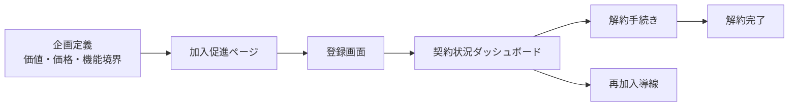

# プレミアムプラン構造資料

## 1. 目的
プレミアムプラン加入に関する仕様を、企画・画面要件・契約運用の3層で一枚に整理し、関係者がこの資料単体で以下を判断できる状態にする。
- 何をプレミアム価値として提供するか
- どの画面で加入から解約までを扱うか
- どの運用ルールで契約を管理するか

## 2. 対象範囲
- 対象: 利用者向けプレミアム加入導線（加入促進、登録、契約確認、解約、再加入）
- 非対象: 管理者向け請求運用の詳細、バックエンド実装詳細、外部連携実装詳細
- 前提: 本リポジトリはモック画面開発フェーズであり、画面仕様を正本として扱う

## 3. 全体構造（3層）
1. 企画層
- 提供価値、価格、機能境界、優先順位を定義する層
- 判断軸: 差別化価値、販売説明のしやすさ、運用負荷、法務/セキュリティ

2. 画面要件層
- 加入導線のUI/UXと入力要件を定義する層
- 判断軸: 迷わない導線、同意の明確性、状態別の出し分け

3. 契約運用層
- 契約状態の表示、解約、再加入を定義する層
- 判断軸: 誤認防止、手続きの一貫性、問い合わせ削減

## 4. プレミアムプラン定義（本資料での基準）
### 4.1 基本定義
- プラン名: Premium
- 価格: 月額 10,000円（税別）
- 保存期間: 無期限

### 4.2 代表的な提供価値
- 高度な設問タイプ（例: 手書き、画像添付）
- 分析/出力の拡張（例: クロス集計、Excel/CSV出力）
- 運用拡張（例: 自社ドメイン送信、オンデマンド系運用）

### 4.3 境界
- Free/Standardとの違いを「使える機能」と「制限値」で明示する
- 未確定要素は販売表現に含めず、企画層で要決定として管理する

## 5. 画面構造
### 5.1 主要画面
| 画面 | 主目的 | 主な利用者状態 |
| :-- | :-- | :-- |
| 加入促進ページ | 価値理解と申し込み意思決定 | 未加入ユーザー |
| 登録画面 | 契約情報入力と同意、申し込み確定 | ログイン済み/未ログイン復帰ユーザー |
| 契約状況ダッシュボード | 契約状態確認と管理導線提供 | プレミアム会員/トライアル/再加入候補 |
| 解約画面 | 解約意思の確定と注意事項提示 | プレミアム会員 |
| 解約完了画面 | 解約受付完了と残利用期間の明示 | 解約手続き完了ユーザー |

### 5.2 画面間の責務分担
- 加入促進ページ: ベネフィット訴求とCTA
- 登録画面: 契約成立のための入力・同意・送信
- ダッシュボード: 契約状態の誤認防止と次アクション導線
- 解約系画面: 期待値調整（いつまで使えるか、何が変わるか）

## 6. フロー構造

## 7. 状態別ルール
### 7.1 未加入
- 加入促進ページで価値/価格/比較を確認
- CTAから登録画面へ遷移

### 7.2 加入処理中
- セッション有効なら登録画面へ直接遷移
- セッション無効ならログイン後に登録画面へ復帰
- 決済/同意の確認を経て加入完了

### 7.3 加入中
- ダッシュボードで契約状態、次回更新、利用可能機能を確認
- 必要に応じて解約導線を利用

### 7.4 解約後
- 契約期間満了までは利用継続
- 期間終了後に制限プランへ移行
- 再加入導線はダッシュボード上で案内

## 8. 非機能観点（加入導線）
- 法務: 課金時の規約・特商法表記の明示
- セキュリティ: 認証状態の検証、セッション管理
- UX: 状態に応じた文言・CTA出し分け、誤操作防止
- 保守性: 価格/文言/導線の更新点を画面要件へ集約

## 9. 更新ルール
- 企画変更（価格・機能範囲）は `docs/プロダクト/サービス企画/` を先に更新する
- 画面・導線変更は `docs/画面設計/仕様/premium/` を正本として更新する
- 旧 `docs/要件定義/premium_*` は legacy redirect とし、新規編集は行わない

## 10. 関連資料
- `docs/画面設計/仕様/premium/premium_page_requirements.md`
- `docs/画面設計/仕様/premium/premium_registration_requirements.md`
- `docs/画面設計/仕様/premium/premium_dashboard_requirements.md`
- `docs/画面設計/仕様/premium/premium_cancellation_requirements.md`
- `docs/プロダクト/サービス企画/2026-01-23_プレミアムプラン_機能選別一覧.md`
- `docs/プロダクト/サービス企画/2026-01-24_プレミアム機能_詳細分解一覧.md`
